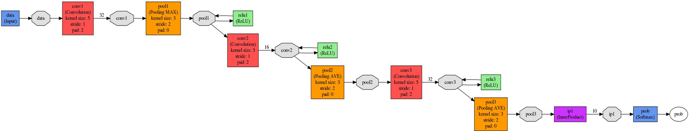
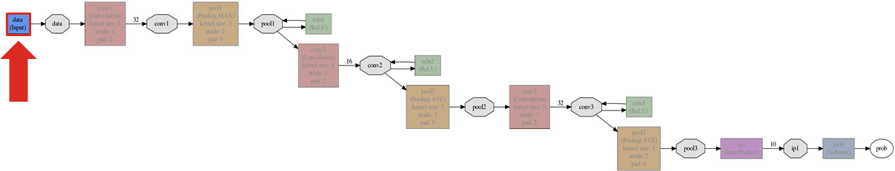
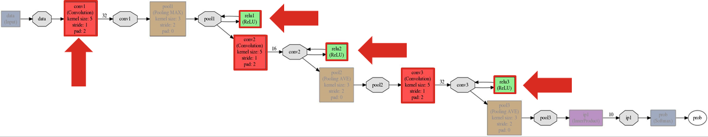
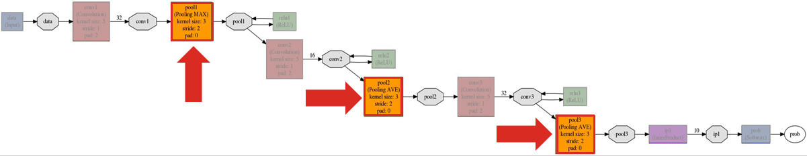
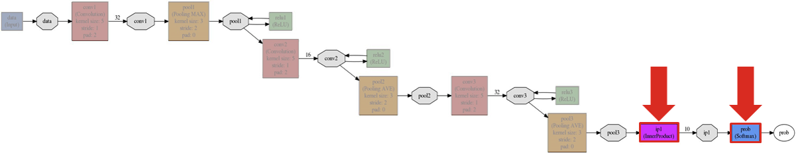
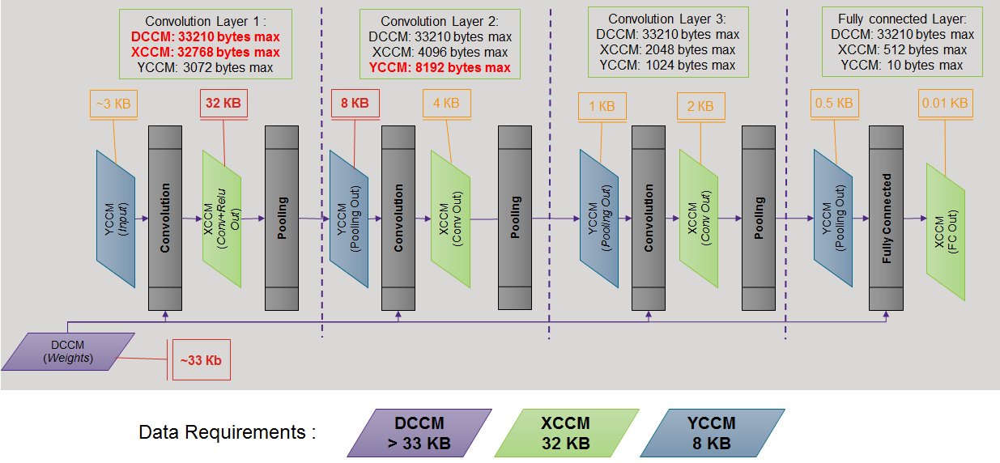

Examples and Tutorials
======================

Model Deployment Tutorial for Caffe and CIFAR-10
~~~~~~~~~~~~~~~~~~~~~~~~~~~~~~~~~~~~~~~~~~~~~~~~

In this chapter, we guide you through the manual model deployment process taking CIFAR-10 application as an example. The example considered is based on Caffe standard tutorial. We are not limited to Caffe and similar approach might be applied to other frameworks. Helper scripts considered here are also available in the repo.

Our assumption is that you are familiar with: 

 - **Neural networks basics** – convolutions, tensors, ReLU, and so on

 - **Python** – you can read and understand python code

 - **NumPy** – de-facto standard numerical library for python

 - **С programming language** – MLI API is C level API

 - **Caffe framework basics**
 
The development process of MLI-based embedded application is depicted with diagram:

.. image::  ../images/1_depl_process.png
   :align: center
   :alt: MLI-Based Application Development Process

..

1. Model definition and training in some appropriate framework. Ensure that you consider all limitations of the target platform here including memory restriction, MHz budget, and quantization effect in some cases.

2. Model deployment implies construction of tested and verified ML module with a defined interface. Hence, wrap the module into file-to-file application for convenient debugging and verification.
   MLI CIFAR-10 example is exactly of this “unit-testing” kind of applications.

3. Integrate this module into the target embedded application code with real data. 

This tutorial focuses on the second step – model deployment. 
Manual deployment consists of two main parts: 

 - Deploying data  — This is obvious because training implies tuning of model parameters. 
 
 - Deploying operations — The model consists of not only parameters but also algorithm that uses some basic operations or machine learning primitives.

Each step of the CIFAR-10 example above is described in separate section below.

Instrument the Model to Extract Weights and Data
~~~~~~~~~~~~~~~~~~~~~~~~~~~~~~~~~~~~~~~~~~~~~~~~

After we successfully pass basic Caffe CIFAR 10 tutorial with minor changes, we obtain the following files for deployment:

 - cifar10_small.prototxt – textual description of the graph which might be visualized as in figure below.

 - cifar10_small.caffemodel.h5 – data of trained graph. Not necessary h5 format.

 - mean file (Optional). Not used in this example. The only mean value for all pixels in all channels was used: 128

.. 

To get access to model data, install following modules in the environment:

.. code:: python

   import caffe
   import lmdb
   import numpy as np
..

To transform Caffe representation of data into numpy arrays, load and initialize model by constructing Caffe Net object which takes prototext and caffemodel files as parameters.

.. code:: python

   classifier = caffe.Net("cifar10_small.prototxt", "cifar10_small.caffemodel.h5", caffe.TEST)

   # Get key to the first output of net (here it’s a prob data)
   out_key = classifier.outputs[0] 
..

To deploy the model correctly, analyze the two subsets of data which might be transformed to numpy arrays by native interface:

1) Model parameters. 

.. code:: python

   for layer_name, data_obj in classifier.params.iteritems():
      weights_np_arr = data_obj[0].data # conv weights is blob #0 
      bias_np_arr = data_obj[1].data   # conv bias is blob #1
      # further operations with data
..

2) Intermediate results

.. code:: python

   for blob_name, data_obj in classifier.blobs.iteritems():
   data_np_arr = data_obj.data
   # further operations with data
..

In Caffe, these objects are referred as blobs. While model parameters in this case are fixed in the inference time (after model had been trained), intermediate results vary from one model input to another. Therefore, intermediate blob content differs depending on the input you feed into net. 

To update classifier object state, use the following command:

.. code:: python

    pred = classifier.forward_all(data=test_data)[out_key]
..

Here:

 - `test_data` is a numpy array with input vector (CIFAR-10 dataset entity),
 
 - `out_key` is our “key” to the network output we had defined early
 
 - `pred` is the output.

Using defined pieces of Python code, you can extract all the required data from the model and adapt it to an embedded MLI based application.  

Collect Data Range Statistic for Each Layer
~~~~~~~~~~~~~~~~~~~~~~~~~~~~~~~~~~~~~~~~~~~

Quantization process is not only meant to convert weights data to fixed point representation, but also meant to define ranges of all the intermediate data for each layer. For this purpose, run the model on some representative data subset and gather statistics for all intermediate results. It is better to use all training subsets, or even all the dataset. 

To accomplish this using previously defined instruments, see this sample code:

.. code:: python

   # Open dataset and get cursor
   lmdb_env = lmdb.open("cifar10_train_lmdb")
   lmdb_txn = lmdb_env.begin()
   lmdb_cursor = lmdb_txn.cursor()
   
   # Init data parser and dictionary for min/max statistic
   datum = caffe.proto.caffe_pb2.Datum()
   ir_ranges = dict()
    
   for key, value in lmdb_cursor:
       datum.ParseFromString(value)
       data_raw = caffe.io.datum_to_array(datum)
       
       # Don't forget about pre-processing if you need it (Mean and scale)
       test_data = np.asarray( [(data_raw – 128.0)/128.0] )
       test_label = datum.label
   
       # Model Inference on loaded data
       pred = classifier.forward_all(data=test_data)[out_key]
   
       # Update ranges (Note: dictionary requires proper initialization in first pass)
       for blob_name, v in classifier.blobs.items():
           ir_ranges[blob_name][0] = max(ir_ranges[key][0], v.data.max())
           ir_ranges[blob_name][1] = min(ir_ranges[key][1], v.data.min())
..

For simplicity, only maximum/minimum range of our data is collected. However, you can choose a more sophisticated approach which also may affect the choice for calibration data.
A similar range definition is required for model parameters. As weights are fixed after training and are not changed in inference time, you can just transform data to numpy arrays. It provides min() and max() methods for easy range definition. It also keeps the shape of data we need for MLI tensor definition later.

.. code:: python

  weights_dict = dict()
  bias_dict = dict()
  for layer_name, data_obj in classifier.params.items():
      weights_np_dict[layer_name] = data_obj[0].data
      bias_np_dict [layer_name] = data_obj[1].data
..

.. attention:: 

   Using batch normalization and scale layers with convolution requires integratation of the parameters of these layers into weights and biases through manual recalculation of weights. 
   This is not straightforward and is beyond the scope of this tutorial.
..

Define Q Data Format for Weights and Data for Each Layer
~~~~~~~~~~~~~~~~~~~~~~~~~~~~~~~~~~~~~~~~~~~~~~~~~~~~~~~~

MLI supports fixed point format defined by Q-notation (see section MLI Fixed-Point Data Format). The next step is to find the appropriate Q-format of input, output and coefficients for each layer to correctly represent float values. This format is fixed in inference time (at least for constant weights). We define the number of integer bits and fractional bits can be easily derived from it. The following table specifies the derivation of integer bits from CIFAR-10 model statistics:

.. table:: Integer Bits Derivation form CIFAR-10 Model Statistics
   :widths: auto
   
   +---------------+---------------------------------------------------------------+---------------------------------------------------------------+
   |               |              **Maximum abs values of tensors**                |            **Maximum abs values of tensors**                  |
   |  **CIFAR10**  +---------------+---------------+---------------+---------------+---------------+---------------+---------------+---------------+
   |               | Layer input   | Layer weights | Layer bias    | Layer out     | Layer input   | Layer weights | Layer bias    | Layer out     |
   |               | Max ABS value | Max ABS value | Max ABS value | Max ABS value | Max ABS value | Max ABS value | Max ABS value | Max ABS value |
   +===============+===============+===============+===============+===============+===============+===============+===============+===============+
   | Layer 1_conv  |     0.99      |     0.49      |     0.73      |    7.03       |       0       |      -1       |       0       |      3        |
   +---------------+---------------+---------------+---------------+---------------+---------------+---------------+---------------+---------------+ 
   | Layer 2_conv  |     7.03      |     0.35      |     0.39      |   21.88       |       3       |      -1       |      -1       |      5        |
   +---------------+---------------+---------------+---------------+---------------+---------------+---------------+---------------+---------------+ 
   | Layer 3_conv  |    17.89      |     0.29      |     0.18      |   27.22       |       5       |      -1       |      -2       |      5        |
   +---------------+---------------+---------------+---------------+---------------+---------------+---------------+---------------+---------------+    
   | Layer 4_fc    |    22.14      |     0.41      |     0.2       |   20.798      |       5       |      -1       |      -2       |      5        |
   +---------------+---------------+---------------+---------------+---------------+---------------+---------------+---------------+---------------+ 
..
 
On the left part of the table are the absolute maximum of ranges for all tensors we had defined early:

.. code:: python

   max_abs_val = max(abs(val_max), abs(val_min))
..

On the right are the calculated minimum number of integer bits:

.. code:: python

   int_bits = int(np.ceil(np.log2(max_abs_val)))
..

Fractional bits are calculated as container size minus integer bits.

For 8-bit depth of data, this is sufficient, but for 16-bit minor corrections are required. MLI uses 40bit accumulator which provides 9 extra bits for processing up to 512 MAC operations in a row on 16x16 operands. For longer MAC series, keep some bits in the operands unused to guarantee that the result does not saturate in accumulation (for more info see :ref:`quant_acc_bit_depth` ).

Consider a small example not directly related to the CIFAR-10: 

.. table:: Integer Bits Derivation Considering Accumulator Restrictions
   :widths: auto

   +--------------+-------------------------------------+----------------------------------------+--------------------------------------------+
   |              |    **Integer bit Requirements**     |      **Accumulator Restrictions**      |      **Integer bit requirements**          |
   |              |         **(fx8 operands)**          |                                        |          **(fx16 operands)**               |
   |              +------------+-------------+----------+--------------+------------+------------+------------+-------------+-----------------+
   |              | Layer      | Layer       | Layer    | Macs per     | Required   | not enough | Layer      | Layer       | Layer           |
   |              | input bits | weight bits | out bits | output value | extra bits | bits       | input bits | weight bits | out bits        |
   |              |            |             |          |              |            |            | (updated)  | (updated)   | (updated)       |
   +==============+============+=============+==========+==============+============+============+============+=============+=================+
   | Layer X conv |     5      |     -1      |    5     ||    801      |     10     | 10 – 9 = 1 | 5 + 1 = 6  |    -1       ||       6        |
   |              |            |             |          || (32*5*5+1)  |            |            |            |             || (next layer in)|
   +--------------+------------+-------------+----------+--------------+------------+------------+------------+-------------+-----------------+
   | Layer X+1 FC |     5      |     -1      |    5     ||   1025      |     11     | 11 – 9 = 2 | 5 + 1 = 6  | -1 + 1 = 0  |       5         |          
   |              |            |             |          || (64*16+1)   |            |            |            |             |                 |
   +--------------+------------+-------------+----------+--------------+------------+------------+------------+-------------+-----------------+
..
  
.. table:: Integer Bits Derivation Considering Accumulator Restrictions
   :widths: 30, 30, 20, 20
   :align: center
   
   +------------------------------+-----------------------+-------------------+------------------+
   |                              |                       | **Layer X Conv**  | **Layer X+1 FC** |
   +------------------------------+-----------------------+-------------------+------------------+
   |                              | Layer Input Bits      |         5         |       5          |
   | **Integer Bit Requirements** +-----------------------+-------------------+------------------+
   | *(fx8 operands)*             | Layer Weight Bits     |        -1         |      -1          |
   |                              +-----------------------+-------------------+------------------+
   |                              | Layer Output Bits     |         5         |       5          |
   +------------------------------+-----------------------+-------------------+------------------+
   |                              | MACs per Output value | 801 (32*5*5+1)    | 1025 (64*16+1)   | 
   |                              +-----------------------+-------------------+------------------+
   | **Accumulator Restrictions** | Required Extra Bits   |        10         |      11          |   
   |                              +-----------------------+-------------------+------------------+   
   |                              | Not Enough Bits       |     10 – 9 = 1    |   11 – 9 = 2     |   
   +------------------------------+-----------------------+-------------------+------------------+  
   |                              | Layer Input Bits      |      5 + 1 = 6    |    5 + 1 = 6     |
   |                              | (updated)             |                   |                  |
   | **Integer Bit Requirements** +-----------------------+-------------------+------------------+
   | *(fx16 operands)*            | Layer Weight Bits     |       -1          |   -1 + 1 = 0     |
   |                              | (updated)             |                   |                  |
   |                              +-----------------------+-------------------+------------------+
   |                              | Layer Output bits     | 6 (next layer in) |       5          |
   |                              | (updated)             |                   |                  |
   +------------------------------+-----------------------+-------------------+------------------+
   
   
   
   
   
   
Ensure that you follow these steps:

1. For a convolution layer, define the number of integer bits as in the previous example. 

2. For each output value, the compute the number of required sequential accumulations: 32[number of channels] * (5*5) [kernel size] +1 [bias] = 801 operations. Hence, 10 extra bits are required for accumulation.

3. Since the number of extra bits is less than the allocated bits for integer - 9, increase number of integer bits for layer input.

For the following fully connected layer, 11 extra bits are required and you need to distribute 2 bits. It’s recommended to do it evenly between operands. Note that number of convolution’s output fractional bits also needs to be changed to be aligned with next fully connected input.

For 8-bit operands,you do not need to perform this adjustment unless your MAC series is more than 131072 operations in which case, apply similar approach. After considering accumulator restrictions for CIFAR-10 example with 16-bit operands, you get the following table:
 
.. table:: Integer Bits Derivation from CIFAR-10 Model Statistics Considering Accumulator Restrictions
   :widths: auto

   +--------------+-------------------------------------+----------------------------------------+--------------------------------------------+
   |              |    **Integer bit requirements**     |      **Accumulator restrictions**      |      **Integer bit requirements**          |
   |              |         **(fx8 operands)**          |                                        |          **(fx16 operands)**               |
   |              +------------+-------------+----------+--------------+------------+------------+------------+-------------+-----------------+
   |              | Layer      | Layer       | Layer    | Macs per     | Required   | not enough | Layer      | Layer       | Layer           |
   |              | input bits | weight bits | out bits | output value | extra bits | bits       | input bits | weight bits | out bits        |
   |              |            |             |          |              |            |            | (updated)  | (updated)   | (updated)       |
   +==============+============+=============+==========+==============+============+============+============+=============+=================+
   | Layer 1_conv |     0      |     -1      |    3     ||      76     |      7     |     0      |     0      |    -1       ||       4        |
   |              |            |             |          ||  (3*5*5+1)  |            |            |            |             || (next layer in)|
   +--------------+------------+-------------+----------+--------------+------------+------------+------------+-------------+-----------------+
   | Layer 2_conv |     3      |     -1      |    5     ||     801     |     10     | 10 – 9 = 1 |  3 + 1 = 4 |    -1       |       5         |          
   |              |            |             |          || (32*5*5+1)  |            |            |            |             |                 |
   +--------------+------------+-------------+----------+--------------+------------+------------+------------+-------------+-----------------+
   | Layer 3_conv |     5      |     -1      |    5     ||     401     |      9     |  9 – 9 = 0 |     5      |    -1       ||       6        |
   |              |            |             |          || (16*5*5+1)  |            |            |            |             || (next layer in)|
   +--------------+------------+-------------+----------+--------------+------------+------------+------------+-------------+-----------------+
   | Layer 4_fc   |     5      |     -1      |    5     ||     513     |     10     | 10 – 9 = 1 |  5 + 1 = 6 |    -1       |       5         |
   |              |            |             |          ||  (32*16+1)  |            |            |            |             |                 |
   +--------------+------------+-------------+----------+--------------+------------+------------+------------+-------------+-----------------+
..    

.. table:: Integer Bits Derivation from CIFAR-10 Model Statistics Considering Accumulator Restrictions
   :widths: 30, 30, 20, 20, 20, 20
   :align: center
   
   +------------------------------+-----------------------+-------------------+------------------+-------------------+------------------+
   |                              |                       | **Layer 1_conv**  | **Layer 2_conv** | **Layer 3_conv**  | **Layer 4_fc**   |
   +------------------------------+-----------------------+-------------------+------------------+-------------------+------------------+
   |                              | Layer Input Bits      |         0         |       3          |         5         |       5          |
   | **Integer Bit Requirements** +-----------------------+-------------------+------------------+-------------------+------------------+
   | *(fx8 operands)*             | Layer Weight Bits     |        -1         |      -1          |        -1         |      -1          |
   |                              +-----------------------+-------------------+------------------+-------------------+------------------+
   |                              | Layer Output Bits     |         3         |       5          |         5         |       5          |
   +------------------------------+-----------------------+-------------------+------------------+-------------------+------------------+
   |                              | MACs per Output Value |   76 (3*5*5+1)    | 801 (64*16+1)    | 401 (16*5*5+1)    | 513 (32*16+1)    |
   |                              +-----------------------+-------------------+------------------+-------------------+------------------+
   | **Accumulator Restrictions** | Required Extra Bits   |         7         |      10          |         9         |      10          |
   |                              +-----------------------+-------------------+------------------+-------------------+------------------+
   |                              | Not Enough Bits       |         0         |   10 – 9 = 1     |      9 – 9 = 0    |   10 – 9 = 1     |
   +------------------------------+-----------------------+-------------------+------------------+-------------------+------------------+
   |                              | Layer Input Bits      |         0         |    3 + 1 = 4     |         5         |    5 + 1 = 6     |
   |                              | (updated)             |                   |                  |                   |                  |
   | **Integer Bit Requirements** +-----------------------+-------------------+------------------+-------------------+------------------+
   | *(fx16 operands)*            | Layer Weight Bits     |        -1         |      -1          |        -1         |      -1          |
   |                              | (updated)             |                   |                  |                   |                  |
   |                              +-----------------------+-------------------+------------------+-------------------+------------------+
   |                              | Layer Output Bits     | 4 (next layer in) |       5          | 6 (next layer in) |       5          |
   |                              | (updated)             |                   |                  |                   |                  |
   +------------------------------+-----------------------+-------------------+------------------+-------------------+------------------+

   
.. note::
   Defining Q format in this way, you can guarantee that accumulator is not saturated while a single output is being calculated. But the restriction may be loosened if you are sure about your data. For example, look at the final fully connected layer above: 9 bits are enough if we do not consider bias addition. Analyze how likely is it that for 1 extra addition result will overflow the defined range. Moreover, saturation of results might have a minor effect on the network accuracy. 
..
   
Quantize Weights According to Defined Q-Format
~~~~~~~~~~~~~~~~~~~~~~~~~~~~~~~~~~~~~~~~~~~~~~

After extracting coefficients in numpy array objects and defining Qm.n format for data, define MLI structures for kernels and export the quantized data. 

Consider a static allocation of data. To extract weights, you may make pre-processor quantize data for you in compile-time by wrapping each coefficient into some macro. It is slower and uses more memory resources of your machine for compilation, but it is worth if the model is not so big. 

.. code:: c++

   #define QMN(type, fraq, val)   \
        (type)(val * (1u << (fraq)) + ((val >= 0)? 0.5f: -0.5f)) 
   #define L1_WQ(val)   QMN(int8_t,  8, val) 
   #define L1_BQ(val)   QMN(int8_t,  7, val)
   const  int8_t L1_conv_wt_buf[] = {\
        L1_WQ( 0.096343018),L1_WQ( 0.148116693),L1_WQ( 0.023189211), … \
        L1_WQ(-0.123411559),L1_WQ(-0.047247209),L1_WQ( 0.091348067), … \ 
        …
   };
   const int8_t  L1_conv_bias_buf[] = {\
        L1_BQ( 0.058115590),L1_BQ(-0.098249219),L1_BQ( 0.456347317), … \
        L1_BQ(-0.135683402),L1_BQ(-0.039959636),L1_BQ( 0.527986348), … \ 
        …
   };
..

Alternatively, you may quantize data externally Layer 1_conv in the same way and just put it into code. 

.. code:: c++

   const int8_t L1_conv_wt_buf[] = {25, 38, 6, -12, -7, …} 
   const int8_t L1_conv_bt_buf[] = {7, -12, 58, -1, -25, …}
..

To describe raw data by tensor structures, see this sample code:

.. code:: c++

   // Conv 1 Layer weights and biases tensors 
   static const mli_tensor L1_conv_wt = {
        .data = (void *)L1_conv_wt_buf,
        .capacity = sizeof(L1_conv_wt_buf),
        .shape =  {32, 3, 5, 5},           // Get Shape from the NP Array
        .rank =  4,
        .el_type = MLI_EL_FX_8,
        .el_params.fx.frac_bits = 8,
    }; 
   static const mli_tensor L1_conv_bias = {
        .data = (void *)L1_conv_bias_buf,
        .capacity = sizeof(L1_conv_bias_buf),
        .shape =  {32},
        .rank =  1,
        .el_type = MLI_EL_FX_8,
        .el_params.fx.frac_bits = 7,
    }; 
   // Next value will be passed with output tensor structure
   #define CONV1_OUT_FRAQ_BITS (4) 
   ...
..   

Extract the shape of the data and its rank (number of dimensions) from numpy object. Set the container parameters, including its type and number of fractional bits, according to bit depth that you want to use and integer bits defined earlier. For MAC-based kernels, allocate the number of fractional bits as well for output (`CONV1_OUT_FRAQ_BITS`).

Deploying Operations
~~~~~~~~~~~~~~~~~~~~

To define MLI operations and its parameters for trained graph, start from input data as shown in the figure below. 

..

Assume that the input is an RGB image in HWC layout, while MLI mostly optimized for CHW layout 
(see MLI documentation section :ref:`data_muldim`). 

.. Note:: 
   Layout is not only about input of network, but also related to intermediate results. Primitive optimization techniques differ for different layouts.

..

Transpose data by permute layer with appropriate parameters:

.. table:: Example of Permute Layer for Different Layout Consideration
   :widths: 20, 130
   
   +---------------------------+---------------------------------------------------------------+
   |                           | .. code::                                                     |
   |                           |                                                               |   
   |                           |    layer {                                                    |
   |                           |      name: "data"                                             |
   |                           |      type: "Input"                                            |
   | **ProtoText description** |      top: "data"                                              |
   |                           |      input_param { shape: { dim: 1                            |
   |                           |      dim: 3 dim: 32 dim: 32 } }                               |
   |                           |    }                                                          |
   |                           | ..                                                            |
   +---------------------------+---------------------------------------------------------------+
   |                           | .. code:: c++                                                 |
   |                           |                                                               |   
   |                           |    mli_status mli_krn_permute_fx8(                            |
   |                           |        const mli_tensor * in,        // Input tensor          |
   | **MLI Function**          |        const mli_permute_cfg * cfg,  // Permute configuration |
   |                           |        mli_tensor * out              // Output tensor         |
   |                           |      );                                                       |
   |                           | ..                                                            |
   +---------------------------+---------------------------------------------------------------+
   |                           | .. code:: c++                                                 |
   |                           |                                                               |   
   |                           |    mli_permute_cfg permute_hwc2chw_cfg = {                    |
   |                           |       .perm_dim =                                             |
   |                           |           {FMAP_C_DIM_HWC, // 2                               |
   |                           |            FMAP_H_DIM_HWC, // 0                               |
   |                           |            FMAP_W_DIM_HWC} // 1                               |
   |                           |    };                                                         |
   |                           | ..                                                            |
   +---------------------------+---------------------------------------------------------------+

..   

Parameters of all convolutions in the model are the same, so you may use the only function for all of them, which is specialized for exactly these parameters. Additionally, MLI convolutions may perform ReLU transformation while saving the result. Hence, there is no need to use separate function (even if it is possible to do so). The only exception is the first layer, where maxpooling is between ReLU and convolution. Luckily, it is a maxpooling operation, not an average pooling one. In this case, you may do ReLU first, and max pooling after without any effect in inference:

.. table:: Example of 2D-Convolution Layer with Embedded ReLU
   :widths: 20, 130
   
   +---------------------------+---------------------------------------------------------------+
   |                           | .. code::                                                     |
   |                           |                                                               |
   |                           |    layer {                                                    |
   |                           |      name: "conv2“                                            |
   |                           |      type: "Convolution“                                      |
   |                           |      bottom: “pool1“                                          |
   |                           |      top: "conv2“                                             |
   | **ProtoText description** |      convolution_param {                                      |
   |                           |         num_output: 32 pad: 2 kernel_size: 5 stride: 1  }}    |
   |                           |    layer {                                                    |
   |                           |      name: "relu2"                                            |
   |                           |      type: "ReLU"                                             |
   |                           |      bottom: "conv2"                                          |
   |                           |      top: "conv2"}                                            |
   |                           | ..                                                            |
   +---------------------------+---------------------------------------------------------------+
   |                           | .. code:: c++                                                 |
   |                           |                                                               |   
   |                           |    mli_status mli_krn_conv2d_chw_fx8_k5x5_str1_krnpad(        |
   |                           |      const mli_tensor * in,       // Input tensor             |
   |                           |      const mli_tensor * weights,  // Weights tensor           |
   |     **MLI Function**      |      const mli_tensor * bias,     // Biases tensor            |
   |                           |      const mli_conv2d_cfg * cfg,  // Convolution config       |
   |                           |      mli_tensor * out             // Output tensor            |
   |                           |   );                                                          |
   |                           | ..                                                            |
   +---------------------------+---------------------------------------------------------------+
   |                           | .. code:: c++                                                 |
   |                           |                                                               |   
   |                           |    mli_conv2d_cfg shared_conv_cfg = {                         |
   |                           |      .stride_height = 1, .stride_width = 1,                   |
   |                           |      .padding_bottom = 2, .padding_top = 2,                   |
   | **MLI Function Config**   |      .padding_left = 2, .padding_right = 2,                   |
   |                           |      .relu.type = MLI_RELU_GEN                                |
   |                           |     };                                                        |
   |                           | ..                                                            |
   +---------------------------+---------------------------------------------------------------+ 

..

.. 

.. table:: Example Pooling Layer with Padding 
   :widths: 20, 130
   
   +---------------------------+---------------------------------------------------------------+
   |                           | .. code::                                                     |
   |                           |                                                               |   
   |                           |    layer {                                                    |
   |                           |      name: "pool1"                                            |
   |                           |      type: "Pooling"                                          |
   |                           |      bottom: "conv1"                                          |
   |                           |      top: "pool1"                                             |
   |                           |      pooling_param {                                          |
   | **ProtoText description** |           pool: MAX    kernel_size: 3    stride: 2  }}        |
   |                           |    layer {                                                    |
   |                           |      name: "pool2"                                            |
   |                           |      type: "Pooling"                                          |
   |                           |      bottom: "conv2"                                          |
   |                           |      top: "pool2"                                             |
   |                           |      pooling_param {                                          |
   |                           |           pool: AVE    kernel_size: 3    stride: 2  }}        |
   |                           | ..                                                            |
   +---------------------------+---------------------------------------------------------------+
   |                           | .. code:: c++                                                 |
   |                           |                                                               |   
   |                           |    mli_status mli_krn_maxpool_chw_fx8_k3x3(                   |
   |                           |       const mli_tensor * in,     // Input tensor              |
   |                           |       const mli_pool_cfg * cfg,  // Pooling configuration     |
   |                           |       mli_tensor * out           // Output tensor             |
   |     **MLI Function**      |    );                                                         |
   |                           |    mli_status mli_krn_avepool_chw_fx8_k3x3(                   |
   |                           |       const mli_tensor * in,     // Input tensor              |
   |                           |       const mli_pool_cfg * cfg,  // Pooling configuration     |
   |                           |       mli_tensor * out           // Output tensor             |
   |                           |    );                                                         |
   |                           | ..                                                            |
   +---------------------------+---------------------------------------------------------------+   
   |                           | .. code:: c++                                                 |
   |                           |                                                               |   
   |                           |     mli_pool_cfg shared_pool_cfg = {                          |
   |                           |        .kernel_height = 3, .kernel_width = 3,                 |
   | **MLI Function Config**   |        .stride_height = 2, .stride_width = 2,                 |
   |                           |        .padding_bottom = 1, .padding_top = 0,                 |
   |                           |        .padding_left = 0, .padding_right = 1                  |
   |                           |     };                                                        |
   |                           | ..                                                            |
   +---------------------------+---------------------------------------------------------------+   
   
..

.. note:: 

   All specializations for pooling and convolution group of primitives are declared in the appropriate header files (see it in the GitHub repository). Functions without specialization postfix work like switchers, analyzing parameters and choosing proper one to delegate actual job. This can be used in debug to define a proper specialization.    
..

Consider the last two operations:
 

..

.. table:: Example of Function Choosing Optimal Specialization 
   :widths: 20, 130
   
   +---------------------------+---------------------------------------------------------------+
   |                           | .. code::                                                     |
   |                           |                                                               |   
   |                           |    layer {                                                    |
   |                           |      name: "ip1"                                              |
   |                           |      type: "InnerProduct“                                     |
   |                           |      bottom: "pool3“                                          |
   |                           |      top: "ip1"                                               |
   | **ProtoText description** |      inner_product_param {  num_output: 10  }                 |
   |                           |    }                                                          |
   |                           |    layer {                                                    |
   |                           |      name: "prob"                                             |
   |                           |      type: "Softmax"                                          |
   |                           |      bottom: "ip1"                                            |
   |                           |      top: "prob"                                              |
   |                           |    }                                                          |
   |                           | ..                                                            |
   +---------------------------+---------------------------------------------------------------+
   |                           | .. code:: c++                                                 |
   |                           |                                                               |   
   |                           |    mli_status mli_krn_fully_connected_fx8(                    |
   |                           |       const mli_tensor * in,      // Input tensor             |
   |                           |       const mli_tensor * weights, // Weights tensor           |
   |                           |       const mli_tensor * bias,    // Bias tensor              |
   |     **MLI Function**      |       mli_tensor * out            // Output tensor            |
   |                           |    );                                                         |
   |                           |    mli_status mli_krn_softmax_fx8(                            |
   |                           |       const mli_tensor * in,   // Input tensor                |
   |                           |       mli_tensor * out         // Output tensor               |
   |                           |    );                                                         |
   |                           | ..                                                            |
   +---------------------------+---------------------------------------------------------------+   
   | **MLI Function Config**   | No configuration is required. Tensors provide all necessary   |
   |                           | information                                                   |
   +---------------------------+---------------------------------------------------------------+
..

When data extracted properly (wrapped into tensors and configuration structures), and functions for inference are defined, execution sequence in terms of MLI calls look like this:

.. code:: c++ 

   // LAYER 0: Change RGB Image layout
   mli_krn_permute_fx16(&input, &permute_hwc2chw_cfg, &ir_tensor_Y);
   
   // LAYER 1
   ir_tensor_X.el_params.fx.frac_bits = CONV1_OUT_FRAQ;
   mli_krn_conv2d_chw_fx8_k5x5_str1_krnpad(&ir_tensor_Y, &L1_conv_wt, &L1_conv_bias, &shared_conv_cfg, &ir_tensor_X);
   mli_krn_maxpool_chw_fx16_k3x3(&ir_tensor_X, &shared_pool_cfg, &ir_tensor_Y);
   
   // LAYER 2
   ir_tensor_X.el_params.fx.frac_bits = CONV2_OUT_FRAQ;
   mli_krn_conv2d_chw_fx8_k5x5_str1_krnpad(&ir_tensor_Y, &L2_conv_wt, &L2_conv_bias, &shared_conv_cfg, &ir_tensor_X);
   mli_krn_avepool_chw_fx16_k3x3_krnpad(&ir_tensor_X, &shared_pool_cfg, &ir_tensor_Y);
   
   // LAYER 3
   ir_tensor_X.el_params.fx.frac_bits = CONV3_OUT_FRAQ;
   mli_krn_conv2d_chw_fx8_k5x5_str1_krnpad(&ir_tensor_Y, &L3_conv_wt, &L3_conv_bias, &shared_conv_cfg, &ir_tensor_X);
   mli_krn_avepool_chw_fx16_k3x3_krnpad(&ir_tensor_X, &shared_pool_cfg, &ir_tensor_Y);
   
   // LAYER 4
   ir_tensor_X.el_params.fx.frac_bits = FC4_OUT_FRAQ;
   mli_krn_fully_connected_fx16(&ir_tensor_Y, &L4_fc_wt, &L4_fc_bias, &ir_tensor_X);
   mli_krn_softmax_fx16(&ir_tensor_X, &output); 
..

Here, you can see the IR tensors for storing intermediate results (ir_tensor_X and ir_tensor_X). They are used in double-buffering style. Each primitive uses only buffers pointed by tensors. Fill the rest of the fields of tensors to provide a valid value to next primitive as input. Hence, before using, output tensor must keep only pointer to buffer and its capacity + number of fractional bits for MAC based operations.
   
Data Allocation
~~~~~~~~~~~~~~~

To estimate how much memory is required, and decide where to keep the operands in the address space, consider EM9D based target with AGU and XY memory. Keeping operands in a different memory banks (DCCM, XCCM, YCCM) significantly increases performance. Ensure that you organize data flow properly for this work properly. 

Here is one of the options:

..   

.. note:: 
   Here 2 memories instead of 3 may be used w/o effect on XY performance. 
..   
