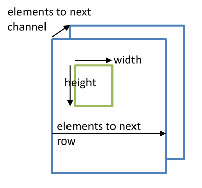

.. _mli_kernels:

MLI Kernels (Operators)
=======================

This chapter lists and describes a collection of ML algorithms (kernels) included 
into MLI specification.  

Introduction
------------

The MLI Specification defines the following groups of NN kernels:

  - Convolution Group

  - Recurrent Group

  - Pooling Group

  - Diverse kernels group

  - Transform (activation) Group

  - Element-wise Group

  - Advanced Image Processing Group

Each kernel is implemented as a separate function, and inputs and outputs are 
represented by the tensor structure defined in section :ref:`mli_tens_data_struct`.  
A kernel can have multiple specializations, each implemented as a separate function. 
As a result, the neural network graph implementation is represented as series of 
function calls, which can either be constructed manually by the user or via some 
automated front-end tool.

The following major sections in this chapter describe each Group’s supported functions 
and conventions.

A note on Slicing
~~~~~~~~~~~~~~~~~~~

The kernels described in the following sections of this specification have no notion of 
slicing (also referred to as tiling).  Instead, the responsibility of slicing is left to 
the caller, which can be either application code, some higher-level API or graph-compiler 
generated. For cores with any sort of closely-coupled memory (CCMs), the kernels assume 
that all the input tensors are in CCM. The output tensor can be either in system memory 
or in CCM.
 
Slicing is required in case there is not enough space in CCM to fit the complete input 
tensors. In this case, the caller can copy a ‘slice’ of the input tensor into CCM, and 
the kernel produces a slice of the output tensor. These output slices can be combined
into a full tensor. Because the tensor data does not have to be contiguous in memory, 
it is possible to create a (slice) tensor that points to a subset of the data of a larger 
tensor. If for instance the output tensor is in system memory, each invocation of the 
kernel that computes a slice can write its output directly into the correct (slice) 
of the output tensor. This eliminates the need for an extra concatenation copy pass. 
The slicing concept is illustrated in Figure :ref:`f_slicing_concept`.

.. _f_slicing_concept:

   
   Slicing Concept
..

If the tensors don’t fit into CCM, and there is no data cache, the data move functions can 
be used to copy full tensors or slices of tensors. (see Chapter :ref:`data_mvmt` ). Slicing 
with some kernels requires updating the kernel parameters when passing each slice.

.. _func_names_special:

Function Names and Specializations
~~~~~~~~~~~~~~~~~~~~~~~~~~~~~~~~~~

All function names of the kernels are constructed in a similar way. To make the implementation 
easier to manage for both the engineer and the compiler, the level of specialization for this 
API is chosen at a point that the specializations that are useful on most  of the platforms 
are fixed in the function names. To make it easier to navigate through the list of API functions, 
all function names are built using the following syntax:

.. code::

  mli\_<group>\_<function>\_[layout_]<dataformats>[\_specializations]([input_tensors],[cfg],[output_tensors]);
..
  
An explanation of each of the preceding elements which make up a name is provided in Table :ref:`t_func_name_conv_fields`. 
The function arguments start with zero or more input tensors, followed by a kernel specific 
configuration struct, followed by the output tensors. All the function parameters are 
grouped inside the config structure.

.. _t_func_name_conv_fields:
.. table:: Function Naming Convention Fields
   :align: center
   :widths: 50, 30, 130 
   
   +------------------+-----------------+--------------------------------------+
   | **Field Name**   | **Examples**    | *Description**                       |
   +==================+=================+======================================+
   | Return Codes     | krn             | krn for compute kernels              |
   |                  | hlp             | hlp for helper functions             |
   |                  | mov             | mov for data move kernels            |
   |                  | usr             | usr for user-defined kernels.        |
   +------------------+-----------------+--------------------------------------+
   | Functions        || conv2d         | Describes the basic functionality.   | 
   |                  | fully_connected | Full list of supported function      |
   |                  | ...             | names is described later             |
   +------------------+-----------------+--------------------------------------+
   | layout           || chw            | Optional description of the layout   |
   |                  || hwcn           | of the input, only relevant for some |
   |                  || nhwc           | functions                            |
   +------------------+-----------------+--------------------------------------+   
   | dataformats      || fx16           | Specifies the tensor data formats.   |
   |                  || sa8_sa8_sa32   | In case of multiple input tensors    | 
   |                  || sa8            | with different data formats, the     |
   |                  |                 | format of each tensor is specified   |
   |                  |                 | in the same order as the function    |
   |                  |                 | arguments. (for details see          |
   |                  |                 | :ref:`t_mli_el_p_union`).            |
   +------------------+-----------------+--------------------------------------+ 
..

.. note::

   User-defined kernels are beyond the scope of this document. To incorporate these 
   functions into future specification versions. it is advised that user-defined 
   kernels follow the same naming convention, data layouts, and datatypes. 
   
..

The naming convention for the data formats is as follows and in :ref:`t_data_fmt_fields`:

.. code::

  <typename><containersize>
..

.. _t_data_fmt_fields:
.. table:: Data Format Naming Convention Fields
   :align: center
   :widths: auto
   
   +------------------+------------------+----------------------------------------------+
   | **Field Name**   | **Examples**     | *Description**                               |
   +==================+==================+==============================================+
   | typename         || **fx**          | Specifies which quantization schema is used: |
   |                  || **sa**          |                                              |
   |                  || **fp**          | - fx for Fixed point                         |
   |                  || **usr**         |                                              |   
   |                  |                  | - sa for Signed Asymmetric                   |
   |                  |                  |                                              |   
   |                  |                  | - fp for Floating Point                      |
   +------------------+------------------+----------------------------------------------+
   | containersize    || 1, 4, 8, 16, 32 | Container size in bits of each individual    | 
   |                  |                  | element.                                     |
   +------------------+------------------+----------------------------------------------+
..

The following convention is applied to the layout field:

 - If MLI kernel implies using only three-dimensional variable tensors as input/output, 
   function name should reflect layout of input and output tensors. Layout of input 
   and output must be the same. 
   
 - If MLI kernel implies using four-dimensional weights tensor in addition to three-dimensional 
   input/output tensors, function name should reflect layout of weights tensor.

NN Kernel-Groups
----------------
   
.. toctree::
   :maxdepth: 2
   
   convolution_grp.rst
   rec_fully_con_grp.rst
   pooling_grp.rst
   diverse_kernels_grp.rst
   transform_grp.rst
   elemw_grp.rst
   adv_img_proc_grp.rst
   