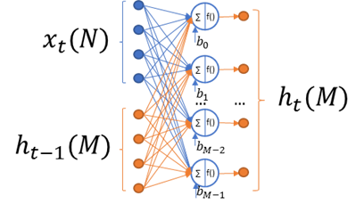

.. _basic_rnn:

Basic RNN Cell
~~~~~~~~~~~~~~

..
   
This kernel implements the basic recurrent cell without memory state.

*N* is the total number of elements in the input and *M*
is the total number of elements in the cell output.

Basic RNN operation is described by the following formula:

.. math:: h_{t} = f(x_{t}W_{x} + h_{t - 1}W_{h} + b)

..

where:

  - :math:`\ x_{t}\ ` - frame :math:`t` in input sequence.
  - :math:`\ h_{t}\ ` - cell output for frame :math:`t` in input sequence.
  - :math:`W_{*}\ ` - weights for appropriate input subtensor.
  - :math:`b_{*}\ ` - bias for appropriate input subtensor.
  - :math:`f()` - output activation function.

This kernel supports the following output activation types (:math:`f()` in
the formula above) :

-  Hyperbolic tangent. Uses TanH kernel of the library (see :ref:`tanh`).

-  Sigmoid. Uses Sigmoid kernel of the library (see :ref:`sigmoid`)

-  No Activation. Passes data without modification

..

This kernel modifies only output tensors and intermediate tensor from
configuration structure in processing. For a full list of parameters
see :ref:`api_brnn`.

This kernel supports three modes of input processing:

-  **One-to-one**

   -  Processes the input tensor as a single input frame

   -  Ignores the shape of input tensor, and only considers the total
      number of elements

   -  Performs single step to produce a one-dimensional output tensor of
      shape [M]

-  **Batch-to-batch**

   -  Processes the input tensor as a sequence of frames to produce a
      sequence of outputs of the same size

   -  Considers the first dimension of the input tensor as sequence size
      (``batch_size``), and considers the total number of elements for the
      rest of the dimensions

   -  Performs ``batch_size`` steps to produce 2 dimensional output tensor
      of shape [``batch_size``, M]

-  **Batch-to-last**

   -  Processes the input tensor as a sequence of frames to produce a
      single (last in the sequence) output

   -  Same as batch-to-batch mode except that output tensor has a shape
      [M] whose values are the same as those for the last sub tensor in
      batch-to-batch mode

..

Weights for a cell is a single 2-dimensionl tensor of shape [*M*,
*M+N*], and Bias is of shape [M]. It represents the stacking of 2
weights sub-tensors into one tensor in the following order:

.. math::

   \begin{bmatrix}
   W_{x} & W_{h} \\
   \end{bmatrix}\text{ }

..
   
To support user-specific complex recurrent cells beside LSTM, basic
RNN cell kernel in One-to-One mode can work with matrices with
stacked weights to produce stacked output tensor.

For example, if weights tensor is 3-dimensionl tensor of shape [*L*,
*M*, *M+N*], and bias of shape [*L, M*], the output tensor is of
shape [*L*, *M*].

In batch-to-last mode, the configuration structure also contains pointer
to the tensor that is used by kernel as intermediate result tensor.
This kernel modifies the memory pointed to by data, shape, rank, element
type and element parameters fields of this tensor. Ensure that the
capacity of the intermediate tensor is enough to store the output for
one step of kernel (M or L*M elements for stacked weights matrix).

For the other modes (one-to-one or batch-to-batch), kernel does not
use the intermediate result tensor and this field might not be
initialized. For more information about configuration structure, see
:ref:`fn_conf_lstm`.
   
.. caution::
   Ensure that you allocate memory for all tensors (including      
   intermediate results tensor) without overlaps.               
                                   
   The only exception is batch-to-last mode due to its usage of 
   intermediate tensor. In this case, the output and the previous   
   output tensors might use the same memory if it is acceptable to
   rewrite previous output data.   

.. _fn_conf_brnn:

Function Configuration Structure
^^^^^^^^^^^^^^^^^^^^^^^^^^^^^^^^

Definition
''''''''''
.. code:: c                     
                                
 typedef struct {               
    mli_rnn_mode mode;          
    mli_rnn_out_activation  act;
    mli_tensor *ir_tsr;         
  } mli_rnn_cell_cfg;           
..

Parameters
''''''''''

.. table:: Function Configuration Parameters
   :widths: 20,80

   +-----------------------+-----------------------+
   |  **Fields**           |  **Description**      |
   +=======================+=======================+
   | ``mode``              | RNN processing mode   |
   |                       | (enumeration)         |
   +-----------------------+-----------------------+
   | ``act``               | RNN output            |
   |                       | activation type       |
   |                       | (enumeration)         |
   +-----------------------+-----------------------+
   | ``ir_tsr``            | Pointer to tensor for |
   |                       | holding intermediate  |
   |                       | results. Tensor must  |
   |                       | contain valid data    |
   |                       | and capacity fields.  |
   |                       | Field is modified by  |
   |                       | kernels.              |
   +-----------------------+-----------------------+
 
.. _mli_rnn_mode_val_desc:
.. table:: mli_rnn_mode Values Description
   :widths: 20,80
   
   +-----------------------------------+-----------------------------------+
   | **Value**                         | **Field Description**             |
   +===================================+===================================+
   | ``RNN_ONE_TO_ONE``                | Process input tensor as a single  |
   |                                   | input frame .                     |
   +-----------------------------------+-----------------------------------+
   | ``RNN_BATCH_TO_BATCH``            | Process input tensor as a         |
   |                                   | sequence of frames to produce a   |
   |                                   | sequence of outputs .             |
   +-----------------------------------+-----------------------------------+
   | ``RNN_BATCH_TO_LAST``             | Process input tensor as a         |
   |                                   | sequence of frames to produce     |
   |                                   | single (last) outputs.            |
   +-----------------------------------+-----------------------------------+

.. _mli_rnn_out_activation_val_desc:
.. table:: mli_rnn_out_activation Values Description
   :widths: 20,100
   
   +-----------------------------------+-----------------------------------+
   | **Value**                         | **Field Description**             |
   +===================================+===================================+
   | ``RNN_ACT_TANH``                  | Hyperbolic tangent activation     |
   |                                   | function.                         |
   +-----------------------------------+-----------------------------------+
   | ``RNN_ACT_SIGM``                  | Logistic (sigmoid) activation     |
   |                                   | function.                         |
   +-----------------------------------+-----------------------------------+
   | ``RNN_ACT_NONE``                  | No activation.                    |
   +-----------------------------------+-----------------------------------+

\

.. _api_brnn:

Kernel Interface
^^^^^^^^^^^^^^^^

Prototype
'''''''''

.. code:: c                                   
                                              
 mli_status mli_krn_basic_rnn_cell_<data_type>
 [_specialization](                           
    const mli_tensor *in,                     
    const mli_tensor *prev_out,               
    const mli_tensor *weights,                
    const mli_tensor *bias,                   
    const mli_rnn_cell_cfg *cfg,              
    mli_tensor *out);                         
..

Parameters
''''''''''

.. table:: Kernel Interface Parameters
   :widths: 20,130
   
   +-----------------------+-----------------------+
   |  **Parameters**       | **Description**       |
   +=======================+=======================+
   |                       |                       |
   | ``in``                | [IN] Pointer to input |
   |                       | tensor                |
   +-----------------------+-----------------------+
   |                       |                       |
   | ``prev_out``          | [IN] Pointer to       |
   |                       | previous output       |
   |                       | tensor                |
   +-----------------------+-----------------------+
   |                       |                       |
   | ``weights``           | [IN] Pointer to       |
   |                       | weights tensor        |
   +-----------------------+-----------------------+
   |                       |                       |
   | ``bias``              | [IN] Pointer to       |
   |                       | biases tensor         |
   +-----------------------+-----------------------+
   |                       |                       |
   | ``cfg``               | [IN/OUT] Pointer to   |
   |                       | configuration         |
   |                       | structure             |
   +-----------------------+-----------------------+
   |                       |                       |
   | ``out``               | [OUT] Pointer to      |
   |                       | output tensor. Result |
   |                       | is stored here        |
   +-----------------------+-----------------------+

.. _kernel-specializations-2:

Kernel Specializations
^^^^^^^^^^^^^^^^^^^^^^

.. table:: Non-Specialized Functions
   :widths: 20,130
   
   +---------------------------------------+-----------------------------------+
   | **Function**                          | **Description**                   |
   +=======================================+===================================+
   | ``mli_krn_basic_rnn_cell_fx8``        | General function; 8bit FX         |
   |                                       | elements;                         |
   +---------------------------------------+-----------------------------------+
   | ``mli_krn_basic_rnn_cell_fx16``       | General function; 16bit FX        |
   |                                       | elements;                         |
   +---------------------------------------+-----------------------------------+
   | ``mli_krn_basic_rnn_cell_fx8w16d``    | General function; FX tensors      |
   |                                       | (8bit weights and biases, 16 bit  |
   |                                       | input, state, cell, output and    |
   |                                       | intermediate data);               |
   +---------------------------------------+-----------------------------------+

.. _conditions-for-applying-the-kernel-2:

Conditions for Applying the Kernel
^^^^^^^^^^^^^^^^^^^^^^^^^^^^^^^^^^

Ensure that you satisfy the following conditions before applying the
function:

-  Input, Weights, Bias, and Previous output tensors must be valid (see
   :ref:`mli_tns_struct`).

-  Weights is a two-dimensional tensor of shape [M, N+M]. But In
   ``RNN_ONE_TO_ONE`` mode, the weights tensor is of shape [L, M, N+M] to
   produce an output tensor of shape [L, M].

-  Bias is a one-dimensional tensor of shape [M]. But In ``RNN_ONE_TO_ONE``
   mode, bias tensor is of shape [L, M] to produce an output tensor
   of shape [L, M].

-  Previous output must be a one-dimensional tensor of shape [M]

-  Element type of weights and bias tensors must be the same.

-  Element type of input, previous output tensors must be the same.

-  The input tensor has the following restrictions:

   -  For ``RNN_ONE_TO_ONE`` mode, the total number of input and previous
      output tensors elements (N+M) must be equal to the last dimension of
      Weights tensor.

   -  For ``RNN_BATCH_TO_BATCH`` and ``RNN_BATCH_TO_LAST`` modes, first
      dimension of input reflects sequence length (batch size) while for
      the rest of the input tensor dimensions the same rules apply as
      those for the ``RNN_ONE_TO_ONE`` mode.

-  The output tensor has the following restrictions:

   -  It must contain a valid pointer to a buffer with sufficient
      capacity for storing the result (to keep *M* or *L*M* elements for
      RNN_ONE_TO_ONE and RNN_BATCH_TO_LAST modes, and *M*\ \*batch_size
      elements for RNN_BATCH_TO_BATCH mode)

   -  If ``RNN_ACT_NONE`` is used as output activation, output tensor must
      contain a valid element parameter (el_params.fx.frac_bits) and it
      must be the same as that for the previous output tensor.

   -  Before processing, the output tensor does not have to contain a
      valid shape, rank, and element type. These are filled by function
      according to inputs, and kernel processing mode. If RNN_ACT_NONE
      is not used, the same rule applies for element parameter
      (``el_params.fx.frac_bits``).

-  The intermediate result tensor in a configuration structure has the following
   restrictions:

   -  For ``RNN_BATCH_TO_LAST`` mode, it must contain a valid pointer to a
      buffer with sufficient capacity for storing the result (M elements
      of input type).

   -  In other cases, this tensor is not used and might be used to hold
      any data.
