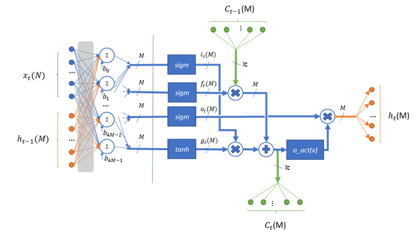

.. _lstm:

Long Short Term Memory (LSTM) Cell
~~~~~~~~~~~~~~~~~~~~~~~~~~~~~~~~~~

..

This kernel implements the default non-peephole implementation of
Long short term memory cell.

The LSTM operation is described by the following formulas:

.. math::

   {i_{t} = sigm\left( x_{t}W_{\text{xi}} + h_{t - 1}W_{\text{hi}} + b_{i} \right)} 
..
  
.. math::
  
   {f_{t} = sigm\left( x_{t}W_{\text{xf}} + h_{t - 1}W_{\text{hf}} + b_{f} \right)}
..   

.. math::

   {o_{t} = sigm\left( x_{t}W_{\text{xo}} + h_{t - 1}W_{\text{ho}} + b_{o} \right)}
..

.. math::
   
   {g_{t} = tanh\left( x_{t}W_{\text{xg}} + h_{t - 1}W_{\text{hg}} + b_{g} \right)}
..

.. math::
   
   {C_{t} = g_{t}*i_{t} + f_{t}*C_{t - 1}}
..

.. math::
   
   {h_{t} = o_{t}\ *o\_ act(C_{t})}

..
   
where:
  - :math:`\ x_{t}\ ` - frame :math:`t` in input sequence.
  - :math:`\ h_{t}\ ` - cell output for frame :math:`t` in input sequence.
  - :math:`i_{t}\ ,\ f_{t}\ ,\ o_{t}` – input, forget, output gate subtensors for frame :math:`t` in input sequence.
  - :math:`\ g_{t}\ ` - new cell candidates for frame :math:`t` in input sequence.
  - :math:`\ C_{t}\ ` - cell state for frame :math:`t` in input sequence.
  - :math:`W_{**}\ ` - weights for appropriate input subtensor.
  - :math:`b_{*}\ ` - bias for appropriate input subtensor.
  - :math:`\ sigm\ , tanh\ ` - sigmoid and hyperbolic tangent activation functions.
  - :math:`o\_ act` – output activation function.

In the figure, *N* is the total number of elements in the input and M
is the total number of elements in the cell output.

This kernel supports the following output activation types (:math:`o\_ act`
in the formula above):

-  **Hyperbolic tangent**: Uses TanH kernel of the library (see :ref:`tanh`).
   Number of fractional bits for output tensor is the same as that for
   tensors processed by TanH activation.

-  **Sigmoid**: Uses Sigmoid kernel of the library (see :ref:`sigmoid`). Number
   of fractional bits for output tensor is the same as that for tensors
   processed by Sigmoid activation.

-  **No Activation**: Passes data without modification.

..

This kernel takes 7 tensors including input, weights, cell,
intermediate tensor from configuration structure and others (for full
list, see :ref:`api_lstm`). It modifies only output tensor, cell tensors, and
intermediate tensor in processing.

Weights for cell is a single three-dimensional tensor of shape [4, *M*,
*M+N*]. Ensure that bias is of shape [4, M]. It represents stacking
of all weights sub tensors into one tensor in order (I, g, f, o):

.. math::

   \begin{bmatrix}
   \begin{matrix}
   W_{\text{xi}} \\
   W_{\text{xg}} \\
   \begin{matrix}
   W_{\text{xf}} \\
   W_{\text{xo}} \\
   \end{matrix} \\
   \end{matrix} & \begin{matrix}
   W_{\text{hi}} \\
   W_{\text{hg}} \\
   \begin{matrix}
   W_{\text{hf}} \\
   W_{\text{ho}} \\
   \end{matrix} \\
   \end{matrix} \\
   \end{bmatrix}\text{ }

..
   
The first [M, *M+N]* sub-tensor of weights is applied to the input
gate, the second, to new cell candidates, the third, to the forget
gate, and the last, to the output gate.

.. note::
   -  Ensure that you keep the same 
      order of sub-tensors for bias 
      tensor. For more information  
      about kernel parameters       
      requirements, see :ref:`cond_lstm`.      
                                    
   -  Ensure that the configuration 
      structure (see :ref:`fn_conf_lstm`) also 
      contains the pointer to       
      tensor, which is used by      
      kernel as intermediate result 
      tensor. This kernel modifies the   
      memory pointed to by the data,
      shape, rank, element type, and 
      element parameters fields of  
      this tensor.                  
                                    
   -  Ensure that the capacity of   
      the intermediate tensor is    
      enough to store M*4 elements  
      of input tensor type          

..

This kernel supports three modes of input processing:

-  **One-to-one**

   -  Processes the input tensor as a single input frame

   -  Ignores the shape of input tensor, and considers only the total
      number of elements

   -  Performs single step to produce one-dimensional output tensor of
      shape [*M*]

   -  Updates the memory pointed to by cell tensor, but does not modify
      the tensor’s fields

-  **Batch-to-batch**

   -  Processes the input tensor as a sequence of frames to produce a
      sequence of outputs of the same size

   -  Considers first dimension of input tensor as sequence size
      (``batch_size``), and considers only the total number of elements
      for the rest of the dimensions

   -  Performs ``batch_size`` steps to produce two-dimensional output tensor
      of shape [``batch_size``, *M*]

   -  Updates the memory pointed to by cell tensor, but does not modify
      the tensor’s fields

-  **Batch-to-last**

   -  Processes the input tensor as a sequence of frames to produce a
      single (last in the sequence) output

   -  Same as Batch-to-batch mode except that outputs tensor has a shape
      [*M*] whose values are the same as those for the last sub
      tensor in batch-to-batch mode

..

Dense part of calculations uses intermediate tensor for result, and
consequently output and previous output tensors might use the same
memory if it is acceptable to rewrite previous output data.

.. note::
   Ensure that you allocate memory
   for the rest of the tensors    
   (including intermediate results
   tensor) without overlaps.      
   Otherwise the behavior is      
   undefined.                     

.. _fn_conf_lstm:

Function Configuration Structure
^^^^^^^^^^^^^^^^^^^^^^^^^^^^^^^^

Definition
''''''''''
.. code:: c                     
                                
 typedef struct {               
    mli_rnn_mode mode;          
    mli_rnn_out_activation  act;
    mli_tensor *ir_tsr;         
  } mli_rnn_cell_cfg;           
..

Parameters
''''''''''

.. table:: Function Configuration Parameters
   :widths: 20,80

   +-----------------------+-----------------------+
   |  **Fields**           |  **Description**      |
   +=======================+=======================+
   | ``mode``              | LSTM processing mode  |
   |                       | (enumeration)         |
   +-----------------------+-----------------------+
   | ``act``               | LSTM output           |
   |                       | activation type       |
   |                       | (enumeration)         |
   +-----------------------+-----------------------+
   | ``ir_tsr``            | Pointer to tensor for |
   |                       | holding intermediate  |
   |                       | results. Tensor must  |
   |                       | contain valid data    |
   |                       | and capacity fields.  |
   |                       | Field is modified by  |
   |                       | kernels.              |
   +-----------------------+-----------------------+
 
.. _mli_rnn_mode_val_desc:
.. table:: mli_rnn_mode Values Description
   :widths: 20,80
   
   +-----------------------------------+-----------------------------------+
   | **Value**                         | **Field Description**             |
   +===================================+===================================+
   | ``RNN_ONE_TO_ONE``                | Process input tensor as a single  |
   |                                   | input frame .                     |
   +-----------------------------------+-----------------------------------+
   | ``RNN_BATCH_TO_BATCH``            | Process input tensor as a         |
   |                                   | sequence of frames to produce a   |
   |                                   | sequence of outputs .             |
   +-----------------------------------+-----------------------------------+
   | ``RNN_BATCH_TO_LAST``             | Process input tensor as a         |
   |                                   | sequence of frames to produce     |
   |                                   | single (last) outputs.            |
   +-----------------------------------+-----------------------------------+

.. _mli_rnn_out_activation_val_desc:
.. table:: mli_rnn_out_activation Values Description
   :widths: 20,100
   
   +-----------------------------------+-----------------------------------+
   | **Value**                         | **Field Description**             |
   +===================================+===================================+
   | ``RNN_ACT_TANH``                  | Hyperbolic tangent activation     |
   |                                   | function.                         |
   +-----------------------------------+-----------------------------------+
   | ``RNN_ACT_SIGM``                  | Logistic (sigmoid) activation     |
   |                                   | function.                         |
   +-----------------------------------+-----------------------------------+
   | ``RNN_ACT_NONE``                  | No activation.                    |
   +-----------------------------------+-----------------------------------+

\

.. _api_lstm:

Kernel Interface
^^^^^^^^^^^^^^^^

Prototype
'''''''''

.. code:: c                               
                                          
 mli_status mli_krn_lstm_cell_<data_type> 
 [_specialization](                       
    const mli_tensor *in,                 
    const mli_tensor *prev_out,           
    const mli_tensor *weights,            
    const mli_tensor *bias,               
    const mli_lstm_cell_cfg *cfg,         
    mli_tensor *cell,                     
    mli_tensor *out);                     

Parameters
''''''''''

.. table:: Kernel Interface Parameters
   :widths: 20,130

   +-----------------------+-----------------------+
   |  **Parameters**       | **Description**       |
   +=======================+=======================+
   | ``in``                | [IN] Pointer to input |
   |                       | tensor                |
   +-----------------------+-----------------------+
   | ``prev_out``          | [IN] Pointer to       |
   |                       | previous output       |
   |                       | tensor                |
   +-----------------------+-----------------------+
   | ``weights``           | [IN] Pointer to       |
   |                       | weights tensor        |
   +-----------------------+-----------------------+
   | ``bias``              | [IN] Pointer to       |
   |                       | biases tensor         |
   +-----------------------+-----------------------+
   | ``cfg``               | [IN/OUT] Pointer to   |
   |                       | configuration         |
   |                       | structure             |
   +-----------------------+-----------------------+
   | ``cell``              | [IN/OUT] Pointer to   |
   |                       | cell state tensor     |
   +-----------------------+-----------------------+
   | ``out``               | [OUT] Pointer to      |
   |                       | output tensor         |
   +-----------------------+-----------------------+

.. _kernel-specializations-1:

Kernel Specializations
^^^^^^^^^^^^^^^^^^^^^^

.. table:: Non-Specialized Functions
   :widths: 50,80
   
   +-----------------------------------+-----------------------------------+
   | **Function**                      | **Description**                   |
   +===================================+===================================+
   | ``mli_krn_lstm_cell_fx8``         | General function; 8bit FX         |
   |                                   | elements;                         |
   +-----------------------------------+-----------------------------------+
   | ``mli_krn_lstm_cell_fx16``        | General function; 16bit FX        |
   |                                   | elements;                         |
   +-----------------------------------+-----------------------------------+
   | ``mli_krn_lstm_cell_fx8w16d``     | General function; FX tensors      |
   |                                   | (8bit weights and biases, 16-bit  |
   |                                   | input, state, cell, output and    |
   |                                   | intermediate data);               |
   +-----------------------------------+-----------------------------------+

.. _cond_lstm:

Conditions for Applying the Kernel
^^^^^^^^^^^^^^^^^^^^^^^^^^^^^^^^^^

Ensure that you satisfy the following conditions before applying the
function:

-  Input, weights, bias, cell, and Previous output tensors must be valid
   (see :ref:`mli_tns_struct`)

-  Weights must be a three-dimensional tensor of shape [4, M, N+M]

-  Bias must be a two-dimensional tensor of shape [4, M]

-  Cell must be a one-dimensional tensor of shape [M]

-  Previous output must be a one-dimensional tensor of shape [M]

-  Element type of weights and bias tensors must be the same

-  Element type of input, cell, and previous output tensors must be the
   same

-  The input tensor has the following restrictions:

   -  For ``RNN_ONE_TO_ONE`` mode, the total number of input and previous
      output tensors (N+M) must be equal to the last dimension of the
      weights tensor

   -  For ``RNN_BATCH_TO_BATCH`` and ``RNN_BATCH_TO_LAST`` modes, the first
      dimension of input reflects sequence length (batch size) while for
      the rest of the input tensor dimensions, the same rules apply as
      for ``RNN_ONE_TO_ONE`` mode

-  The output tensor has the following restrictions:

   -  It must contain a valid pointer to a buffer with sufficient
      capacity for storing the result (to keep M elements for
      ``RNN_ONE_TO_ONE`` and ``RNN_BATCH_TO_LAST`` modes, and M*batch_size
      elements for ``RNN_BATCH_TO_BATCH`` mode)

   -  If ``RNN_ACT_NONE`` is used as output activation, output tensor must
      contain a valid element parameter (``el_params.fx.frac_bits``) and it
      must be the same as for the previous output tensor

   -  Before processing, the output tensor does not have to contain a
      valid shape, rank, or element type. These are filled by function
      according to inputs and kernel processing mode. If ``RNN_ACT_NONE`` is
      not used, the same applies to element parameter
      (``el_params.fx.frac_bits``)

   -  Before processing, intermediate result tensor in config structure
      must contain a valid pointer to a buffer with sufficient capacity
      for the result (4*M elements of input type)