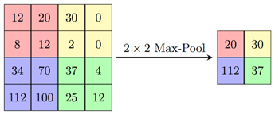

.. _max_pool:

MAX-Pooling
~~~~~~~~~~~

   
..   

This kernel implements a max-pooling operation. Input and output
feature maps are three-dimensional tensors even if one of dimensions is
equal to 1. Input shape includes height, width, and depth (channels)
according to used data layout (see :ref:`data_muldim`).

Each channel of input is considered independently, which means that
the analysis fragment includes only neighbor points of the channel.
For each fragment of input tensor, maximum value is being defined as
the output value. The fragment size is defined in configuration
structure according to kernel_width and kernel_height values.

Splitting input on fragments is performed according to stride and
padding parameters. This logic is similar to convolution 2D operation
(see :ref:`cnvl_2d`).

.. important::
   TensorFlow and Caffe differ significantly when processing padding and 
   borders of pooling kernels. To be compatible with both, MLI follows TF 
   approach. For more information, see :ref:`avg_pool`.

..

For more information on calculations, see the pooling part of
`TensorFlow–Neural Network details`_.
   
.. _TensorFlow–Neural Network details: https://www.tensorflow.org/versions/r1.11/api_guides/python/nn   

.. caution::
   Ensure that input and output
   tensors do not point to     
   overlapped memory regions,  
   otherwise the behavior is   
   undefined.                   

.. _fn_conf_str_max_pool:

Function Configuration Structure
^^^^^^^^^^^^^^^^^^^^^^^^^^^^^^^^

Definition
''''''''''

.. code:: c                 
                            
 typedef struct {           
    uint8_t kernel_width;   
    uint8_t kernel_height;  
    uint8_t stride_width;   
    uint8_t stride_height;  
    uint8_t padding_left;   
    uint8_t padding_right;  
    uint8_t padding_top;    
    uint8_t padding_bottom; 
 } mli_pool_cfg;            

..

Parameters
''''''''''

.. table:: Function Configuration Parameters 
   :widths: 20,130
   
   +-----------------------+-----------------------+
   |  **Fields**           |  **Description**      |
   +-----------------------+-----------------------+
   | ``kernel_width``      | Width of frame for    |
   |                       | applying function     |
   +-----------------------+-----------------------+
   | ``kernel_height``     | Height of frame for   |
   |                       | applying function     |
   +-----------------------+-----------------------+
   | ``stride_width``      | Stride of frame       |
   |                       | across a width        |
   |                       | dimension of input    |
   +-----------------------+-----------------------+
   | ``stride_height``     | Stride of frame       |
   |                       | across a height       |
   |                       | dimension of input    |
   +-----------------------+-----------------------+
   | ``padding_left``      | Number of points      |
   |                       | implicitly added to   |
   |                       | the left side of      |
   |                       | input (width          |
   |                       | dimension)            |
   +-----------------------+-----------------------+
   | ``padding_right``     | Number of points      |
   |                       | implicitly added to   |
   |                       | the right side of     |
   |                       | input (width          |
   |                       | dimension)            |
   +-----------------------+-----------------------+
   | ``padding_top``       | Number of points      |
   |                       | implicitly added to   |
   |                       | the upper side of     |
   |                       | input (height         |
   |                       | dimension)            |
   +-----------------------+-----------------------+
   | ``padding_bottom``    | Number of points      |
   |                       | implicitly added to   |
   |                       | the bottom side of    |
   |                       | input (height         |
   |                       | dimension)            |
   +-----------------------+-----------------------+

.. _general-api-2:

Kernel Interface
^^^^^^^^^^^^^^^^

Interface of all specializations are the same and described as follows.
   
Prototype
'''''''''   

.. code:: c                           
                                      
 mli_status mli_krn_maxpool_<layout>_ 
 <data_type>[_specialization](        
    const mli_tensor  *in,            
    const mli_pool_cfg *cfg,             
    mli_tensor *out);                    

..

Parameters
''''''''''

.. table:: Kernel Interface Parameters
   :widths: 20,130
   
   +-----------------------+-----------------------+
   |   **Parameters**      | **Description**       |
   +-----------------------+-----------------------+
   |                       |                       |
   |                       |                       |
   | ``in``                | [IN] Pointer to input |
   |                       | feature map tensor    |
   +-----------------------+-----------------------+
   | ``cfg``               | [IN] Pointer to       |
   |                       | pooling parameters    |
   |                       | structure             |
   +-----------------------+-----------------------+
   | ``out``               | [OUT] Pointer to      |
   |                       | output feature map    |
   |                       | tensor. Result is     |
   |                       | stored here           |
   +-----------------------+-----------------------+

..

.. _function-specializations-2:

Function Specializations
^^^^^^^^^^^^^^^^^^^^^^^^

There are about 150 specializations for the primitive assuming
various combinations of inputs parameters. Max-pooling primitive
follows the naming convention for specializations (see :ref:`spec_fns`
). The header file :code:`mli_krn_maxpool_spec_api.h` contains
declarations of all specializations for the primitive.

:ref:`Non_Spl_func_MAX_pool` contains only non-specialized functions.

.. _Non_Spl_func_MAX_pool:
.. table:: Non-Specialized Functions
   :widths: 20,130
   
   +--------------------------------------+-----------------------------------+
   | **Function**                         | **Description**                   |
   +======================================+===================================+
   ||                          *CHW Data Layout*                              |
   +--------------------------------------+-----------------------------------+
   | ``mli_krn_maxpool_chw_fx8``          | Switching function (see           |
   |                                      | :ref:`fns`); 8bit FX tensors;     |
   |                                      | Delegates calculations to         |
   |                                      | suitable specialization or        |
   |                                      | generic function.                 |
   +--------------------------------------+-----------------------------------+
   | ``mli_krn_maxpool_chw_fx16``         | Switching function (see           |
   |                                      | :ref:`fns`); 16bit FX tensors;    |
   |                                      | Delegates calculations to         |
   |                                      | suitable specialization or        |
   |                                      | generic function.                 |
   +--------------------------------------+-----------------------------------+
   | ``mli_krn_maxpool_chw_fx8_generic``  | General function; 8bit FX tensors |
   +--------------------------------------+-----------------------------------+
   | ``mli_krn_maxpool_chw_fx16_generic`` | General function; 16bit FX        |
   |                                      | tensors                           |
   +--------------------------------------+-----------------------------------+
   | ``mli_krn_maxpool_chw_fx8_[spec]``   | Specialization function*; 8bit FX |
   |                                      | tensors                           |
   +--------------------------------------+-----------------------------------+
   | ``mli_krn_maxpool_chw_fx16_[spec]``  | Specialization function*; 16bit   |
   |                                      | FX tensors                        |
   +--------------------------------------+-----------------------------------+
   ||                          *HWC Data Layout*                              |
   +--------------------------------------+-----------------------------------+
   | ``mli_krn_maxpool_hwc_fx8``          | General function; 8bit FX         |
   |                                      | elements;                         |
   +--------------------------------------+-----------------------------------+
   | ``mli_krn_maxpool_hwc_fx16``         | General function; 16bit FX        |
   |                                      | elements;                         |
   +--------------------------------------+-----------------------------------+

.. attention:: 
   \*For specialization functions,  
   backward compatibility between 
   different releases cannot be     
   guaranteed. The general functions
   call the available               
   specializations when possible.   

.. _conditions-for-applying-the-function-2:

Conditions for Applying the Function
^^^^^^^^^^^^^^^^^^^^^^^^^^^^^^^^^^^^

Ensure that you satisfy the following conditions before applying the
function:

-  Input tensor must be valid (see :ref:`mli_tns_struct`) and its rank
   must be 3.

-  Before processing, the output tensor must contain a valid pointer to
   a buffer with sufficient capacity (enough for storing the result).

-  While processing, the following output tensor parameters are filled
   by functions:

   -  Shape (new shape is calculated according to input tensor shape,
      stride, and padding parameters).
   
   -  Rank, element type, and element parameters (these are copied from
      the input tensor).
   
   -  ``padding_top`` and ``padding_bottom`` parameters must be in range of [0,
      ``kernel_height``).
   
   -  ``padding_left`` and ``padding_right`` parameters must be in range of [0,
      ``kernel_width``).
   
   -  ``stride_width`` and ``stride_height`` parameters must be >= 1.
   
   -  ``kernel_width`` and ``kernel_height`` must be less than or equal to the
      corresponding dimensions of input tensor.

-  Additional restrictions for specialized functions are described in
   section :ref:`spec_fns`.