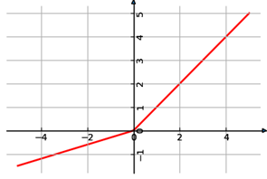

.. _leaky_relu:

Leaky ReLU
~~~~~~~~~~

   
..   

This kernel represents Rectified Linear unit (ReLU) with a negative
slope. It transforms each element of input tensor according to next
formula:

	:math:`f(x) = \left\{ \begin{matrix}
	x\ \ if\ x \geq 0 \\
	\alpha*x\ \ if\ x < 0 \\
	\end{matrix} \right.\ `

where:
  - :math:`\ x\ ` - input value.
  - :math:`\alpha\ ` - Coefficient of the negative slope.

The function accepts two tensors as input and one as output. The
first input tensor is the feature map to be processed by the kernel,
and the second input is a tensor-scalar (see :ref:`mli_tns_struct`)
that holds a negative slope coefficient.

Ensure that the scalar tensor holds element of the same type as that
of input tensor (it does not need to have the same format, that is,
the number of fractional bits).

This kernel outputs tensor of the same shape, type and format as input
tensor.

This kernel can perform in-place computation: output and input might point
to exactly the same memory (the same starting address). It might affect
performance for some platforms.

.. _function-configuration-structure-8:

Function Configuration Structure
^^^^^^^^^^^^^^^^^^^^^^^^^^^^^^^^

No configuration structure for leaky ReLU kernel is required. All
necessary information is provided by tensors.

.. _api-4:

Kernel Interface
^^^^^^^^^^^^^^^^

Prototype
'''''''''

.. code:: c                                
                                           
   mli_status mli_krn_leaky_relu_<data_type>(
      const mli_tensor *in,                     
      const mli_tensor *slope_coeff,            
      mli_tensor *out);                         
..

Parameters
''''''''''
.. table:: Kernel Interface Parameters
   :widths: 20,130

   +-----------------------+-----------------------+
   | **Parameters**        | **Description**       |
   +=======================+=======================+
   |                       |                       |
   | ``in``                | [IN] Pointer to input |
   |                       | tensor                |
   +-----------------------+-----------------------+
   |                       |                       |
   | ``slope_coeff``       | [IN] Pointer to       |
   |                       | tensor-scalar with    |
   |                       | negative slope        |
   |                       | coefficient           |
   +-----------------------+-----------------------+
   |                       |                       |
   | ``out``               | [OUT] Pointer to      |
   |                       | output tensor for     |
   |                       | storing the result    |
   +-----------------------+-----------------------+

.. _kernel-specializations-4:

Kernel Specializations
^^^^^^^^^^^^^^^^^^^^^^

.. table:: Non-Specialized Functions
   :widths: 20,130
   
   +-----------------------------+--------------------------------------+
   | **Function**                | **Description**                      |
   +=============================+======================================+
   | ``mli_krn_leaky_relu_fx8``  | General function; 8bit FX elements;  |
   +-----------------------------+--------------------------------------+
   | ``mli_krn_leaky_relu_fx16`` | General function; 16bit FX elements; |
   +-----------------------------+--------------------------------------+
..
	
.. _conditions-for-applying-the-kernel-4:

Conditions for Applying the Kernel
^^^^^^^^^^^^^^^^^^^^^^^^^^^^^^^^^^

Ensure that you satisfy the following conditions before applying the
function:

-  Input and slope coefficient tensors must be valid (see :ref:`mli_tns_struct`
   ).

-  Slope coefficient must be a valid tensor-scalar (see :ref:`mli_tns_struct`).

-  Before processing, the output tensor must contain a valid pointer to
   a buffer with sufficient capacity for storing the result.
   Other fields are filled by the kernel (shape, rank and element
   specific parameters).