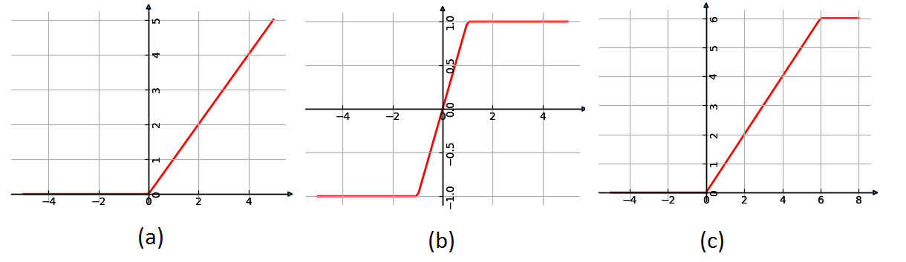

.. _relu:

ReLU
~~~~

   
..

   This kernel represents Rectified Linear unit (ReLU). It performs
   various types of the rectifier activation on input. The following
   types of ReLU supported by this type of kernel:

1) General ReLU: :math:`f(x) = MAX\left( x,\ \ 0 \right)`

2) ReLU1:
      :math:`f(x) = MAX\left( \text{MIN}\left( x,\ 1 \right),\  - 1 \right)`

3) ReLU6:
      :math:`f(x) = MAX\left( \text{MIN}\left( x,\ 6 \right),\ 0 \right)`

..

   Where:

   *x* - input value.

   Kernel outputs a tensor of the same shape, type and format as input
   tensor.

   Kernel might perform in-place computation: output and input might point
   to exactly the same memory (the same starting address). It might affect
   performance for some platforms.

.. _function-configuration-structure-7:

Function Configuration Structure
^^^^^^^^^^^^^^^^^^^^^^^^^^^^^^^^

+-----------------------+-----------------------+-----------------------+
|                       |.. code:: c                                    |
|                       |                                               |
| **Definition**        | typedef struct {                              |
|                       |    mli_relu_type type;                        |
|                       |  } mli_relu_cfg;                              |
|                       |                                               |
+-----------------------+-----------------------+-----------------------+
|                       |                       |                       |
| **Fields**            | ``Type``              | Type of ReLu          |
|                       |                       | that is applied       |
|                       |                       | (enumeration)         |
+-----------------------+-----------------------+-----------------------+

\

.. _mli_relu_val_desc:
.. table:: mli_relu_type Values Description
   :widths: auto   

   +-----------------------------------+-----------------------------------+
   | **Value**                         | **Field Description**             |
   +===================================+===================================+
   | ``MLI_RELU_NONE``                 | No ReLU. Identity function.       |
   +-----------------------------------+-----------------------------------+
   | ``MLI_RELU_GEN``                  | General Rectifier function with   |
   |                                   | output range from 0 to value      |
   |                                   | maximum inclusively.              |
   +-----------------------------------+-----------------------------------+
   | ``MLI_RELU_1``                    | ReLU1 Rectifier function with     |
   |                                   | output range [-1, 1]              |
   +-----------------------------------+-----------------------------------+
   | ``MLI_RELU_6``                    | ReLU6 Rectifier function with     |
   |                                   | output range [0, 6]               |
   +-----------------------------------+-----------------------------------+

.. _api-3:

API
^^^

+-----------------------+-----------------------+-----------------------+
|                       |.. code:: c                                    |
|                       |                                               |
| **Prototype**         | mli_status mli_krn_relu_<data_type>(          |
|                       |    const mli_tensor *in,                      |
|                       |    const mli_relu_cfg *cfg,                   |
|                       |    mli_tensor *out);                          |
|                       |                                               |
+-----------------------+-----------------------+-----------------------+
|                       |                       |                       |
| **Parameters**        | ``in``                | [IN] Pointer to input |
|                       |                       | tensor                |
+-----------------------+-----------------------+-----------------------+
|                       |                       |                       |
|                       | ``cfg``               | [IN] Pointer to       |
|                       |                       | function parameters   |
|                       |                       | structure             |
+-----------------------+-----------------------+-----------------------+
|                       |                       |                       |
|                       | ``out``               | [OUT] Pointer to      |
|                       |                       | output tensor for     |
|                       |                       | storing the result    |
+-----------------------+-----------------------+-----------------------+

.. _kernel-specializations-3:

Kernel Specializations
^^^^^^^^^^^^^^^^^^^^^^

+-----------------------+--------------------------------------+
| **Function**          | **Description**                      |
+=======================+======================================+
| ``mli_krn_relu_fx8``  | General function; 8bit FX elements;  |
+-----------------------+--------------------------------------+
| ``mli_krn_relu_fx16`` | General function; 16bit FX elements; |
+-----------------------+--------------------------------------+

.. _conditions-for-applying-the-kernel-3:

Conditions for Applying the Kernel
^^^^^^^^^^^^^^^^^^^^^^^^^^^^^^^^^^

   Ensure that you satisfy the following conditions before applying the
   function:

   -  Input, tensors must be valid (see :ref:`mli_tns_struct`).

   -  Before processing, the output tensor must contain valid pointer to a
      buffer with sufficient capacity enough for storing the result.
      Other fields are filled by kernel (shape, rank and element
      specific parameters)