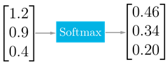

.. _softmax:

SoftMax
~~~~~~~

..

   This kernel performs activation function which is a generalization of
   the logistic function that transform input vector according to next
   formula:

.. math::

   y_{i} = \frac{e^{x_{i}}}{\sum_{j}^{}e^{x_{j}}}
   
..

   *x* :sub:`i` - i :sub:`th` value in input tensor.

   :math:`y_{i}\ ` - :math:`i_{\text{th}}` value in output tensor.

..
   
   The SoftMax function is often used as the final layer of a neural
   network-based classifier and its output can be considered as a
   probability distribution over N different possible outcomes. The sum
   of all the entries across the last dimension tends to 1.

   For FX data type, the range of output values is [0, 1), and all
   non-sign bits are fractional. Output holds 7 fractional bits for fx8
   type, and 15 fractional bits for fx16 type. For this reason, the
   maximum representable value of SoftMax is equivalent to 0.9921875 in
   case of fx8 output tensor, and to 0.999969482421875 in case of fx16
   (not 1.0).

   The kernel outputs tensor of the same shape and type as input.

   The kernel can perform in-place computation: output and input can
   point to exactly the same memory (the same starting address).

.. _function-configuration-structure-11:

Function Configuration Structure
^^^^^^^^^^^^^^^^^^^^^^^^^^^^^^^^

   No configuration structure for softmax kernel is required. All
   necessary information is provided by tensors.

.. _api-7:

API
^^^

+-----------------------+-----------------------+-----------------------+
|                       |.. code:: c                                    |
|                       |                                               |
| **Prototype**         | mli_status mli_krn_softmax_<data_type>(       |
|                       |    const mli_tensor *in,                      |
|                       |    mli_tensor *out);                          |
|                       |                                               |
+-----------------------+-----------------------+-----------------------+
|                       |                       |                       |
| **Parameters**        | ``in``                | [IN] Pointer to input |
|                       |                       | tensor                |
+-----------------------+-----------------------+-----------------------+
|                       |                       |                       |
|                       | ``out``               | [OUT] Pointer to      |
|                       |                       | output tensor. Result |
|                       |                       | is stored here        |
+-----------------------+-----------------------+-----------------------+

.. _kernel-specializations-7:

Kernel Specializations
^^^^^^^^^^^^^^^^^^^^^^

+--------------------------+--------------------------------------+
| **Function**             | **Description**                      |
+==========================+======================================+
| ``mli_krn_softmax_fx8``  | General function; 8bit FX elements;  |
+--------------------------+--------------------------------------+
| ``mli_krn_softmax_fx16`` | General function; 16bit FX elements; |
+--------------------------+--------------------------------------+

.. _conditions-for-applying-the-kernel-7:

Conditions for Applying the Kernel
^^^^^^^^^^^^^^^^^^^^^^^^^^^^^^^^^^

   Ensure that you satisfy the following conditions before applying the
   function:

   -  Input, tensors must be valid (see :ref:`mli_tns_struct`).

   -  Before processing, the output tensor must contain a valid pointer to
      a buffer, with sufficient capacity enough for storing the result.
      Other fields are filled by kernel (shape, rank and element
      specific parameters)