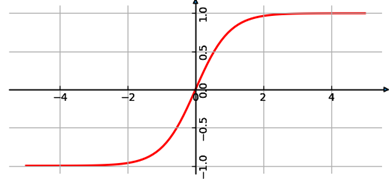

.. _tanh:

TanH
~~~~

   
..

This kernel performs hyperbolic tangent activation function on input
tensor element-wise and stores the result to the output tensor:

.. math::

   f(x) = \frac{e^{x} - e^{- x}}{e^{x} + e^{- x}}
..

where: :math:`\ x\ ` - input value.

The range of function is (-1, 1), and kernel outputs a completely
fractional tensor of the same shape and type as input. Output holds 7
fractional bits for ``fx8`` type, and 15 fractional bits for ``fx16`` type.
For this reason, the maximum representable value of TanH is
equivalent to 0.9921875 in case of ``fx8`` output tensor, and to
0.999969482421875 in case of ``fx16`` (not 1.0).

The kernel can perform in-place computation: output and input can
point to exactly the same memory (the same starting address).

.. _function-configuration-structure-10:

Function Configuration Structure
^^^^^^^^^^^^^^^^^^^^^^^^^^^^^^^^

No configuration structure for tanh kernel is required. All
necessary information is provided by tensors.

.. _api-6:

Kernel Interface
^^^^^^^^^^^^^^^^

Prototype
'''''''''

.. code:: c                          
                                     
 mli_status mli_krn_tanh_<data_type>(
    const mli_tensor *in,            
    mli_tensor *out);                
..

Parameters
''''''''''

.. table:: Kernel Interface Parameters
   :widths: 20,130
   
   +-----------------------+-----------------------+
   | **Parameters**        | **Description**       |
   +=======================+=======================+
   |                       |                       |
   | ``in``                | [IN] Pointer to input |
   |                       | tensor                |
   +-----------------------+-----------------------+
   |                       |                       |
   | ``out``               | [OUT] Pointer to      |
   |                       | output tensor for     |
   |                       | storing the result    |
   +-----------------------+-----------------------+

.. _kernel-specializations-6:

Kernel Specializations
^^^^^^^^^^^^^^^^^^^^^^

.. table:: Non-Specialized Functions
   :widths: 20,130
   
   +-----------------------+--------------------------------------+
   | **Function**          | **Description**                      |
   +=======================+======================================+
   | ``mli_krn_sigm_fx8``  | General function; 8bit FX elements;  |
   +-----------------------+--------------------------------------+
   | ``mli_krn_sigm_fx16`` | General function; 16bit FX elements; |
   +-----------------------+--------------------------------------+

.. _conditions-for-applying-the-kernel-6:

Conditions for Applying the Kernel
^^^^^^^^^^^^^^^^^^^^^^^^^^^^^^^^^^

Ensure that you satisfy the following conditions before applying the
function:

-  Input tensors must be valid (see :ref:`mli_tns_struct`).

-  Before processing, the output tensor must contain a valid pointer to
   a buffer with sufficient capacity for storing the result.
   Other fields are filled by kernel (shape, rank and element
   specific parameters).