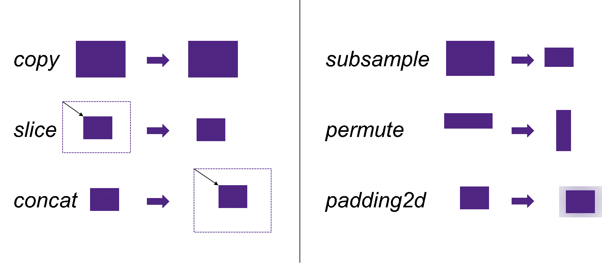
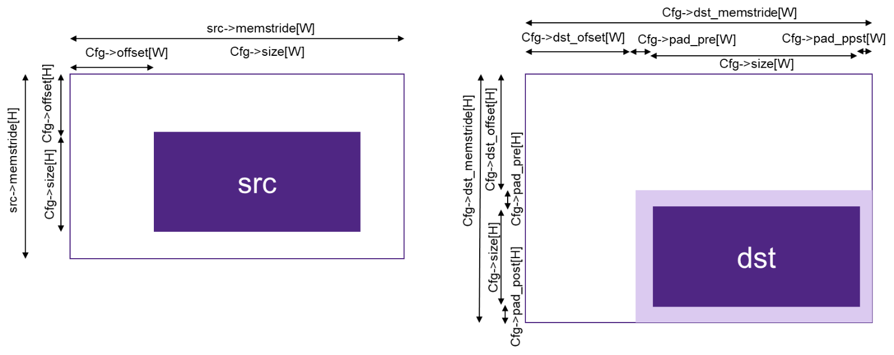

.. _data_mvmt:

Data Movement
=============

In the case of most processors and accelerators, achieving optimal performance 
requires that input data to the kernels resides in “close” local memories on 
those processors (eg: CCMs).  Meanwhile, the total amount of data that needs to 
be operated on is usually bigger than the sizes of those CCMs, so you must copy 
data into CCMs for processing.  

The functions in the Data Movement Group assist with this moving (copying) of data.  
For further efficiency, the APIs allow data to be manipulated in several ways, thus 
allowing copy+manipulation to happen at the same time, rather than in two separate steps.

The supported transformations are described here and shown pictorially in Figure  
:ref:`f_data_mv_grp_t`

 - Copy – a simple copy operation only
 
 - Slicing – select a subset of a larger tensor and copy it to the destination tensor
 
 - Concatenation – copy the content of a smaller tensor into a larger one
 
 - Subsample – Reduce the size of the output by taking only every nth element from the source
 
 - Permute – Reorder dimensions of a tensor
 
 - Padding – Adds zeros around the specified dimensions

 More than one transform can be combined into a single operation.

.. _f_data_mv_grp_t:  

   Data Movement Group Transformations
..

The data movement APIs support both synchronous (blocking) and asynchronous (non-blocking) APIs. 
The caller can choose which is most suitable for their use-case.  The functions are described 
in the following sections.   

Synchronous Copy from Source Tensor to Destination Tensor
---------------------------------------------------------

This function performs a blocking data copy from the source tensor to the destination tensor 
according to the settings in the configuration structure, mli_mov_cfg. Any combination of the 
previously mentioned transformations can be specified. The destination tensor needs to contain a valid 
pointer to a large enough buffer. The size of this buffer needs to be specified in the capacity 
field of the destination tensor. The other fields of the destination tensor is filled by the 
move function. The function returns after the complete data transfer completes.

For platforms with a DMA, the synchronous move function internally acquires one or more DMA 
channels from a pool of resources. The application needs to use the function mli_mov_set_num_dma_ch 
to assign a set of channels to MLI for its exclusive use. See section 5.4. for a detailed 
explanation.

.. code::

   mli_status mli_mov_tensor_sync (
      mli_tensor *src,
      mli_mov_cfg *cfg,
      mli_tensor *dst);
..
   
   where ``mli_mov_cfg`` is defined as:

.. code::

   typedef struct {
       uint32_t offset[MLI_MAX_RANK];
       uint32_t size[MLI_MAX_RANK];
       uint32_t sub_sample_step[MLI_MAX_RANK];
       uint32_t dst_offset[MLI_MAX_RANK];
       int32¬_t dst_mem_stride[MLI_MAX_RANK];
       uint8_t perm_dim[MLI_MAX_RANK];
       uint8_t padding_pre[MLI_MAX_RANK];
       uint8_t padding_post[MLI_MAX_RANK];
   } mli_mov_cfg_t;
..

The fields of this structure are described in Table :ref:`t_mli_mov_cfg_desc`. All the fields are arrays with 
size ``MLI_MAX_RANK``.Fields are stored in order starting from the one with the largest stride between the data 
portions. For example, for a matrix A(rows, columns), shape[0] = rows, shape[1] = columns. The data move function 
doesn’t change the number of dimensions. The rank of the source tensor determines the amount of values that are 
read from the array. The other values are don’t care.

The size of the array is defined by ``MLI_MAX_RANK``.

.. _t_mli_mov_cfg_desc: 
.. table:: mli_mov_cfg Structure Field Description
   :align: center
   :widths: auto 
   
   +---------------------+----------------+---------------------------------------------------------------------+
   | **Field Name**      | **Type**       | **Description**                                                     |
   +=====================+================+=====================================================================+
   | ``offset``          | ``uint32_t[]`` | Start coordinate in the source tensor. Values must be smaller       |
   |                     |                | than the shape of the source tensor.                                |
   +---------------------+----------------+---------------------------------------------------------------------+
   |                     |                | Size of the copy in elements per dimension.                         |
   | ``size``            | ``uint32_t[]`` | Restrictions:  Size[d] + offset[d] <= src->shape[d]                 |
   |                     |                | If size=0 is provided, the size is computed from the input          |
   |                     |                | size and the cfg parameters.                                        |
   +---------------------+----------------+---------------------------------------------------------------------+
   |                     |                | Subsample factor for each dimension. Default value is 1, which      |
   | ``sub_sample_step`` | ``uint32_t[]`` | means no subsampling. Eg: A subsample step of 3 means that every    |
   |                     |                | third sample is copied to the output.                               |
   +---------------------+----------------+---------------------------------------------------------------------+
   | ``dst_offset``      | ``uint32_t[]`` | Start coordinate in the destination tensor. Values must be          |
   |                     |                | smaller than the memstride of the destination tensor.               |
   +---------------------+----------------+---------------------------------------------------------------------+
   |                     |                | Distance in elements to the next dimension in the destination       |
   | ``dst_mem_stride``  | ``int32_t[]``  | tensor. If zero, it is computed from input tensor and cfg           |
   |                     |                | parameters.                                                         |
   +---------------------+----------------+---------------------------------------------------------------------+
   | ``perm_dim``        | ``uint8_t[]``  | Array to specify reordering of dimensions. For example, to convert  |
   |                     |                | from CHW layout to HWC layout this array would be {1, 2, 0}.        |
   +---------------------+----------------+---------------------------------------------------------------------+
   | ``padding_pre``     | ``uint8_t[]``  | Number of padded samples before the data for each dimension.        |
   |                     |                | Padded samples is set to zero.                                      |
   +---------------------+----------------+---------------------------------------------------------------------+
   | ``padding_post``    | ``uint8_t[]``  | Number of padded samples after the data for each dimension.         |
   |                     |                | Padded samples is set to zero.                                      |
   +---------------------+----------------+---------------------------------------------------------------------+ 
..

The function must comply to the following conditions:

 - ``src`` tensor must be valid.
 
  - ``dst`` tensor must contain a valid pointer to a buffer with sufficient capacity 
    (that is, the total amount of elements in input tensor). 
    Other fields are filled by the kernel (shape, rank and element-specific parameters).

 - Buffers of ``src`` and ``dst`` tensors must point to different, non-overlapped memory regions
 
For **sa8_sa8_sa32** versions of kernel, in addition to the preceding conditions: 

 - In case of per-axis quantization, ``el_params`` field of ``dst`` tensor are filled by kernel 
   using ``src`` quantization parameters. The following fields are affected:

    - ``dst.el_params.sa.zero_point.mem.pi16`` and related capacity field

    - ``dst.el_params.sa.scale.mem.pi16`` and related capacity field

    - ``dst.el_params.sa.scale_frac_bits.mem.pi8`` and related capacity field

   Depending on the state of the above pointers, the following options are available:

    - If the pointers are initialized with ``nullptr``, then corresponding fields from ``in`` tensor 
      are copied to ``dst`` tensor. No copy of quantization parameters itself is performed.

    - If the pointers and capacity fields are initialized with corresponding fields from ``in`` tensor 
      then no action is applied.

    - If pointers and capacity fields are initialized with pre-allocated memory and its capacity,
      then a copy of quantization parameters itself is performed. Capacity of allocated memory must 
      be big enough to keep related data from input tensor.

   All of the fields must be initialized in a consistent way, using only one of the above options.

Depending on the debug level (see section :ref:`err_codes`) this function performs a parameter 
check and return the result as an ``mli_status`` code as described in section :ref:`kernl_sp_conf`.

Figure :ref:`f_mli_mov_cfg_params` shows the relationship between some of the parameters of the ``mli_mov_cfg``
structure. 

.. _f_mli_mov_cfg_params:  

   Relationship of mli_mov_cfg Structure Parameters
   
Helper Functions for Data Move Config Struct
--------------------------------------------

When only one of the transformations is needed during the copy, several helper functions can be used to fill 
the config struct. These are described in Table 20. The arguments to the function are copied into the cfg 
struct while the remaining parameters are set to their default values.  In the case of multiple transformations, 
there is a generic helper function available or the user can manually fill the cfg struct parameters.  Note that 
the mli_mov_cfg structure is described in detail in Table 19.

.. table:: Description of Helper Functions for Data Move Config Struct
   :align: center
   :widths: auto 
   
   +------------------------------------+---------------------------------------------------------------------+ 
   | **Function Name**                  | **Description**                                                     |
   +====================================+=====================================================================+
   | .. code::                          |                                                                     |
   |                                    |                                                                     | 
   |    mli_mov_cfg_for_copy(           | Fills the cfg struct with the values needed for a full tensor       |
   |      mli_mov_cfg_t *cfg)           | copy and sets all the other fields to a neutral value.              |
   | ..                                 |                                                                     |
   |                                    | - **cfg**: pointer to the config structure that is filled           |
   +------------------------------------+---------------------------------------------------------------------+ 
   | .. code::                          |                                                                     |
   |                                    |                                                                     |
   |    mli_mov_cfg_for_slice (         | Fill the cfg struct with the values needed for copying a            |
   |      mli_mov_cfg_t  *cfg,          | slice from the source to the destination tensor.                    |
   |      int* offsets                  |                                                                     |   
   |      int* sizes,                   | - **cfg**: pointer to the config structure that is filled           |
   |      int* dst_mem_stride);         |                                                                     |   
   | ..                                 | - **offsets**: Start coordinate in the source tensor. Values must   |
   |                                    |   be smaller than the shape of the source tensor.                   |
   |                                    |                                                                     |   
   |                                    | - **sizes**: Size of the copy in elements per dimension.            |
   |                                    |                                                                     |   
   |                                    | - **dst_mem_stride**: Distance in elements to the next dimension in | 
   |                                    |   the destination tensor.                                           |
   +------------------------------------+---------------------------------------------------------------------+ 
   | .. code::                          |                                                                     |
   |                                    |                                                                     |
   |    mli_mov_cfg_for_concat(         | Fill the cfg struct with the values needed for copying a complete   |
   |      mli_mov_cfg_t *cfg,           | tensor into a larger tensor at a specified position.                |
   |      int* dst_offsets,             |                                                                     |
   |      int* dst_mem_stride);         | - **cfg**: pointer to the config structure that is filled           |
   | ..                                 |                                                                     |
   |                                    | - **dst_offsets**: Start coordinate in the destination tensor.      |
   |                                    |   Values must be smaller than the memstride of the destination      |
   |                                    |   tensor.                                                           |   
   |                                    |                                                                     |   
   |                                    | - **dst_mem_strides**: Distance in elements to the next dimension   |
   |                                    |   in the destination tensor.                                        |
   +------------------------------------+---------------------------------------------------------------------+
   | .. code::                          |                                                                     |
   |                                    |                                                                     |
   |    mli_mov_cfg_for_subsample(      | Fill the cfg struct with the values needed for subsampling a        |
   |      mli_mov_cfg_t *cfg,           | tensor.                                                             |
   |      int* sub_sample_step,         |                                                                     |
   |      int* dst_mem_stride);         | - **cfg**: pointer to the config structure that is filled           |
   | ..                                 |                                                                     |
   |                                    | - **subsample_step**: Subsample factor for each dimension. Default  |
   |                                    |   value is 1, which means no subsampling                            |
   |                                    |                                                                     |   
   |                                    | - **dst_mem_strides**: Distance in elements to the next dimension   |
   |                                    |   in the destination tensor                                         |
   +------------------------------------+---------------------------------------------------------------------+  
   | .. code::                          |                                                                     |
   |                                    |                                                                     |
   |    mli_mov_cfg_for_permute(        |                                                                     |
   |      mli_mov_cfg_t *cfg,           | Fill the cfg struct with the values needed for reordering the order |
   |      uint8_t* perm_dim);           | of the dimensions in a tensor.                                      |
   |                                    |                                                                     |   
   | ..                                 | - **cfg**: pointer to the config structure that is filled           |
   |                                    |                                                                     |   
   |                                    | - **perm_dim**: Array to specify reordering of dimensions, see      |
   |                                    |   :ref:`t_mli_mov_cfg_desc` for details                             |
   +------------------------------------+---------------------------------------------------------------------+  
   | .. code::                          |                                                                     |
   |                                    |                                                                     |
   |    mli_mov_cfg_for_padding2d_chw(  | Fill the cfg struct with the values needed to add zero padding to a |
   |      mli_mov_cfg_t *cfg,           | tensor in CHW layout.                                               |
   |      uint8_t padleft,              |                                                                     |  
   |      uint8_t padright,             | - **cfg**: pointer to the config structure that is filled           |
   |      uint8_t padtop,               |                                                                     |
   |      uint8_t padbot,               | - **padleft**: number of zero samples to be added to the left of    |
   |      int* dst_mem_stride);         |   the W dimension                                                   |
   | ..                                 |                                                                     |   
   |                                    | - **padright**: number of zero samples to be added to the right of  |
   |                                    |   the W dimension                                                   |
   |                                    |                                                                     |   
   |                                    | - **padtop**: number of zero samples to be added at the top of the  |
   |                                    |   H dimension                                                       |
   |                                    |                                                                     |   
   |                                    | - **padbot**: number of zero samples to be added at the bottom of   |
   |                                    |   the H dimension                                                   |
   |                                    |                                                                     |   
   |                                    | - **dst_mem_strides**: Distance in elements to the next dimension   |
   |                                    |   in the destination tensor                                         |
   +------------------------------------+---------------------------------------------------------------------+   
   | .. code::                          |                                                                     |
   |                                    |                                                                     |
   |    mli_mov_cfg_for_padding2d_hwc(  | Fill the cfg struct with the values needed to add zero padding to a |
   |      mli_mov_cfg_t *cfg,           | tensor in HWC layout.                                               |
   |      uint8_t padleft,              |                                                                     |    
   |      uint8_t padright,             | - **cfg**: pointer to the config structure that is filled           |
   |      uint8_t padtop,               |                                                                     |    
   |      uint8_t padbot,               | - **padleft**: number of zero samples to be added to the left of    |
   |      int* dst_mem_stride);         |   the W dimension                                                   |
   | ..                                 |                                                                     |    
   |                                    | - **padright**: number of zero samples to be added to the right of  |
   |                                    |   the W dimension                                                   |
   |                                    |                                                                     |    
   |                                    | - **padtop**: number of zero samples to be added at the top of the  |
   |                                    |   H dimension                                                       |
   |                                    |                                                                     |    
   |                                    | - **padbot**: number of zero samples to be added at the bottom of   |
   |                                    |   the H dimension                                                   |
   |                                    |                                                                     |    
   |                                    | - **dst_mem_strides**: Distance in elements to the next dimension   |
   |                                    |   in the destination tensor                                         |
   +------------------------------------+---------------------------------------------------------------------+
   | .. code::                          |                                                                     |
   |                                    |                                                                     |   
   |    mli_mov_cfg_all(                | This function fills the cfg struct with the values provided as      |
   |      mli_mov_cfg_t *cfg,           | function arguments. It is recommended the applications use this     |
   |      int* offsets,                 | function instead of direct structure access, so that application    |
   |      int* sizes,                   | code doesn’t have to change in case the structure format ever does. |
   |      int* subsample_step,          |                                                                     |  
   |      int* dst_offsets,             | - **cfg**: pointer to the config structure that is filled           |
   |      int* dst_mem_strides,         |                                                                     |   
   |      uint8_t* perm_dim,            | - **offsets**: Start coordinate in the source tensor. Values must   |
   |      uint8_t* pad_pre,             |   be smaller than the shape of the source tensor.                   |
   |      uint8_t* pad_post);           |                                                                     |   
   | ..                                 | - **sizes**: Size of the copy in elements per dimension.            |
   |                                    |                                                                     |   
   |                                    | - **subsample_step**: Subsample factor for each dimension. Default  |
   |                                    |   value is 1, which means no subsampling                            |   
   |                                    |                                                                     |   
   |                                    | - **dst_offsets**: Start coordinate in the destination tensor.      |
   |                                    |   Values must be smaller than the memstride of the destination      |
   |                                    |   tensor.                                                           |
   |                                    |                                                                     |   
   |                                    | - **dst_mem_strides**: Distance in elements to the next dimension   |
   |                                    |   in the destination tensor                                         |
   |                                    |                                                                     |   
   |                                    | - **perm_dim**: Array to specify reordering of dimensions.          |
   |                                    |                                                                     |   
   |                                    | - **pad_pre**: Number of padded samples before the data for each    |
   |                                    |   dimension. Padded samples are set to zero.                        |
   |                                    |                                                                     |   
   |                                    | - **pad_post**: Number of padded samples after the data for each    |
   |                                    |   dimension. Padded samples are set to zero                         |
   +------------------------------------+---------------------------------------------------------------------+ 
..   

Asynchronous Data Move Functions
--------------------------------

Certain implementations might choose to perform other processing while the move 
operations are in progress.  This is especially helpful for systems that use a 
DMA to move the data. The asynchronous API can be used in that case.  

The operation is divided into three separate steps, each with corresponding APIs:

 1. Preparation (DMA programming)
 
 2. Start processing (trigger DMA)
 
 3. Done notification (DMA finished, data is ready) – via either callback or polling 
 
Between steps 2 & 3, the application can do other processing
These APIs use the mli_mov_handle_t type. The definition of this type is private to 
the implementation, but to avoid dynamic memory allocation the definition is put in 
the public header file. This way the caller can allocate it on the stack.

.. code::

   (ADD IN typedef for mli_move_handle_t)
..

Preparation
~~~~~~~~~~~

The ``mli_mov_prepare`` function is called first to set up the transfer.  Implementations 
would typically do target-specific DMA programming here.  Table :ref:`t_mli_mov_prep` 
describes the parameters of this function.

.. code::

   mli_status
   mli_mov_prepare(mli_mov_handle_t* h, mli_tensor* src, mli_mov_cfg_t* cfg, mli_tensor* dst);
..

.. _t_mli_mov_prep:
.. table:: mli_mov_prepare Parameters
   :align: center
   :widths: auto
   
   +--------------------------+-------------------------------------------------------------+
   | **Parameter Name**       | **Description**                                             |
   +==========================+=============================================================+
   | ``mli_mov_handle_t* h``  | Pointer to a handle obtained by ``mli_mov_acquire_handle``. |
   |                          | See :ref:`dma_res_mgmt` for details                         |
   +--------------------------+-------------------------------------------------------------+
   | ``mli_tensor* src``      | Pointer to Source tensor                                    |
   +--------------------------+-------------------------------------------------------------+
   | ``mli_mov_cfg_t* cfg``   | Pointer to a cfg structure (see                             |
   |                          | :ref:`t_mli_mov_cfg_desc` for details)                      |
   +--------------------------+-------------------------------------------------------------+
   | ``mli_tensor* dst``      | Pointer to Destination tensor                               |
   +--------------------------+-------------------------------------------------------------+   
..

Depending on the debug level (see section :ref:`err_codes`) this function performs a parameter 
check and return the result as an ``mli_status`` code as described in section :ref:`kernl_sp_conf`.

Start Processing
~~~~~~~~~~~~~~~~

The ``mli_mov_start`` function is called to begin the previously-setup transfer. Table 
:ref:`t_mli_mov_start` describes the parameters of this function.  If this function 
is called without first calling ``mli_mov_prepare`` for a given handle, the DMA might 
be triggered with an old configuration leading to undefined behavior. In a debug build, 
an assert is triggered. 

.. code::

   mli_status
   mli_mov_start(mli_mov_handle_t* h, mli_tensor* src, mli_mov_cfg_t* cfg, mli_tensor* dst);
..

.. _t_mli_mov_start:
.. table:: mli_mov_start Parameters
   :align: center
   :widths: auto
   
   +--------------------------+--------------------------------------------+
   | **Parameter Name**       | **Description**                            |
   +==========================+============================================+
   | ``mli_mov_handle_t* h``  | Pointer to handle used when calling        |
   |                          | associated ``mli_move_prepare``            |
   +--------------------------+--------------------------------------------+
   | ``mli_tensor* src``      | Pointer to Source tensor                   |
   +--------------------------+--------------------------------------------+
   | ``mli_mov_cfg_t* cfg``   | Pointer to a cfg structure (see            |
   |                          | :ref:`t_mli_mov_cfg_desc` for description) |
   +--------------------------+--------------------------------------------+
   | ``mli_tensor* dst``      | Pointer to Destination tensor              |
   +--------------------------+--------------------------------------------+
..

Depending on the debug level (see section :ref:`err_codes`) this function performs a parameter 
check and return the result as an ``mli_status`` code as described in section :ref:`kernl_sp_conf`.

Done Notification – Callback
~~~~~~~~~~~~~~~~~~~~~~~~~~~~

You can register a callback function which is called after the data move is finished. A callback 
is registered with the following function.  The parameters are described in Table :ref:`t_mli_mov_regcb`.

.. code::

  mli_status
  mli_mov_registercallback(mli_mov_handle_t* h, void (*cb)(int32_t), int32_t cookie);
..

.. _t_mli_mov_regcb:
.. table:: mli_mov_registercallback Parameters
   :align: center
   :widths: auto
   
   +--------------------------+-------------------------------------------------+
   | **Parameter Name**       | **Description**                                 |
   +==========================+=================================================+
   | ``mli_mov_handle_t* h``  | Pointer to handle used when calling associated  |
   |                          | ``mli_move_prepare``                            |
   +--------------------------+-------------------------------------------------+
   | ``void (*cb)(int32_t)``  | Pointer to user-supplied callback function      |
   +--------------------------+-------------------------------------------------+
   | ``int32_t cookie``       | Parameter passed to callback function           |
   +--------------------------+-------------------------------------------------+
..

.. note::: 

   If a callback is used, ``mli_mov_registercallback`` must be called before ``mli_mov_start`` 
   to avoid race conditions. A race condition would arise if the DMA transaction is faster  
   than the registration of the callback and would cause the callback to not be called.
..

If a callback function has been registered, this callback is called after the DMA 
transaction completes, and the value of cookie is passed in as an argument.

Done Notification – Polling
~~~~~~~~~~~~~~~~~~~~~~~~~~~

You can also simply poll for the completion of the DMA transaction using this function:

.. code::

   bool
   mli_mov_isdone(mli_mov_handle_t* h);
..
   
This function takes a pointer to the handle used for ``mli_mov_prepare`` and returns:

 - True – if the transaction is complete
 
 - False – if the transaction is still in progress

You can also wait for the DMA to compete using the following function: 

.. code::

   mli_status
   mli_mov_wait(mli_mov_handle_t* h);
..

This function takes a pointer to the handle used for mli_mov_prepare and returns 
after the transaction completes or in case of an error.

Restrictions for source and destination tensors
~~~~~~~~~~~~~~~~~~~~~~~~~~~~~~~~~~~~~~~~~~~~~~~~

``src`` and ``dst`` tensors for all functions of asynchronous data move set must comply to the following conditions:

  - ``src`` tensor must be valid.

  - ``dst`` tensor must contain a valid pointer to a buffer with sufficient capacity 
    (that is, the total amount of elements in input tensor). 
    Other fields are filled by the kernel (shape, rank and element-specific parameters).

 - Buffers of ``src`` and ``dst`` tensors must point to different, non-overlapped memory regions
 
For **sa8_sa8_sa32** versions of kernel, in addition to the preceding conditions: 

 - In case of per-axis quantization, ``el_params`` field of ``dst`` tensor are filled by kernel 
   using ``src`` quantization parameters. The following fields are affected:

    - ``dst.el_params.sa.zero_point.mem.pi16`` and related capacity field

    - ``dst.el_params.sa.scale.mem.pi16`` and related capacity field

    - ``dst.el_params.sa.scale_frac_bits.mem.pi8`` and related capacity field

   Depending on the state of the above pointers, the following options are available:

    - If the pointers are initialized with ``nullptr``, then corresponding fields from ``in`` tensor 
      are copied to ``dst`` tensor. No copy of quantization parameters itself is performed.

    - If the pointers and capacity fields are initialized with corresponding fields from ``in`` tensor 
      then no action is applied.

    - If pointers and capacity fields are initialized with pre-allocated memory and its capacity,
      then a copy of quantization parameters itself is performed. Capacity of allocated memory must 
      be big enough to keep related data from input tensor.

   All of the fields must be initialized in a consistent way, using only one of the above options.

.. _dma_res_mgmt:

DMA Resource Management
-----------------------

The MLI API permits multiple mov transactions occurring in parallel, if the particular 
implementation has a DMA engine which supports multiple channels.  MLI also assumes 
that other parts of the system might want to access the DMA Engine at the same time and 
relies on the application/caller to provide it with a pool of available DMA channels 
that can be used exclusively by MLI. The following functions are used for this purpose:

The ``mli_mov_set_num_dma_ch`` is called once at initialization time to assign a set of 
channels to MLI for its exclusive use.   

.. code::

   mli_status
   mli_mov_set_num_dma_ch(int ch_offset, int num_ch);
..
   
 - ``ch_offset`` – first channel number that MLI should use
 
 - ``num_ch`` – max number of channels that MLI can use
 
The asynchronous move functions require a handle to a DMA resource. This handle can be 
obtained from the pool using mli_mov_acquire_handle:

.. code::

   mli_status
   mli_mov_acquire_handle(int num_ch, mli_mov_handle_t* h);
..
   
 - ``num_ch`` – Number of DMA channels required for this move. Certain complex transactions 
   might be more efficient when multiple channels can be used. By default, a value of 1 
   should be used.
	
 - ``mli_mov_handle_t* h`` – Pointer to a handle type which is initialized by this function
 
After the move has completed, the resources should be released back to the pool to avoid 
exhaustion:

.. code::

   mli_status
   mli_mov_release_handle(mli_mov_handle_t* h);
..
   
 - ``mli_mov_handle_t* h`` – Pointer to a handle type which is used by the now-completed 
   transaction
	
Depending on the debug level (see section :ref:`err_codes`) this function performs a parameter 
check and return the result as an ``mli_status`` code as described in section :ref:`kernl_sp_conf`.

.. note:: 
  
   The synchronous move function mli_mov_tensor_sync manages these DMA operations internally.
..
