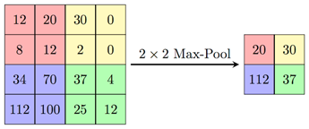

Pooling Group
-------------

   Pooling group of functions provides operations which divides input
   features on sub frames and applies a function with scalar output on
   each of them. Generally, this results in a feature map with reduced,
   withheld or emphasized key features.

MAX-Pooling
~~~~~~~~~~~

.. _f_max_pooling:

   Max Pooling Operation Example

   This kernel implements a max-pooling operation. Input and output
   feature maps are three-dimensional tensor even if one of dimensions is
   equal to 1. Input shape includes height, width, and depth (channels)
   according to used data layout (see :ref:`data_muldim`).

   Each channel of input is considered independently, which means that
   the analysis fragment includes only neighbor points of the channel.
   For each fragment of input tensor, maximum value is being defined as
   the output value. The fragment size is defined in configuration
   structure according to kernel_width and kernel_height values.

   Splitting input on fragments is performed according to stride and
   padding parameters. This logic is similar to convolution 2D operation
   (see :ref:`cnvl_2d`).

.. note::
   TensorFlow and Caffe differ significantly when processing padding and 
   borders of pooling kernels. To be compatible with both, MLI follows TF 
   approach. See :ref:`avg_pool` for more information.

..

   For more information on calculations, see the pooling part of [3] of :ref:`refs`.

.. note::
   Ensure that input and output
   tensors do not point to     
   overlapped memory regions,  
   otherwise the behavior is   
   undefined.                   

.. _fn_conf_str_max_pool:

Function Configuration Structure
^^^^^^^^^^^^^^^^^^^^^^^^^^^^^^^^

+-----------------------+-----------------------+-----------------------+
|                       |.. code:: c                                    |
|                       |                                               |
| **Definition**        | typedef struct {                              |
|                       |    uint8_t kernel_width;                      |
|                       |    uint8_t kernel_height;                     |
|                       |    uint8_t stride_width;                      |
|                       |    uint8_t stride_height;                     |
|                       |    uint8_t padding_left;                      |
|                       |    uint8_t padding_right;                     |
|                       |    uint8_t padding_top;                       |
|                       |    uint8_t padding_bottom;                    |
|                       | } mli_pool_cfg;                               |
|                       |                                               |
+-----------------------+-----------------------+-----------------------+
| **Fields**            | ``kernel_width``      | Width of frame for    |
|                       |                       | function applying     |
+-----------------------+-----------------------+-----------------------+
|                       | ``kernel_height``     | Height of frame for   |
|                       |                       | function applying     |
+-----------------------+-----------------------+-----------------------+
|                       | ``stride_width``      | Stride of frame       |
|                       |                       | across a width        |
|                       |                       | dimension of input    |
+-----------------------+-----------------------+-----------------------+
|                       | ``stride_height``     | Stride of frame       |
|                       |                       | across a height       |
|                       |                       | dimension of input    |
+-----------------------+-----------------------+-----------------------+
|                       | ``padding_left``      | Number of points      |
|                       |                       | implicitly added to   |
|                       |                       | the left side of      |
|                       |                       | input (width          |
|                       |                       | dimension).           |
+-----------------------+-----------------------+-----------------------+
|                       | ``padding_right``     | Number of points      |
|                       |                       | implicitly added to   |
|                       |                       | the right side of     |
|                       |                       | input (width          |
|                       |                       | dimension).           |
+-----------------------+-----------------------+-----------------------+
|                       | ``padding_top``       | Number of points      |
|                       |                       | implicitly added to   |
|                       |                       | the upper side of     |
|                       |                       | input (height         |
|                       |                       | dimension).           |
+-----------------------+-----------------------+-----------------------+
|                       | ``padding_bottom``    | Number of points      |
|                       |                       | implicitly added to   |
|                       |                       | the bottom side of    |
|                       |                       | input (height         |
|                       |                       | dimension).           |
+-----------------------+-----------------------+-----------------------+

.. _general-api-2:

General API
^^^^^^^^^^^

   Interface of all specializations are the same and described as follows.
   
   \

+-----------------------+-----------------------+-----------------------+
|                       |.. code:: c                                    |
|                       |                                               |
| **Prototype**         | mli_status mli_krn_maxpool_<layout>_          |
|                       | <data_type>[_specialization](                 |
|                       |    const mli_tensor  *in,                     |
|                       |    const mli_pool_cfg *cfg,                   |
|                       |    mli_tensor *out);                          |
|                       |                                               |
+-----------------------+-----------------------+-----------------------+
|                       |                       |                       |
|                       |                       |                       |
| **Parameters**        | ``in``                | [IN] Pointer to input |
|                       |                       | feature map tensor    |
+-----------------------+-----------------------+-----------------------+
|                       | ``cfg``               | [IN] Pointer to       |
|                       |                       | pooling parameters    |
|                       |                       | structure             |
+-----------------------+-----------------------+-----------------------+
|                       | ``out``               | [OUT] Pointer to      |
|                       |                       | output feature map    |
|                       |                       | tensor. Result is     |
|                       |                       | stored here           |
+-----------------------+-----------------------+-----------------------+

..

.. _function-specializations-2:

Function Specializations
^^^^^^^^^^^^^^^^^^^^^^^^

   There are about 150 specializations for the primitive assuming
   various combinations of inputs parameters. Max-pooling primitive
   follows the naming convention for specializations (see :ref:`spec_fns`
   ). The header file :code:`mli_krn_maxpool_spec_api.h` contains
   declarations of all specializations for the primitive.

   :numref:`Non_Spl_func_MAX_pool` contains only non-specialized functions.

.. _Non_Spl_func_MAX_pool:
.. table:: Non-Specialized Functions for MAX-Pooling
   :widths: auto   
   
   +--------------------------------------+-----------------------------------+
   | **Function**                         | **Description**                   |
   +======================================+===================================+
   | *CHW Data Layout*                                                        |
   +--------------------------------------+-----------------------------------+
   | ``mli_krn_maxpool_chw_fx8``          | Switching function (see           |
   |                                      | :ref:`fns`); 8bit FX tensors;     |
   |                                      | Delegates calculations to         |
   |                                      | suitable specialization or        |
   |                                      | generic function.                 |
   +--------------------------------------+-----------------------------------+
   | ``mli_krn_maxpool_chw_fx16``         | Switching function (see           |
   |                                      | :ref:`fns`); 16bit FX tensors;    |
   |                                      | Delegates calculations to         |
   |                                      | suitable specialization or        |
   |                                      | generic function.                 |
   +--------------------------------------+-----------------------------------+
   | ``mli_krn_maxpool_chw_fx8_generic``  | General function; 8bit FX tensors |
   +--------------------------------------+-----------------------------------+
   | ``mli_krn_maxpool_chw_fx16_generic`` | General function; 16bit FX        |
   |                                      | tensors                           |
   +--------------------------------------+-----------------------------------+
   | ``mli_krn_maxpool_chw_fx8_[spec]``   | Specialization function*; 8bit FX |
   |                                      | tensors                           |
   +--------------------------------------+-----------------------------------+
   | ``mli_krn_maxpool_chw_fx16_[spec]``  | Specialization function*; 16bit   |
   |                                      | FX tensors                        |
   +--------------------------------------+-----------------------------------+
   | *HWC Data Layout*                    |                                   |
   +--------------------------------------+-----------------------------------+
   | ``mli_krn_maxpool_hwc_fx8``          | General function; 8bit FX         |
   |                                      | elements;                         |
   +--------------------------------------+-----------------------------------+
   | ``mli_krn_maxpool_hwc_fx16``         | General function; 16bit FX        |
   |                                      | elements;                         |
   +--------------------------------------+-----------------------------------+

.. note:: 
   \*For specialization functions,  
   backward compatibility between 
   different releases cannot be     
   guaranteed. The General functions
   call the available               
   specializations when possible.   

.. _conditions-for-applying-the-function-2:

Conditions for Applying the Function
^^^^^^^^^^^^^^^^^^^^^^^^^^^^^^^^^^^^

   Ensure that you satisfy the following conditions before applying the
   function:

   -  Input tensor must be valid (see :ref:`mli_tns_struct`) and its rank
      must be 3.

   -  Before processing, the output tensor must contain a valid pointer to
      a buffer with sufficient capacity (enough for storing the result).

   -  While processing, the following output tensor parameters are filled
      by functions:

   -  Shape (new shape is calculated according to input tensor shape,
      stride, and padding parameters)

   -  Rank, element type and element parameters (these are copied from
      the input tensor)

   -  ``padding_top`` and ``padding_bottom`` parameters must be in range of [0,
      ``kernel_height``).

   -  ``padding_left`` and ``padding_right`` parameters must be in range of [0,
      ``kernel_width``).

   -  ``stride_width`` and ``stride_height`` parameters must be >= 1.

   -  ``kernel_width`` and ``kernel_height`` must be less than or equal to the
      corresponding dimensions of input tensor.

   -  Additional restrictions for specialized functions are described in
      section :ref:`spec_fns`.

.. _avg_pool:
   
Average-Pooling
~~~~~~~~~~~~~~~

.. _f_average_pooling:
.. figure:: ../pic/images/image109.png

   Average Pooling Operation Example

   This kernel implements an average-pooling operation. Input and output
   feature maps are three-dimensional tensor even if one of dimensions is
   equal to 1. Input shape includes height, width, and depth (channels)
   according to used data layout (see :ref:`data_muldim`).

   Each channel of input is considered independently, which means that
   analysis window includes only neighbor points of the channel. For
   each window, average value over all considered ponts is defined as
   the output value. Window size (or kernel size for convolution layers)
   is defined in configuration structure according to kernel_width and
   kernel_height values. Window positioning and moving is performed
   according to stride and padding parameters. This logic is similar to
   convolution 2D operation (see :ref:`cnvl_2d`).

   Pooling primitive does not analyze an area smaller than kernel size
   (typically, this occurs on the right and bottom borders). In this
   case, ensure that you set padding parameters explicitly in order not
   to miss valid border values. Padded values do not participate in the
   calculations. So when a fragment includes padded values, only the
   existing values are analyzed (this also implies reducing of divider
   for average calculation).

   To use padding in Caffe, use Padding2D (see :ref:`pad_2d`) primitive
   before pooling.

.. note::
   Ensure that input and output
   tensors do not point to     
   overlapped memory regions,  
   otherwise the behavior is   
   undefined.                   
   
.. _function-configuration-structure-3:

Function Configuration Structure
^^^^^^^^^^^^^^^^^^^^^^^^^^^^^^^^

   Average pooling kernel shares configuration structure with max
   pooling kernel. For more information see :ref:`fn_conf_str_max_pool`
   section of Max-pooling function.

.. _general-api-3:

General API
^^^^^^^^^^^

   Interface of all specializations are the same and described as follows.
   
\  

+-----------------------+-----------------------+-----------------------+
|                       |.. code:: c                                    |
|                       |                                               |
| **Prototype**         | mli_status  mli_krn_avepool_<layout>_         |
|                       | <data_type>[_specialization](                 |
|                       |    const mli_tensor *in,                      |
|                       |    const mli_avepool_cfg *cfg,                |
|                       |    mli_tensor *out);                          |
|                       |                                               |
+-----------------------+-----------------------+-----------------------+
|                       |                       |                       |
|                       |                       |                       |
| **Parameters**        |  ``in``               | [IN] Pointer to input |
|                       |                       | feature map tensor    |
+-----------------------+-----------------------+-----------------------+
|                       |                       |                       |
|                       |                       |                       |
|                       |  ``cfg``              | [IN] Pointer to       |
|                       |                       | pooling parameters    |
|                       |                       | structure             |
+-----------------------+-----------------------+-----------------------+
|                       |                       |                       |
|                       |                       |                       |
|                       |  ``out``              | [OUT] Pointer to      |
|                       |                       | output feature map    |
|                       |                       | tensor. Result is     |
|                       |                       | stored here           |
+-----------------------+-----------------------+-----------------------+

.. _function-specializations-3:

Function Specializations
^^^^^^^^^^^^^^^^^^^^^^^^

   There are about 80 specializations for the primitive assuming various
   combinations of inputs parameters. Average-pooling primitive follows
   the naming convention for specializations (see :ref:`spec_fns`
   ). The header file ``mli_krn_avepool_spec_api.h`` contains
   declarations of all specializations for the primitive.

   :numref:`Non-spec_funct_avg_pool` contains only non-specialized functions.

.. _Non-spec_funct_avg_pool:
.. table:: Non-specialized Functions for Average-Pooling
   :widths: auto   

   +-------------------------------------+-----------------------------------+
   | **Function**                        | **Description**                   |
   +=====================================+===================================+
   | *CHW Data Layout*                                                       |
   +-------------------------------------+-----------------------------------+
   | ``mli_krn_avepool_chw_fx8``         | Switching function (see           |
   |                                     | :ref:`fns`); 8bit FX tensors;     |
   |                                     | Delegates calculations to         |
   |                                     | suitable specialization or        |
   |                                     | generic function.                 |
   +-------------------------------------+-----------------------------------+
   | ``mli_krn_avepool_chw_fx16``        | Switching function (see           |
   |                                     | :ref:`fns`); 16bit FX tensors;    |
   |                                     | Delegates calculations to         |
   |                                     | suitable specialization or        |
   |                                     | generic function.                 |
   +-------------------------------------+-----------------------------------+
   | ``mli_krn_avepool_chw_fx8_generic`` | General function; 8bit FX tensors |
   +-------------------------------------+-----------------------------------+
   | ``mli_krn_avepool_chw_fx16_generic``| General function; 16bit FX        |
   |                                     | tensors                           |
   +-------------------------------------+-----------------------------------+
   | ``mli_krn_avepool_chw_fx8_[spec]``  | Specialization function*; 8bit FX |
   |                                     | tensors                           |
   +-------------------------------------+-----------------------------------+
   | ``mli_krn_avepool_chw_fx16_[spec]`` | Specialization function*; 16bit   |
   |                                     | FX tensors                        |
   +-------------------------------------+-----------------------------------+
   | *HWC Data Layout*                                                       |
   +-------------------------------------+-----------------------------------+
   | ``mli_krn_avepool_hwc_fx8``         | General function; 8bit FX         |
   |                                     | elements;                         |
   +-------------------------------------+-----------------------------------+
   | ``mli_krn_avepool_hwc_fx16``        | General function; 16bit FX        |
   |                                     | elements;                         |
   +-------------------------------------+-----------------------------------+

.. note::
   \*For specialization          
   functions, backward          
   compatibility between        
   different releases cannot be  
   guaranteed. The General       
   functions call the available  
   specializations when possible.

.. _conditions-for-applying-the-function-3:

Conditions for Applying the Function
^^^^^^^^^^^^^^^^^^^^^^^^^^^^^^^^^^^^

   Ensure that you satisfy the following conditions before applying the
   function:

   -  Input tensor must be valid (see :ref:`mli_tns_struct`) and its rank
      must be 3.

   -  Before processing, the output tensor must contain a valid pointer to
      a buffer with sufficient capacity (enough for result storing).

   -  While processing, the following output tensor parameters are filled
      by functions:

   -  Shape (new shape is calculated according to input tensor shape,
      stride and padding parameters)

   -  Rank, element type, and element parameters (are copied from the input
      tensor)

   -  ``padding_top`` and ``padding_bottom`` parameters must be in range of [0,
      kernel_height).

   -  ``padding_left`` and ``padding_right`` parameters must be in range of [0,
      kernel_width).

   -  ``stride_width`` and ``stride_height`` parameters must be >= 1.

   -  ``kernel_width`` and ``kernel_height`` must be less than or equal to the
      corresponding dimensions of input tensor.

   -  Additional restrictions for specialized functions are described in
      section :ref:`spec_fns`.
