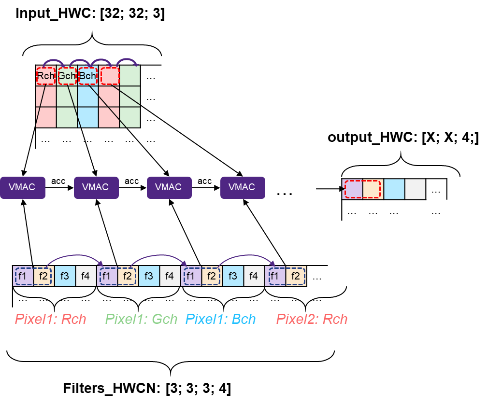
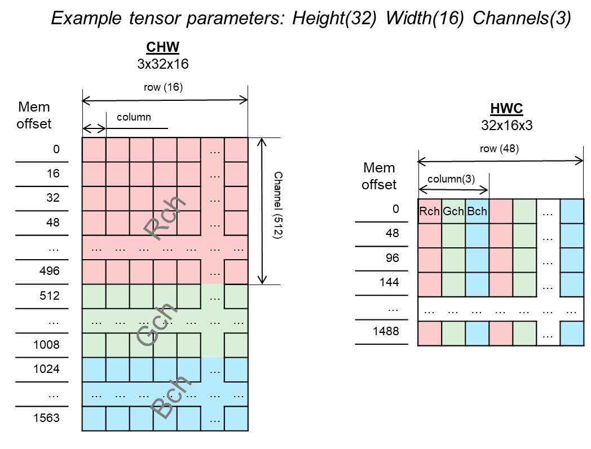

Data Layouts
------------

Data Layouts define how the multi-dimension tensor data is physically arranged in memory. 
This is relevant in the context of kernels related to convolution and pooling groups 
or other vision-specific layers. These kernels deal with multi-dimensional tensors which 
might be considered as images or set of images. In this case, specific layout (order of 
dimensions and its meaning) is important as it dictates the way calculations are performed. 
Other kernels are layout-agnostic, or imply non-vision meaning of dimensions. The table 
:ref:`t_layout_letter_desc` describes the letters used for the layout description.

.. _t_layout_letter_desc:
.. table:: Layout Letter Description
   :align: center
   :widths: 30, 130 
   
   +------------+----------------------------+
   | **Letter** | **Description**            |
   +============+============================+
   |  H         | Height                     |
   +------------+----------------------------+
   |  W         | Width                      |
   +------------+----------------------------+
   |  C         | Number of (input) channels |
   +------------+----------------------------+
   |  N         | Number of filters, or      |
   |            | number of output channels  |
   +------------+----------------------------+   
..

.. note::

   In this context, the letter N is used for the number of output channels, and not for the 
   number of batches in batch processing.
..

Native MLI Data layout (HWCN)
~~~~~~~~~~~~~~~~~~~~~~~~~~~~~

Layout-dependent MLI kernels use the HWC layout for tensors and HWCN layout for weights. 
The Height/Width/Channel layout is also referred as “Interleaved” or “Channel last”. 
The smallest stride between dimension elements in memory is for C (channel or depth) 
followed by the width and then the height. The height is the least frequently changing 
index. 

.. admonition:: Example 
   :class: "admonition tip"

   :math:`in(32,16,3)` is a feature map with 32 rows (height), 16 columns (width), 
   and 3 channels.
..

In the HWCN layout, the smallest stride between dimension elements in memory is for N (filters or 
output channel), followed by (input) channels, width, and finally height, with the latter being 
the least frequently-changing index. 

.. admonition:: Example 
   :class: "admonition tip"
   
   :math:`weights(4,3,2,1)` in this case is 1 filter of 4 rows, 3 columns, and 2 (input) channels.
..

Refer to Figure :ref:`f_hwcn_conv2d` and Table :ref:`t_hwcn_spec` for details. A 
transpose function can also be used to convert one layout into another layout.

.. _f_hwcn_conv2d:  

   Applicability of HWCN Layout for 2D Convolution Calculation
  

Description
^^^^^^^^^^^

.. _t_hwcn_spec:
.. table:: The HWCN Layout
   :align: center
   :widths: 60, 130 
   
   +--------------------+---------------------------------------------+
   | **Aspect**         | **Comment**                                 |
   +====================+=============================================+
   | Input data layout  | HWC (Height; Width; Channel)                | 
   +--------------------+---------------------------------------------+
   | Weights layout     | HWCN (Height; Width; Channel; Filter)       |
   +--------------------+---------------------------------------------+
   | Output data layout | Number of (input) channels                  |
   +--------------------+---------------------------------------------+
   | Vectorization      | Vectorization across a depth dimension of   |
   |                    | output is beneficial. Depth of output       |
   |                    | should be bigger than vector size.          |
   |                    | Ideally, a multiple of it.                  |
   +--------------------+---------------------------------------------+   
..

Benefits of the HWCN layout:

  - Typically, in the beginning of a graph, NN data is wider than it is deep.  However, after just 
    few layers it becomes deeper while the Height/Width dimensions become small. In this case, 
    vectorization across depth becomes more beneficial. As statistics of implemented graphs show, 
    most implemented layers fit better to "vectorization across depth" strategy. 
    
  - This layout is more stable to convolution configuration parameters like stride padding and dilation 
    rate as it typically does not touch depth dimension.
    
  - Slicing of variable tensors is more DMA-friendly as it implies longer linear DMA series and less 
    types of jumping. 

Changing the Data Layout of Three-Dimensional Tensors
~~~~~~~~~~~~~~~~~~~~~~~~~~~~~~~~~~~~~~~~~~~~~~~~~~~~~

Inputs and outputs of vision layers, like convolution or pooling, are typically three-dimensional tensors 
(also referred to as feature maps) that reflect the value of various features (channels) across 
image-like input (height and width). The two most frequently used layouts are HWC and CHW, depicted 
in :ref:`f_var_tnsr_data`. The MLI Native data layout is HWC, but there is a conversion (transpose) function 
provided to change from one data layout into another layout.

.. _f_var_tnsr_data:  

   
   Variable Tensor Data Layouts: Visualization of Placing in Memory   
