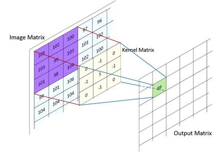

Convolution 2D Prototype and Function List
~~~~~~~~~~~~~~~~~~~~~~~~~~~~~~~~~~~~~~~~~~

This kernel implements a general 2D convolution operation. It applies each filter 
of weights tensor to each framed area of the size of input tensor. 

The convolution operation is shown in Figure :ref:`f_conv_2d`.
 
.. _f_conv_2d:  

   Convolution 2D 
..
 
For example, in a HWCN data layout, if the ``in`` feature map is :math:`(Hi, Wi, Ci)` and 
the ``weights`` feature map is :math:`(Hk, Wk, Ci, Co)`, the output feature map is :math:`(Ho, Wo, Co)` 
tensor where the output dimensions :math:`Ho` and :math:`Wo` are calculated dynamically depending on 
convolution parameters (such as padding or stride), inputs and weights shape. 

.. note::

   For more details on calculations, see chapter 2 of `A guide to convolution arithmetic 
   for deep learning <https://arxiv.org/abs/1603.07285>`_.
..

Optionally, saturating ReLU activation function can be applied to the result of the 
convolution during the function’s execution. For more info on supported ReLU types 
and calculations, see :ref:`relu_prot`.

This is a MAC-based kernel which implies accumulation. See :ref:`quant_accum_infl` for more info on related quantization aspects. 
The Number of accumulation series in terms of above-defined variables is equal to (Hk * Wk * Ci).

The functions which implement 2D Convolutions have the following prototype:

.. code:: c

   mli_status mli_krn_conv2d_hwcn_<data_format>(
     const mli_tensor *in,
     const mli_tensor *weights,
     const mli_tensor *bias,
     const mli_conv2d_cfg *cfg,	
     mli_tensor *out);	
..
	 
where ``data_format`` is one of the data formats listed in Table :ref:`mli_data_fmts` 
and the function parameters are shown in the following table:

.. table:: 2D Convolution Function Parameters
   :align: center
   :widths: 30, 50, 130 
   
   +---------------+-----------------------+--------------------------------------------------+
   | **Parameter** | **Type**              | **Description**                                  |
   +===============+=======================+==================================================+
   | ``in``        | ``mli_tensor *``      | [IN] Pointer to constant input tensor            |
   +---------------+-----------------------+--------------------------------------------------+
   | ``weights``   | ``mli_tensor *``      | [IN] Pointer to constant weights tensor          |
   +---------------+-----------------------+--------------------------------------------------+
   | ``bias``      | ``mli_tensor *``      | [IN] Pointer to constant bias tensor             |
   +---------------+-----------------------+--------------------------------------------------+
   | ``cfg``       | ``mli_conv2d_cfg *``  | [IN] Pointer to convolution parameters structure |
   +---------------+-----------------------+--------------------------------------------------+
   | ``out``       | ``mli_tensor *``      | [OUT] Pointer to output feature map tensor.      |
   |               |                       | Result is stored here                            |
   +---------------+-----------------------+--------------------------------------------------+   
..

Here is a list of all available 2D Convolution functions:

.. table:: List of Available 2D Convolution Functions
   :align: center
   :widths: auto 
   
   +-------------------------------------------+----------------------------------------+
   | **Function Name**                         | Details                                |
   +===========================================+========================================+
   | ``mli_krn_conv2d_hwcn_sa8_sa8_sa32``      || In/out layout: **HWC**                |
   |                                           || Weights layout: **HWCN**              |
   |                                           || In/out/weights data format: **sa8**   |
   |                                           || Bias data format: **sa32**            |
   +-------------------------------------------+----------------------------------------+
   | ``mli_krn_conv2d_hwcn_fx16``              || In/out layout: **HWC**                |
   |                                           || Weights layout: **HWCN**              |
   |                                           || All tensors data format: **fx16**     |
   +-------------------------------------------+----------------------------------------+
   | ``mli_krn_conv2d_hwcn_fx16_fx8_fx8``      || In/out layout: **HWC**                |
   |                                           || Weights layout: **HWCN**              |
   |                                           || In/out data format: **fx16**          |
   |                                           || Weights/Bias data format: **fx8**     |
   +-------------------------------------------+----------------------------------------+
   | ``mli_krn_conv2d_hwcn_sa8_sa8_sa32_k1x1`` || In/out layout: **HWC**                |
   |                                           || Weights layout: **HWCN**              |
   |                                           || In/out/weights data format: **sa8**   |
   |                                           || Bias data format: **sa32**            |
   |                                           || Width of weights tensor: **1**        |
   |                                           || Height of weights tensor: **1**       |
   +-------------------------------------------+----------------------------------------+
   | ``mli_krn_conv2d_hwcn_fx16_k1x1``         || In/out layout: **HWC**                |
   |                                           || Weights layout: **HWCN**              |
   |                                           || All tensors data format: **fx16**     |
   |                                           || Width of weights tensor: **1**        |
   |                                           || Height of weights tensor: **1**       |
   +-------------------------------------------+----------------------------------------+
   | ``mli_krn_conv2d_hwcn_fx16_fx8_fx8_k1x1`` || In/out layout: **HWC**                |
   |                                           || Weights layout: **HWCN**              |
   |                                           || In/out data format: **fx16**          |
   |                                           || Weights/Bias data format: **fx8**     |
   |                                           || Width of weights tensor: **1**        |
   |                                           || Height of weights tensor: **1**       |
   +-------------------------------------------+----------------------------------------+
   | ``mli_krn_conv2d_hwcn_sa8_sa8_sa32_k3x3`` || In/out layout: **HWC**                |
   |                                           || Weights layout: **HWCN**              |
   |                                           || In/out/weights data format: **sa8**   |
   |                                           || Bias data format: **sa32**            |
   |                                           || Width of weights tensor: **3**        |
   |                                           || Height of weights tensor: **3**       |
   +-------------------------------------------+----------------------------------------+
   | ``mli_krn_conv2d_hwcn_fx16_k3x3``         || In/out layout: **HWC**                |
   |                                           || Weights layout: **HWCN**              |
   |                                           || All tensors data format: **fx16**     |
   |                                           || Width of weights tensor: **3**        |
   |                                           || Height of weights tensor: **3**       |
   +-------------------------------------------+----------------------------------------+
   | ``mli_krn_conv2d_hwcn_fx16_fx8_fx8_k3x3`` || In/out layout: **HWC**                |
   |                                           || Weights layout: **HWCN**              |
   |                                           || In/out data format: **fx16**          |
   |                                           || Weights/Bias data format: **fx8**     |
   |                                           || Width of weights tensor: **3**        |
   |                                           || Height of weights tensor: **3**       |
   +-------------------------------------------+----------------------------------------+
   | ``mli_krn_conv2d_hwcn_sa8_sa8_sa32_k5x5`` || In/out layout: **HWC**                |
   |                                           || Weights layout: **HWCN**              |
   |                                           || In/out/weights data format: **sa8**   |
   |                                           || Bias data format: **sa32**            |
   |                                           || Width of weights tensor: **5**        |
   |                                           || Height of weights tensor: **5**       |
   +-------------------------------------------+----------------------------------------+
   | ``mli_krn_conv2d_hwcn_fx16_k5x5``         || In/out layout: **HWC**                |
   |                                           || Weights layout: **HWCN**              |
   |                                           || All tensors data format: **fx16**     |
   |                                           || Width of weights tensor: **5**        |
   |                                           || Height of weights tensor: **5**       |
   +-------------------------------------------+----------------------------------------+
   | ``mli_krn_conv2d_hwcn_fx16_fx8_fx8_k5x5`` || In/out layout: **HWC**                |
   |                                           || Weights layout: **HWCN**              |
   |                                           || In/out data format: **fx16**          |
   |                                           || Weights/Bias data format: **fx8**     |
   |                                           || Width of weights tensor: **5**        |
   |                                           || Height of weights tensor: **5**       |
   +-------------------------------------------+----------------------------------------+
..
 
Ensure that you satisfy the following conditions before calling the function:

 - ``in``, ``weights`` and ``bias`` tensors must be valid (see :ref:`mli_tnsr_struc`).
 
 - ``out`` tensor must contain a valid pointer to a buffer with sufficient capacity, valid 
   ``mem_stride`` field  and valid ``el_params`` union. Other fields of the structure do not
   have to contain valid data and are filled by the function.
   
 - ``in`` and ``out`` tensors must not point to overlapped memory regions.
 
 - Channel (C) dimension of ``in`` and ``weights`` tensors must be equal.
 
 - ``mem_stride`` of the innermost dimension must be equal to 1 for all the tensors.
 
 - ``bias`` must be a one-dimensional tensor. Its length must be equal to N dimension 
   (number of filters) of ``weights`` tensor.
   
 - ``padding_top`` and ``padding_bottom`` parameters must be in the range of [0, weights (H)eight).
 
 - ``padding_left`` and ``padding_right`` parameters must be in the range of [0, weights (W)idth).
 
 - ``stride_width`` and ``stride_height`` parameters must not be equal to 0.
 
 - Width (W) and Height (H) dimensions of the ``weights`` tensor must be less than or equal to 
   the appropriate dimensions of the ``in`` tensor. 
   
 - Effective width and height of the ``weights`` tensor after applying dilation factor must not 
   exceed appropriate dimensions of the ``in`` tensor. 

.. admonition:: Example 
   :class: "admonition tip"
   
   :math:`(weights\_W*dilation\_W+1)<=in\_W`.
..
                                                                          
For **sa8_sa8_sa32** versions of kernel, in addition to preceding conditions, ensure that you satisfy 
the following conditions before calling the function:

 - ``in`` and ``out`` tensors must be quantized on the tensor level. This implies that each tensor 
   contains a single scale factor and a single zero offset.

 - Zero offset of ``in`` and ``out`` tensors must be within [-128, 127] range.

 - ``weights`` and ``bias`` tensors must be symmetric. Both must be quantized on the same level. 
   Allowed Options:
   
   - Per tensor level. This implies that each tensor contains a single scale factor and a 
     single zero offset equal to 0.
	 
   - Per N dimension level (number of filters). This implies that each tensor contains 
     separate scale point for each sub-tensor. All tensors contain single zero offset equal to 0.
	 
 - Scale factors of ``bias`` tensor must be equal to the multiplication of input scale factor 
   broadcasted on weights array of scale factors. 
   
Depending on the debug level (see section :ref:`err_codes`) this function might perform a parameter 
check and return the result as an ``mli_status`` code as described in section :ref:`kernl_sp_conf`.   