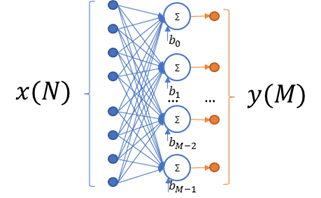

.. _fully_con_grp:

Fully Connected Prototype and Function List 
-------------------------------------------

.. _f_fully_conn_layer:

   
..

This kernel implements a fully connected layer, also usually referred to as the inner 
product or dense layer.  
 
Each value of output tensor is calculated according to the following formula:

.. math:: 

   y_{i} = b_{i} + \sum_{j}^{}x_{j}*W_{i,j}
..

Where:

    :math:`x_{j}` *–* :math:`j_{\text{th}}` *value in input tensor*

    :math:`y_{i}` *– output of* :math:`i_{\text{th}}` neuron
    (:math:`i_{\text{th}}` *value in output tensor)*

    :math:`W_{i,j}` *– weight of* :math:`j_{\text{th}}\ `\ *input element
    for* :math:`i_{\text{th}}` *neuron.*

    :math:`b_{i}` *– bias for* :math:`i_{\text{th}}` *neuron*

Optionally, a saturating ReLU activation function can be applied to the result of the calculations 
during the function’s execution. For more information on supported ReLU types, see :ref:`relu_prot`.  

This is a MAC-based kernel which implies accumulation. See :ref:`quant_accum_infl` for more information on related quantization aspects. 
The Number of accumulation series is equal to input size.

Functions that implement fully connected kernels have the following prototype:

.. code:: c

   mli_status mli_krn_fully_connected_<data_format>(
      const mli_tensor *in,
      const mli_tensor *weights,
      const mli_tensor *bias,
      const mli_fully_connected_cfg *cfg,
      mli_tensor *out);
..
  
where ``data_format`` is one of the data formats listed in Table :ref:`mli_data_fmts` 
and the function parameters are shown in the following table:

.. table:: Fully Connected Function Parameters
   :align: center
   :widths: auto 
   
   +------------------+---------------------------------+--------------------------------------------------------+
   | **Parameter**    | **Type**                        | **Description**                                        |
   +==================+=================================+========================================================+
   | ``in``           | ``mli_tensor *``                | [IN] Pointer to constant input tensor.                 |
   +------------------+---------------------------------+--------------------------------------------------------+
   | ``weights``      | ``mli_tensor *``                | [IN] Pointer to constant weights tensor.               |
   +------------------+---------------------------------+--------------------------------------------------------+
   | ``bias``         | ``mli_tensor *``                | [IN] Pointer to constant bias tensor.                  |
   +------------------+---------------------------------+--------------------------------------------------------+
   | ``cfg``          | ``mli_fully_connected_cfg *``   | [IN] Pointer to fully connected parameters structure.  |
   +------------------+---------------------------------+--------------------------------------------------------+
   | ``out``          | ``mli_tensor *``                | [OUT] Pointer to output tensor. Result is stored here. |
   +------------------+---------------------------------+--------------------------------------------------------+
..

   ``mli_fully_connected_cfg`` is defined as:

.. code:: c
   
   typedef struct {
        mli_relu_cfg relu;
   } mli_fully_connected cfg; 
..

.. _t_mli_fc_cfg_desc:
.. table:: mli_fully_connected_cfg Structure field description
   :align: center
   :widths: auto 
   
   +-----------------+--------------------+-------------------------------------------------------+
   | **Field Name**  | **Type**           | **Description**                                       |
   +=================+====================+=======================================================+
   |                 |                    | Type of ReLU activation applied to output values.     |
   | ``relu``        | ``mli_relu_cfg``   | See :ref:`relu_prot` for definition of this structure |
   +-----------------+--------------------+-------------------------------------------------------+
..

Here is a list of all available Fully Connected functions:

.. table:: List of Available Fully Connected Functions
   :align: center
   :widths: auto 
   
   +---------------------------------------------------+----------------------------------------+
   | **Function Name**                                 | **Details**                            |
   +===================================================+========================================+
   | ``mli_krn_fully_connected_sa8_sa8_sa32``          || In/out/weights data format: **sa8**   |
   |                                                   || Bias data format: **sa32**            |
   +---------------------------------------------------+----------------------------------------+
   | ``mli_krn_fully_connected_fx16``                  || All tensors data format: **fx16**     |
   +---------------------------------------------------+----------------------------------------+
   | ``mli_krn_fully_connected_fx16_fx8_fx8``          || In/out data format: **fx16**          |
   |                                                   || Weights/Bias data format: **fx8**     |
   +---------------------------------------------------+----------------------------------------+
   | ``mli_krn_fully_connected_sa8_sa8_sa32_ext_bias`` || In/out/weights data format: **sa8**   |
   |                                                   || Bias data format: **sa32**            |
   |                                                   || Bias data adjusted to include         |
   |                                                   || zero point additives                  |
   +---------------------------------------------------+----------------------------------------+
..

``mli_krn_fully_connected_sa8_sa8_sa32_ext_bias`` is a specialized version of 
``mli_krn_fully_connected_sa8_sa8_sa32`` which performs calculations much faster, but requires bias
data to be adjusted according to the following formula:

.. math:: 

   \hat{b}_{i} = b_{i} + \sum_{j}^{}in\_zp*W_{i,j}
..

Where:

    :math:`in\_zp` *–* zero point of input sa8 tensor

    :math:`W_{i,j}` *– weight of* :math:`j_{\text{th}}\ `\ *input element
    for* :math:`i_{\text{th}}` *neuron.*

    :math:`b_{i}` *– original sa32 bias for* :math:`i_{\text{th}}` *neuron*
 
    :math:`\hat{b}_{i}` *– adjusted sa32 bias for* :math:`i_{\text{th}}` *neuron*

Ensure that you satisfy the following conditions before calling the function:

 - ``in``, ``weights`` and ``bias`` tensors must be valid (see :ref:`mli_tnsr_struc`).
 
 - ``in`` tensor might be of any shape and rank. Only total number of elements is 
   considered.
   
 - ``weights`` must be a two-dimensional tensor of shape (N, M), where N is the 
   total number of elements in the input tensor and M is the total number of 
   neurons and is equal to output length
   
 - ``out`` tensor must contain a valid pointer to a buffer with sufficient capacity, valid ``mem_stride`` field 
   and valid ``el_params`` union. Other fields of the structure do not have to contain 
   valid data and are filled by the function.
   
 - ``bias`` must be a one-dimensional tensor. Its length must be equal to M dimension 
   (number of filters and is equal to output length) of weights tensor.
   
 - ``in`` and ``out`` tensors must not point to overlapped memory regions.
   
 - ``mem_stride`` must satisfy the following statements
   
    - For ``in`` and ``out`` tensors - memstride must reflect the shape or be set to 0, 
      e.g memory of these tensors must be contiguous
      
    - For ``weights`` and ``bias`` tensor - memstride of the innermost dimension must 
      be equal to 1.

 
For **sa8_sa8_sa32** versions of kernel, in addition to the preceding conditions, ensure that you 
satisfy the following conditions before calling the function: 

 - ``in`` and  ``out`` tensors must be quantized on the tensor level. 
   It implies that each tensor contains a single scale factor and a single zero offset.
   
 - ``weights`` and ``bias`` tensors must be quantized on the tensor level. 
   It implies that each tensor contains a single scale factor and a single zero offset.
   
 - Zero offset of in and out tensors must be within [-128, 127] range.

 - ``weights`` and ``bias`` tensors must be symmetric. Both must be quantized at the same level.
   Allowed options are
   
    - Per Tensor level. This implies that each tensor contains a single scale factor and a single zero
      offset equal to 0.
      
    - Per M dimension level (number of neurons). This implies that each tensor contains separate scale point
      for each sub-tensor. All tensors contain single zero offset equal to 0.
   
 - Scale factor of bias tensor must be equal to the multiplication of input scale factor 
   and weights scale factor.

Depending on the debug level (see section :ref:`err_codes`) this function performs a parameter 
check and returns the result as an ``mli_status`` code as described in section :ref:`kernl_sp_conf`.

