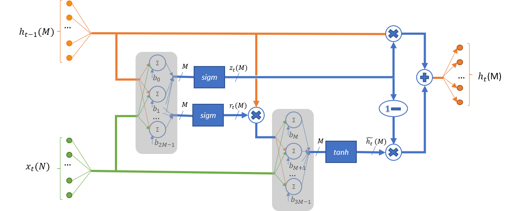

Gated Recurrent Unit (GRU) Cell Prototype and Function List
~~~~~~~~~~~~~~~~~~~~~~~~~~~~~~~~~~~~~~~~~~~~~~~~~~~~~~~~~~~

This kernel implements the Gated Recurrent Unit (GRU) cell in version where a reset 
gate is applied on the hidden state before matrix multiplication [6], as shown in 
Figure :ref:`f_gru_schematic`. 
 
.. _f_gru_schematic:

 
   Gated Recurrent Unit Schematic Representation
..

The GRU operation is described by the following formulas:

.. math::

   {z_{t}} &= {sigm\left( x_{t}W_{\text{xz}} + h_{t - 1}W_{\text{hz}} + b_{z} \right)}
   
   {r_{t}} &= {sigm\left( x_{t}W_{\text{xr}} + h_{t - 1}W_{\text{hr}} + b_{r} \right)}
   
   {{\widetilde{h}}_{t}} &= {tanh\left( x_{t}W_{\text{xu}} + (r_{t}*h_{t - 1})W_{\text{hu}} + b_{e} \right)}
   
   {h_{t}} &= {\left( 1 - z_{t} \right)*h_{t - 1} + z_{t}*{\widetilde{h}}_{t}}
..

Where:

   :math:`\ x_{t}\ ` *- frame* :math:`t` *in input sequence.*

   :math:`\ h_{t}\ ` *- hidden stat (also cell output) for frame*
   :math:`t` *in input sequence.*

   :math:`\ {\widetilde{h}}_{t}\ ` *- updated hidden state for frame*
   :math:`t` *in input sequence.*

   :math:`z_{t}\ ,\ r_{t}` *– Update and reset gates subtensors for
   frame* :math:`t` *in input sequence.*

   :math:`W_{**}\ ` *- weights for appropriate input subtensor.*

   :math:`b_{*}\ ` *- bias for appropriate input subtensor.*

   :math:`sigm` , :math:`tanh` *- sigmoid and hyperbolic tangent
   activation functions.*
   

In the Figure :ref:`f_gru_schematic`, N is the total number of elements in the input and M is the total number 
of elements in the cell output.

Kernels which implement an GRU cell have the following prototype:

.. code::

   mli_status mli_krn_gru_cell_<data_format>(
      const mli_tensor *in,
      const mli_tensor *prev_out,
      const mli_tensor *weights_in,
      const mli_tensor *weights_out,
      const mli_tensor *bias,
      const mli_rnn_cell_cfg *cfg,
      mli_tensor *out);
..
	  
where data_format is one of the data formats listed in Table :ref:`mli_data_fmts` and the function parameters 
are shown in the following table:

.. table:: Data Format Naming Convention Fields
   :align: center
   :widths: auto 
   
   +------------------+-------------------------+-----------------------------------------------------------+
   | **Parameter**    | **Type**                | **Description**                                           |
   +==================+=========================+===========================================================+
   | ``in``           | ``mli_tensor *``        | [IN] Pointer to constant input tensor.                    |
   +------------------+-------------------------+-----------------------------------------------------------+
   | ``prev_out``     | ``mli_tensor *``        | [IN] Pointer to constant previous output tensor.          |
   +------------------+-------------------------+-----------------------------------------------------------+
   | ``weights_in``   | ``mli_tensor *``        | [IN] Pointer to constant weights tensor for GRU input.    |
   +------------------+-------------------------+-----------------------------------------------------------+
   | ``weights_out``  | ``mli_tensor *``        | [IN] Pointer to constant weights tensor for GRU output.   |
   +------------------+-------------------------+-----------------------------------------------------------+
   | ``bias``         | ``mli_tensor *``        | [IN] Pointer to constant bias tensor.                     |
   +------------------+-------------------------+-----------------------------------------------------------+
   | ``cfg``          | ``mli_rnn_dense_cfg *`` | [IN/OUT] Pointer to RNN cell parameters structure.        |
   +------------------+-------------------------+-----------------------------------------------------------+
   | ``out``          | ``mli_tensor *``        | [OUT] Pointer to output tensor. Result is stored here.    |
   +------------------+-------------------------+-----------------------------------------------------------+
..

Fields of ``mli_rnn_cell_cfg`` structure are described in table :ref:`t_mli_rnn_cell_cfg_desc`.

Weights for the cell are consist of two tensors:

 - ``weights_in``: a three-dimensional tensor of shape (3, N, M) where N is a number of elements in 
   input tensor, and M is a number of elements in hidden state (equal to number of elements in 
   output tensor). It represents stacking of next weights from the preceding formulas in order (z, r, u):
   
.. math::

   \begin{bmatrix}
   W_{\text{xz}} & W_{\text{xr}} & W_{\text{xu}} \\
   \end{bmatrix}
..
	
 - ``weights_out``: a three-dimensional tensor of shape (3, M, M) where M is a number of cell elements 
   (weights which involved into a single dot product series are stored column wise, that is, with M stride 
   in memory). It represents stacking of next weights from the preceding formulas in order (z, r, u):
   
.. math::

   \begin{bmatrix}
   W_{\text{hz}} & W_{\text{hr}} & W_{\text{hu}} \\
   \end{bmatrix}
..

 - ``bias`` tensor of shape (3, M) keeps subtensors in the same order:
 
.. math::

   \begin{bmatrix}
   b_{z} & b_{r} & b_{u} \\
   \end{bmatrix}
..

This kernel implies sequential processing of the set of inputs vectors which is passed by input tensor 
of shape (batch_size, N) where N is the length of the single frame :math:`x_{t}` . Both 
directions of processing (forward and backward) are supported and defined by cfg structure. Kernel can 
output the bunch of results for according to each step of processing, or only the last one in the sequence. 

Dense part of calculations uses scratch data from configuration structure for results, and consequently 
output and previous output tensors might use the same memory if it is acceptable to rewrite previous 
output data. Ensure that you allocate memory for the rest of the tensors and for scratch data from cfg 
structure without overlaps. Otherwise the behavior is undefined.

The following table lists all the available GRU cell functions:

.. table:: List of Available GRU Cell Functions
   :align: center
   :widths: auto
   
   +------------------------------------+--------------------------------------+
   | **Function Name**                  | **Details**                          |
   +====================================+======================================+
   | ``mli_krn_gru_cell_sa8_sa8_sa32``  || In/out/weights data format: **sa8** |
   |                                    || Bias data format: **sa32**          |
   +------------------------------------+--------------------------------------+
   | ``mli_krn_gru_cell_fx16``          || All tensors data format: **fx16**   |
   +------------------------------------+--------------------------------------+
   | ``mli_krn_gru_cell_fx16_fx8_fx8``  || In/out data format: **fx16**        |
   |                                    || weights/Bias data format: **fx8**   |
   +------------------------------------+--------------------------------------+
..

All the listed functions must comply to the following conditions:

 - ``in``, ``prev_out``, ``weights_in``, ``weights_out`` and ``bias`` tensors must be valid.
 
 - ``in`` must be a tensor of shape (batch_size, N) where batch_size is a number of 
   input frames for sequential processing by GRU cell.
   
 - ``weights_in`` must be a three-dimensional tensor of shape (3, N, M).
 
 - ``weights_out`` must be a three-dimensional tensor of shape (3, M, M).
 
 - ``bias`` must be a two-dimensional tensor of shape (3, M).
 
 - ``prev_out`` must be a one-dimensional tensor of shape (M).
 
 - ``out`` tensor must contain a valid pointer to a buffer with sufficient capacity for 
   storing the result (to keep M elements if GRU cell is configured with RNN_OUT_LAST 
   or to keep M*batch_size elements if GRU cell is configured with RNN_OUT_ALL). Other 
   fields of the structure do not have to contain valid data and are filled by the function.
   
 - ``in`` and ``out`` tensors must not point to overlapped memory regions.
 
 - ``mem_stride`` of the innermost dimension should be equal to 1 for all the tensors.
 
 - Before processing, scratch_data field in config structure must contain a valid pointer to 
   a buffer with enough capacity for the intermediate result (3*M elements of input type). 
   The ``scratch_capacity`` field must reflect the available size of this memory in bytes properly 
   (see Table :ref:`t_mli_rnn_cell_cfg_desc`). 

For **sa8_sa8_sa32** versions of kernel, in addition to the preceding conditions:
 
 - ``in`` and ``prev_out`` tensor must be quantized on the tensor level. It implies that each tensor 
   contains a single scale factor and a single zero offset.
	
 - ``weights_in``, ``weights_out`` and ``bias`` tensors must be symmetric. All these tensors must be 
   quantized on the same level. Allowed Options:
   
   - Per Tensor level. It implies that each tensor contains a single scale factor and a single 
     zero offset equal to 0.
	 
   - Per First Dimension level (number of sub-tensors equal to 3). It implies that each tensor 
     contains separate scale point for each sub-tensor. All tensors contain single zero offset 
     equal to 0.
 
 - Scale factors of bias tensor must be equal to the multiplication of input scale factor 
   broadcasted on weights_in array of scale factors.

Depending on the debug level (see section :ref:`err_codes`) this function performs a parameter 
check and return the result as an ``mli_status`` code as described in section :ref:`kernl_sp_conf`.

TODO – add posteffects for all kernels (return status, what ``out`` tensor contains after .
These kernels modify out tensor and memory pointed by scratch_data field of cfg structure.
