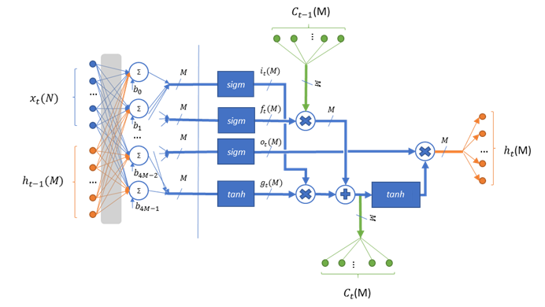

Basic Long Short Term Memory (LSTM) Cell Prototype and Function List
^^^^^^^^^^^^^^^^^^^^^^^^^^^^^^^^^^^^^^^^^^^^^^^^^^^^^^^^^^^^^^^^^^^^

Description
"""""""""""

This kernel implements the basic non-peephole Long Short-Term Memory (LSTM) cell 
(see `Long Short-term Memory <https://en.wikipedia.org/wiki/Long_short-term_memory>`_ 
for more details), as shown in Figure :ref:`f_lstm_schematic`. 
 
.. _f_lstm_schematic:

 
   Long Short Term Memory Schematic Representation
..

The LSTM operation is described by the following formulas:

.. math::
   :label: eq_lstm_op

   {i_{t}} &= {sigm(x_{t}W_{\text{xi}} + h_{t - 1}W_{\text{hi}} + b_{i})}
   
   {f_{t}} &= {sigm(x_{t}W_{\text{xf}} + h_{t - 1}W_{\text{hf}} + b_{f})}
      
   {o_{t}} &= {sigm(x_{t}W_{\text{xo}} + h_{t - 1}W_{\text{ho}} + b_{o})}
   
   {g_{t}} &= {tanh(x_{t}W_{\text{xg}} + h_{t - 1}W_{\text{hg}} + b_{g})}
   
   {C_{t}} &= {g_{t}*i_{t} + f_{t}*C_{t - 1}}
   
   {h_{t}} &= {o_{t}\ * tanh(C_{t})}
..

Where:

   :math:`\ x_{t}\ ` *- frame* :math:`t` *in input sequence.*

   :math:`\ h_{t}\ ` *- cell output for frame* :math:`t` *in input
   sequence.*

   :math:`i_{t}\ ,\ f_{t}\ ,\ o_{t}` *– Input, forget, output gate
   subtensors for frame* :math:`t` *in input sequence.*

   :math:`\ g_{t}\ ` *- New cell candidates for frame* :math:`t` *in
   input sequence.*

   :math:`\ C_{t}\ ` *- Cell state for frame* :math:`t` *in input
   sequence.*

   :math:`W_{**}\ ` *- weights for appropriate input subtensor.*

   :math:`b_{*}\ ` *- bias for appropriate input subtensor.*

   :math:`sigm` , :math:`tanh` *- sigmoid and hyperbolic tangent
   activation functions.*

In the Figure :ref:`f_lstm_schematic`, N is the total number of 
elements in the input and M is the total number of elements in the cell output.

This kernel uses two look-up tables (LUTs) to perform data transformation. 
See :ref:`lut_prot` section and the pseudo-code sample for more details on LUT structure preparation.
Use the following functions for the purpose:

 - :code:`mli_krn_tanh_get_lut_size`
 - :code:`mli_krn_tanh_create_lut`
 - :code:`mli_krn_sigm_get_lut_size`
 - :code:`mli_krn_sigm_create_lut`

This is a MAC-based kernel which implies accumulation. See :ref:`quant_accum_infl` for more information on related quantization aspects. 
The number of accumulation series is equal to a single input frame size plus single output frame size.

Functions
"""""""""

Kernels which implement an LSTM cell have the following prototype:

.. code:: c

   mli_status mli_krn_lstm_cell_<data_format>(
      const mli_tensor *in,
      const mli_tensor *prev_out,
      const mli_tensor *weights_in,
      const mli_tensor *weights_out,
      const mli_tensor *bias,
      const mli_lut * tanh_lut,
      const mli_lut * sigm_lut,
      const mli_rnn_cell_cfg *cfg,
      mli_tensor *cell,
      mli_tensor *out);
..

where ``data_format`` is one of the data formats listed in Table :ref:`mli_data_fmts` and the function parameters 
are shown in the following table:

.. table:: LSTM Function parameters
   :align: center
   :widths: auto 
   
   +------------------+-------------------------+-----------------------------------------------------------------+
   | **Parameter**    | **Type**                | **Description**                                                 |
   +==================+=========================+=================================================================+
   | ``in``           | ``mli_tensor *``        | [IN] Pointer to constant input tensor.                          |
   +------------------+-------------------------+-----------------------------------------------------------------+
   | ``prev_out``     | ``mli_tensor *``        | [IN] Pointer to constant previous output tensor.                |
   +------------------+-------------------------+-----------------------------------------------------------------+
   | ``weights_in``   | ``mli_tensor *``        | [IN] Pointer to constant weights tensor for LSTM input.         |
   +------------------+-------------------------+-----------------------------------------------------------------+
   | ``weights_out``  | ``mli_tensor *``        | [IN] Pointer to constant weights tensor for LSTM output.        |
   +------------------+-------------------------+-----------------------------------------------------------------+
   | ``bias``         | ``mli_tensor *``        | [IN] Pointer to constant bias tensor.                           |
   +------------------+-------------------------+-----------------------------------------------------------------+
   | ``tanh_lut``     | ``mli_lut *``           | [IN] Pointer to a valid LUT table structure prepared for the    |
   |                  |                         | hyperbolic tangent activation.                                  |
   +------------------+-------------------------+-----------------------------------------------------------------+
   | ``sigm_lut``     | ``mli_lut *``           | [IN] Pointer to a valid LUT table structure prepared for        |
   |                  |                         | sigmoid  activation.                                            |
   +------------------+-------------------------+-----------------------------------------------------------------+
   | ``cfg``          | ``mli_rnn_cell_cfg *``  | [IN | OUT] Pointer to RNN cell parameters structure.            |
   +------------------+-------------------------+-----------------------------------------------------------------+
   | ``cell``         | ``mli_tensor *``        | [IN | OUT] Pointer to cell tensor. Is modified during execution.|
   +------------------+-------------------------+-----------------------------------------------------------------+
   | ``out``          | ``mli_tensor *``        | [IN | OUT] Pointer to output tensor. Result is stored here.     |
   +------------------+-------------------------+-----------------------------------------------------------------+
..

Fields of ``mli_rnn_cell_cfg`` structure are described in the Table :ref:`t_mli_rnn_cell_cfg_desc`.

Weights for the cell consist of three tensors:

 - ``weights_in``: a three-dimensional tensor of shape (4, N, M) where N is a number of elements 
   in input tensor, and M is a number of cell elements (equal to number of elements in cell state 
   and output tensor). It represents stacking of weights from the LSTM operation :eq:`eq_lstm_op` 
   in the order (I, g, f,o):

.. math::

   \begin{bmatrix}
   W_{\text{xi}} & W_{\text{xg}} & \begin{matrix}
   W_{\text{xf}} & W_{\text{xo}} \\
   \end{matrix} \\
   \end{bmatrix}
..

 - ``weights_out``: a three-dimensional tensor of shape (4, M, M) where M is a number of cell 
   elements (weights which involved into a single dot    product series are stored column-wise, 
   that is, with M stride in memory). It represents stacking of weights from the LSTM operation 
   :eq:`eq_lstm_op` in order (I, g, f, o):

.. math::

   \begin{bmatrix}
   W_{\text{hi}} & W_{\text{hg}} & \begin{matrix}
   W_{\text{hf}} & W_{\text{ho}} \\
   \end{matrix} \\
   \end{bmatrix}
..

 - ``bias`` tensor of shape (4, M) keeps subtensors in the same order:

.. math::

   \begin{bmatrix}
   b_{i} & b_{g} & \begin{matrix}
   b_{f} & b_{o} \\
   \end{matrix} \\
   \end{bmatrix} 
..
   
This kernel implies sequential processing of the set of input vectors (or timesteps) that is passed by input tensor 
of shape (sequence_length, N) where N is the length of the single frame :math:`x_{t}`. Both directions 
of processing (forward and backward) are supported and defined by cfg structure. The Kernel can output 
a pack of results at each step of processing, or it can output the result vector only for the last 
step in the sequence.
 
Dense part of calculations uses scratch data from configuration structure for results, and consequently 
output and previous output tensors might use the same memory if it is acceptable to rewrite previous output 
data. Ensure that you allocate memory for the rest of the tensors and for scratch data from cfg structure 
without overlaps. Otherwise the behavior is undefined.

Here is a list of all available LSTM cell functions:

.. table:: List of Available LTSM Cell Functions
   :align: center
   :widths: auto 
   
   +-------------------------------------+-------------------------------------------+
   | **Function Name**                   | **Details**                               |
   +=====================================+===========================================+
   | ``mli_krn_lstm_cell_sa8_sa8_sa32``  || In/out/cell/weights data format: **sa8** |
   |                                     || Bias data format: **sa32**               |
   +-------------------------------------+-------------------------------------------+
   | ``mli_krn_lstm_cell_fx16``          || All tensors data format: **fx16**        |
   +-------------------------------------+-------------------------------------------+
   | ``mli_krn_lstm_cell_fx16_fx8_fx8``  || In/out/cell data format: **fx16**        |
   |                                     || weights/Bias data format: **fx8**        |
   +-------------------------------------+-------------------------------------------+
..

Conditions
""""""""""

Ensure that you satisfy the following general conditions before calling the function:

 - ``in``, ``out``, ``prev_out``, ``weights_in``, ``weights_out``, ``bias``, and ``cell`` 
   tensors must be valid (see :ref:`mli_tnsr_struc`) and satisfy data requirements of the 
   selected version of the kernel.

 - ``tanh_lut`` and ``sigm_lut`` structures must be valid and prepared for 
   hyperbolic tangent and sigmoid activation functions accordingly (see :ref:`lut_prot`).

 - Shapes of ``in``, ``out``, ``prev_out``, ``weights_in``, ``weights_out``, ``bias``, and ``cell``
   tensors must be compatible, which implies the following requirements:

   - ``in`` must be a 2-dimensional tensor (rank==2) of shape (sequence_length, :math:`N`) 
     where sequence_length is a number of input frames (or timesteps) for sequential processing by LSTM cell.

   - ``weights_in`` must be a 3-dimensional tensor (rank==3) of shape (4, :math:`N`, :math:`M`).

   - ``weights_out`` must be a 3-dimensional tensor (rank==3) of shape (4, :math:`M`, :math:`M`).

   - ``bias`` must be a 2-dimensional tensor (rank==2) of shape (4, :math:`M`).

   - ``cell`` must be a one-dimensional tensor (rank==1) of shape (:math:`M`).

   - ``prev_out`` must be a one-dimensional tensor (rank==1) of shape (:math:`M`).
 
   - ``out`` tensor might be of any shape and rank. Kernel changes its shape to (sequence_length, :math:`M`)

 - ``out.data`` container must point to a buffer with sufficient capacity for storing the result (to keep :math:`M` 
   elements if LSTM cell is configured with ``RNN_OUT_LAST`` or to keep :math:`M*sequence\_length` elements if
   LSTM cell is configured with ``RNN_OUT_ALL``).

 - ``scratch_data`` field in config structure must contain a valid pointer to a buffer with sufficient 
   capacity for the intermediate result (:math:`4*M` elements of input type). The ``capacity`` field of 
   the ``scratch_data`` must reflect the available size of this memory in bytes properly 
   (see Table :ref:`t_mli_rnn_cell_cfg_desc`). 
   
 - ``in.data`` and ``cfg->scratch_data`` containers must not point to overlapped memory regions.
 
 - ``mem_stride`` must satisfy the following statements:

   - For ``in``, ``prev_out``, ``out``  and ``cell`` tensors - memstride must reflect the shape,
     e.g memory of these tensors must be contiguous

   - For ``weights_in``, ``weights_out`` and ``bias`` tensor - memstride of the innermost dimension must 
     be equal to 1.

For **fx16** and **fx16_fx8_fx8** versions of kernel, in addition to the general conditions, ensure that you 
satisfy the following quantization conditions before calling the function:

 - The number of ``frac_bits`` in the ``bias`` tensor must not exceed the sum of ``frac_bits`` 
   in the ``in`` and ``weights_in`` tensors.

For **sa8_sa8_sa32** versions of kernel, in addition to the general conditions, ensure that you 
satisfy the following quantization conditions before calling the function: 

 - ``in``, ``out``, ``prev_out``,  and ``cell`` tensor must be quantized on the tensor level. This implies that each tensor contains a 
   single scale factor and a single zero offset.

 - Zero offset of ``in``, ``out``, ``prev_out`` and ``cell`` tensors must be within [-128, 127] range.
   
 - ``weights_in``, ``weights_out`` and ``bias`` tensors must be symmetric. All these tensors must be 
   quantized on the same level. Allowed options:
   
   - Per Tensor level. This implies that each tensor contains a single scale factor and a single 
     zero offset equal to 0.

   - Per First Dimension level (number of sub-tensors equal to 4). This implies that each tensor 
     contains separate scale point for each sub-tensor. All tensors contain single zero offset 
     equal to 0.
   
 - Scale factors of bias tensor must be equal to the multiplication of input scale factor
   broadcasted on ``weights_in`` array of scale factors. See the example for the similar condition 
   in the :ref:`conv_2d`.

Ensure that you satisfy the platform-specific conditions in addition to those listed above 
(see the :ref:`platform_spec_chptr` chapter).

Result
""""""

These functions modify:

 - ``shape``, ``rank`` and ``mem_stride`` of ``out`` tensor. 
 - memory pointed by ``out.data.mem`` field.  
 - memory pointed by ``cell.data.mem`` field.  
 - memory pointed by ``cfg.scratch_data.mem`` fields.  

It is assumed that all the other fields and structures are properly populated 
to be used in calculations and are not modified by the kernel.

Depending on the debug level (see section :ref:`err_codes`) this function performs a parameter 
check and returns the result as an ``mli_status`` code as described in section :ref:`kernl_sp_conf`.

