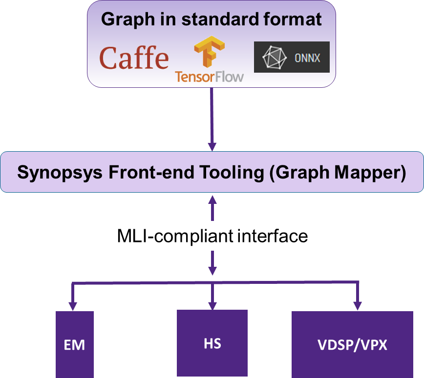
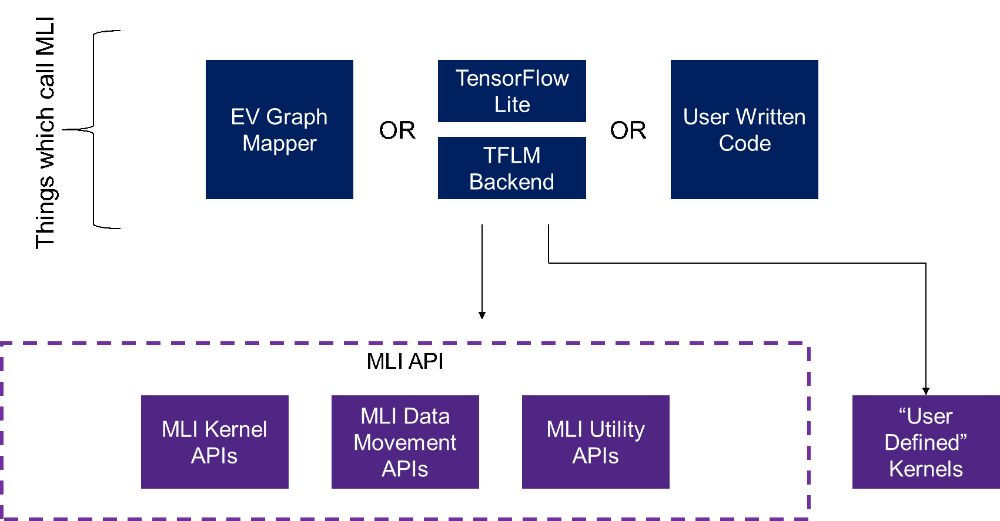

.. _overview: 

Overview
========

Introduction
------------

  The purpose of this document is to describe the MLI 2.0 API, which can be used by 
  developers of higher-level tools (like graph mappers/compilers) and also by those 
  creating new Implementations of MLI for various target processors. 
  
.. _f_mli_impl:  

   MLI Implementations

    
The figure :ref:`f_mli_impl` shows how different MLI-compliant Implementations for 
different processors can all be targeted using common front-end mapping tools.

Purpose of This Document
------------------------

  This document formally describes the MLI API in enough detail so that you 
  can use it as a guide for creating a compliant MLI Implementation for your target processor 
  or for creating higher-level ML mapping tools which target the MLI interface. 

Context of the MLI API
----------------------

  The following chapters describe the technical details of MLI data formats, data layouts, 
  quantization schemes, kernel naming convention and supported kernels. :ref:`f_mli_api` shows how 
  the MLI API is intended to exist below the various code bases which call into it.  
  This can include the Synopsys EV Graph Mapper, another framework like TensorFlow and the 
  TensorFlow Lite for Microcontrollers backend, and even user code (manual graph mapping).  
  
  Note that some systems might need kernels which don’t exist in the MLI API.  These kernels 
  can be implemented by the user and directly called by the upper-layer code.  This provides 
  the most flexibility and allows for quick additions of new kernels outside of MLI API refresh 
  cycles.  It is recommended that user-defined kernels be implemented using the same tensor struct, 
  data formats and data layout and the same naming conventions as MLI kernels (see :ref:`func_names_special`) 
  for easier inclusion in future API versions.
 
.. _f_mli_api:  

   
   MLI API
 
Memory Hierarchy
----------------

  The functions in the MLI API operate on the lowest level in the memory hierarchy: the local 
  memories (eg: DCCM, VCCM, and so on). All the memory movement needs to happen at a level above the MLI API. 
  The data move functions can be used for the purpose. Inside the MLI kernels, there is no data movement. 
  The strategy on data movement can be different for each platform or each application. For some 
  platforms and some applications, all the data could fit in CCM, in which case no data movement 
  is needed. Some platforms have a data cache; in those cases the data movement is done by the 
  hardware in a transparent way. The caller/user of MLI APIs is responsible for ensuring that all 
  data buffers passed to the MLI functions are in the CPU's local memory prior to making the call.
  
  The MLI library does not allocate any memory dynamically. The caller is responsible for providing 
  the correct parameters and allocated memory. The MLI library might use internal statically allocated 
  data.

Header Files
------------

  To ensure consistency for users, the following public header files are provided with  
  MLI Implementation.  These are intended to be included by the application code:
  
  - ``mli_types.h``: This file contains definitions of the various data structures defined elsewhere 
    in this document.
  
  - ``mli_config.h``: This file describes configuration-related parameters as well as platform-specific 
    data
  
  - ``mli_api.h``: This file (or sub-include files) declares the MLI API functions

Directory Structure
-------------------

The directory structure to use for an MLI implementation is really a decision of the implementor.
However, we do recommend that developers maintain the same structure that is present for existing 
MLI implementations. This can be seen by reviewing the MLI public repository on Github and is not 
specified in this document. 
  
    
.. _Copyright:
  
Copyright
---------

  Copyright TBD
