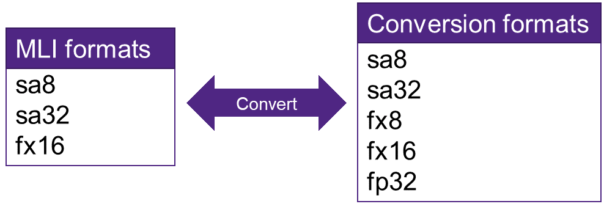

Utility Functions
=================

Utility functions are a set of MLI API that facilitate the interface 
between MLI kernels and the user code. Operations in this set are not directly 
involved in graph calculations and are instead used to prepare data for MLI processing or 
to get information encoded in the MLI interface.

Data Conversion Group
---------------------

This group contains functions which copy elements from the input tensor to the 
output with data conversion according to the output tensor type parameters. The 
functions converts the data from the source type to the destination type, 
considering the quantization parameters of source and destinations. This 
includes a combination of:

 - Change of container size

 - Change of number of fractional bits or scale factor

 - Change of zero offset

Change of quantization axis of a per-axis quantized tensor is not allowed. 
It means that if the input tensor is quantized per specific axis, then the output tensor
must have per-tensor quantization granularity or must be quantized across the same axis 
as the input tensor.

The conversion function only supports the conversion between the MLI formats and 
the conversion formats as listed in Figure :ref:`f_data_conv_fmts`.
 
.. _f_data_conv_fmts:  

   Data Conversion Formats
..

Rounding or saturation are used where needed to fit the data into the destination 
container.Each output element is calculated from the corresponding input element in 
the following way:
   
.. math:: x_{\text{dst}} = Sat\left( Round \left( \left( x_{\text{src}} - z_{\text{src}} \right)*\frac{s_{\text{src}}}{2^{n_{\text{src}}}}*\frac{2^{n_{\text{dst}}}}{s_{\text{dst}}} + z_{\text{dst}}\  \right) \right)

Where:

-  :math:`x_{dst},x_{src}` - destination and source sample

-  :math:`z_{dst},z_{src}` = destination and source zeropoint (= 0
   for formats other than signed asymmetric)

-  :math:`s_{dst},s_{src}` = destination and source scale factor (=
   1 for formats other than signed asymmetric)

-  :math:`n_{dst},n_{src}` = destination and source number of
   fractional bits (= 0 for float formats)

-  :math:`Sat` = saturation according to destination container size

-  :math:`Round` = rounding according to destination container size

Tensor shape and rank are not changed by this function. They are copied from the source 
to the destination tensor. For conversions with equal container size, in-place computation 
is permitted. Note that this could impact performance on some platforms.
``mem_stride`` of the innermost dimension should be equal to 1 for all the tensors.

If ``mem_stride`` of the output tensor is not equal to 0, the function will use these ``mem_strides``
to store the results in the output buffer. If the ``mem_stride`` is equal to 0, 
it will be computed from the input shape.

Function prototype:

.. code::

   mli_status mli_hlp_convert_tensor(
       const mli_tensor* src,
       mli_tensor* dst);
..
   
For some platforms there is a code size penalty if floating point operations are used. 
Because the preceding function uses floating point operations even if no conversion from/to 
float is needed by the application, the linker links-in the float support. For that 
reason, there is also a fixed point specialization. This function should be used in all 
places where it is known that neither of the source or destination tensor is a float tensor. 
It supports both signed asymmetric data formats and fixed point data formats 

.. code::

   mli_status mli_hlp_convert_tensor_safx(
       const mli_tensor* src,
       mli_tensor* dst);
..
   
Depending on the debug level (see section :ref:`err_codes`) this function performs a parameter 
check and return the result as an ``mli_status`` code as described in section :ref:`kernl_sp_conf`.

Helper Functions Group
----------------------

The following Helper functions are used for 
getting information from data structures and performing various operations on them.

 - :ref:`get_elem_size`
 
 - :ref:`count_elements`
 
 - :ref:`get_scale_val`

 - :ref:`get_shift_val`
 
 - :ref:`get_zero_offset_val`
 
 - :ref:`point_sub_tensor`
 
 
.. _get_elem_size:

Get Element Size
~~~~~~~~~~~~~~~~

This function returns the size of the tensor basic element in bytes. It returns 0 if the in pointer 
does NOT point to a tensor with a supported element type (see description of mli_element_type 
in section :ref:`kernl_sp_conf`).

.. code::

   uint32_t mli_hlp_count_elem_num(
       const mli_tensor *in);
..

.. _count_elements:

Count Number of Elements
~~~~~~~~~~~~~~~~~~~~~~~~

This function counts the number of elements in a tensor starting from the provided dimension 
number (dimension numbering starts from 0): 

.. math::

   elementCount=shape_{startdim} * shape_{(startdim+1)}*… *shape_{(rank-1)}
..

When used with startdim = 0, the total element count of the tensor is computed.

Function prototype:

.. code::

   uint32_t mli_hlp_count_elem_num(
       const mli_tensor *in,
       uint32_t start_dim);
..

The parameters are described in :ref:`t_mli_hlp_count_elem_num_params`.

.. _t_mli_hlp_count_elem_num_params:
.. table:: mli_hlp_count_elem_num Parameters
   :align: center
   :widths: auto
   
   +--------------------+-----------------+-------------------------------------+
   | **Field Name**     | Type            | Description                         |
   +====================+=================+=====================================+
   | ``in``             | ``mli_tensor*`` | [IN] Pointer to input tensor        |
   +--------------------+-----------------+-------------------------------------+
   | ``start_dim``      | ``start_dim``   | [IN] Start dimension for counting   |
   +--------------------+-----------------+-------------------------------------+
..

Conditions:

 - ``in`` must contain a valid rank (less then ``MLI_MAX_RANK``)

 - ``start_dim`` must be less than or equal to input rank

.. _get_scale_val:
 
Get Scale Value
~~~~~~~~~~~~~~~

This function returns the scale value from the quantization parameters. For data 
formats that don’t have a scale value, the value 1 is returned. In case of 
an invalid tensor, the value 0 is returned.

Function prototype:

.. code::

   int16_t mli_hlp_tensor_scale(
       const mli_tensor *in);
..
  
The parameters are described in Table :ref:`t_mli_hlp_tensor_scale_params`
 
.. _t_mli_hlp_tensor_scale_params:
.. table:: mli_hlp_tensor_scale Parameters
   :align: center
   :widths: auto
   
   +----------------+-----------------+-------------------------------+
   | **Field name** | **Type**        | **Description**               |
   +================+=================+===============================+
   | ``in``         | ``mli_tensor*`` | [IN] Pointer to input tensor  |  
   +----------------+-----------------+-------------------------------+ 
..   

Conditions:

 - ``in`` must contain a valid data format

.. _get_shift_val:
 
Get Scale Shift Value
~~~~~~~~~~~~~~~~~~~~~

This function returns the shift value from the quantization parameters. 
For data formats that don’t have a shift value, the value 0 is returned.

Function prototype

.. code::

   int16_t mli_hlp_tensor_scale_shift(
       const mli_tensor *in);
..
	  
The parameters are described in Table :ref:`t_mli_hlp_tensor_scale_shift_params`

.. _t_mli_hlp_tensor_scale_shift_params:
.. table:: mli_hlp_tensor_scale_shift Parameters
   :align: center
   :widths: auto
   
   +----------------+-----------------+------------------------------+
   | **Field name** | **Type**        | **Description**              |
   +================+=================+==============================+
   | ``in``         | ``mli_tensor*`` | [IN] Pointer to input tensor |  
   +----------------+-----------------+------------------------------+ 
.. 

Conditions:

 - ``in`` must contain a valid data format

.. _get_zero_offset_val:
 
Get Zero Offset Value
~~~~~~~~~~~~~~~~~~~~~

This function returns the zero offset value from the quantization parameters.
For data formats that don’t have a zero offset value, the value 0 is returned.

Function prototype:

.. code::

   int16_t mli_hlp_tensor_zero_offset(
       const mli_tensor *in);
..
  
The parameters are described in Table :ref:`t_mli_hlp_tensor_zero_offset_params`

.. _t_mli_hlp_tensor_zero_offset_params:
.. table:: mli_hlp_tensor_zero_offset Parameters
   :align: center
   :widths: auto
   
   +----------------+-----------------+------------------------------+
   | **Field name** | **Type**        | **Description**              |
   +================+=================+==============================+
   | ``in``         | ``mli_tensor*`` | [IN] Pointer to input tensor |  
   +----------------+-----------------+------------------------------+ 
.. 

Conditions:

 - ``in`` must contain a valid data format
 
.. _point_sub_tensor:
 
Point to Sub-Tensor
~~~~~~~~~~~~~~~~~~~

This function points to sub tensors in the input tensor. This function can 
be considered as indexing in a multidimensional array without copying or 
used to create a slice/fragment of the input tensor without copying the data.

For example, given a HWC tensor, this function could be used to create a HWC 
tensor for the top half of the HW image for all channels.

The configuration struct is defined as follows and the fields are explained in 
Table :ref:`t_mli_sub_tensor_cfg_desc`.

.. code::

   typedef struct {
     uint32_t offset[MLI_MAX_RANK];
     uint32_t size[MLI_MAX_RANK];
     uint32_t sub_tensor_rank;
   } mli_sub_tensor_cfg;
..

.. _t_mli_sub_tensor_cfg_desc:
.. table:: mli_sub_tensor_cfg Structure Field Description
   :align: center
   :widths: auto
   
   +---------------------+----------------+---------------------------------------------------------+
   | **Field Name**      | **Type**       | Description                                             |
   +=====================+================+=========================================================+
   |                     |                | Start coordinate in the input tensor. Values must       |
   | ``offset``          | ``uint32_t[]`` | be smaller than the shape of the input tensor. Size     |
   |                     |                | of the array must be equal to the rank of the input     |
   |                     |                | tensor.                                                 |
   +---------------------+----------------+---------------------------------------------------------+
   |                     |                | Size of the sub tensor in elements per dimension:       |
   | ``size``            | ``uint32_t[]`` |                                                         |
   |                     |                | Restrictions:  Size[d] +   offset[d] <= input->shape[d] |
   +---------------------+----------------+---------------------------------------------------------+
   |                     |                | Rank of the sub tensor that is produced. Must be        |
   |                     |                | smaller or equal to the rank of the input tensor. If    |
   | ``sub_tensor_rank`` | ``uint32_t``   | the ``sub_tensor_rank`` is smaller than the input rank, |
   |                     |                | the dimensions with a size of 1 is removed in the       |
   |                     |                | output shape starting from the first dimension until    |
   |                     |                | the requested ``sub_tensor_rank`` value is reached.     |
   +---------------------+----------------+---------------------------------------------------------+ 
..

The implementation of this function computes the new data pointer based on the 
offset vector and it sets the shape of the output tensor according to the size 
vector. The ``mem_stride`` fields are copied from input to output, so it’s possible 
that after this operation, the output tensor is not a contiguous block of data.

The function also reduces the rank of the output tensor if requested by the 
configuration. Only dimensions with a size of 1 can be removed. Data format and 
quantization parameters are copied from input to output tensor.

The capacity field of the output is the input capacity decremented with the same 
value as used to increment the data pointer.

The function prototype:

.. code::

   mli_status mli_hlp_subtensor(
     const mli_tensor *in,
     const mli_subtensor_cfg *cfg,
     mli_tensor *out);
..
 
Depending on the debug level (see section :ref:`err_codes`) this function performs a parameter 
check and return the result as an ``mli_status`` code as described in section :ref:`kernl_sp_conf`.

