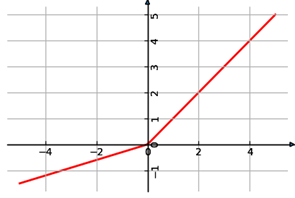
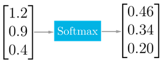

embARC Machine Learning Inference Library
*****************************************

Definitions
===========

.. _Definitions:
.. table:: Definitions
   :widths: auto
   
   +-----------------------------------+-----------------------------------+
   | **Term**                          | **Definition**                    |
   +===================================+===================================+
   | AGU                               | Address Generation Unit           |
   +-----------------------------------+-----------------------------------+
   | ARCv2DSP                          | Synopsys DesignWare® ARC®         |
   |                                   | Processors family of 32-bit CPUs  |
   +-----------------------------------+-----------------------------------+
   | ARC EMxD                          | Family of 32 bit ARC processor    |
   |                                   | cores. Single core, 3-step        |
   |                                   | pipeline, ARCv2DSP                |
   +-----------------------------------+-----------------------------------+
   | ARC HS4xD                         | Family of 32 bit ARC processor    |
   |                                   | cores. Multi core, dual issue,    |
   |                                   | 10-step pipeline, ARCv2DSP        |
   +-----------------------------------+-----------------------------------+
   | CHW                               | Channel-Height-Width data layout  |
   +-----------------------------------+-----------------------------------+
   | DMA                               | Direct memory Access              |
   +-----------------------------------+-----------------------------------+
   | DSP                               | Digital Signal Processor          |
   +-----------------------------------+-----------------------------------+
   | HWC                               | Height-Width-Channel data layout  |
   +-----------------------------------+-----------------------------------+
   | IoT                               | Internet Of Things                |
   +-----------------------------------+-----------------------------------+
   | MAC                               | Multiple Accumulate               |
   +-----------------------------------+-----------------------------------+
   | MWDT                              | MetaWare Development Tool set     |
   +-----------------------------------+-----------------------------------+
   | ML                                | Machine Learning                  |
   +-----------------------------------+-----------------------------------+
   | MLI Library                       | Machine Learning Inference        |
   |                                   | Library                           |
   +-----------------------------------+-----------------------------------+
   | MLI kernel                        | Basic operation on tensors in ML  |
   |                                   | model, provided by MLI Library as |
   |                                   | C-style API function. Typically   |
   |                                   | does not imply any intermediate   |
   |                                   | copying.                          |
   +-----------------------------------+-----------------------------------+
   | NN                                | Neural Network                    |
   +-----------------------------------+-----------------------------------+
   | Primitive                         | Basic ML functionality            |
   |                                   | implemented as MLI Kernel or MLI  |
   |                                   | Layer (Convolution 2D, Fully      |
   |                                   | connected, and so on)             |
   +-----------------------------------+-----------------------------------+
   | ReLU                              | Rectified Linear Unit             |
   +-----------------------------------+-----------------------------------+
   | TCF                               | Tool Configuration File. Hold     |
   |                                   | information about ARC processor   |
   |                                   | build configuration and           |
   |                                   | extensions.                       |
   +-----------------------------------+-----------------------------------+
   | Tensor                            | Object that contains binary data  |
   |                                   | and its complete description,     |
   |                                   | such as dimensions, element data  |
   |                                   | type, and so on.                  |
   +-----------------------------------+-----------------------------------+

\

Revision history
================

   +-----------------------+-----------------------+-----------------------+
   | **Date**              | **Version**           | **Comment**           |
   +=======================+=======================+=======================+
   | 15-June-2018          | 0.1                   | Draft for initial     |
   |                       |                       | review, incorporating |
   |                       |                       | list of functions of  |
   |                       |                       | interest for primary  |
   |                       |                       | customer              |
   +-----------------------+-----------------------+-----------------------+
   | 6-Dec-2018            | 0.4                   | First version for     |
   |                       |                       | wide review with      |
   |                       |                       | complete set of main  |
   |                       |                       | kernels.              |
   +-----------------------+-----------------------+-----------------------+
   | 15-Jan-2019           | 0.6                   | Changes of document   |
   |                       |                       | and API according to  |
   |                       |                       | feedback of first     |
   |                       |                       | review                |
   +-----------------------+-----------------------+-----------------------+

\

Machine Learning Inference Library API Description
==================================================

   *This chapter gives a brief introduction to Machine Learning
   Inference Library API, the arithmetic involved, the package contents
   and the build process.*

\

General Considerations
----------------------

   The Machine Learning Inference Library is the basis for machine
   learning inference for lower power families of ARCv2 DSP cores (ARC
   EMxD and ARC HS4xD). Its purpose is to enable porting of machine
   learning models mostly based on NN to ARC processors.

   The library is a collection of ML algorithms (primitives) which
   roughly can be separated into the following groups:

   -  **Convolution** - convolve input features with a set of trained weights.

   -  **Pooling** – pool input features with a function.

   -  **Common** - Common ML, mathematical, and statistical operations

   -  **Transform** - Transform each element of input set according to a particular function

   -  **Elementwise** - Apply multi operand function element-wise to several inputs

   -  **Data manipulation** - Move input data by a specified pattern

\

   MLI supported primitives are intended for

   -  ease of use and

   -  inferring efficient solutions for small/middle models using very limited resources.
      
\
  
.. _gen_api_struct:

.. _General_API_Structure:
   
General API Structure
~~~~~~~~~~~~~~~~~~~~~

   Library is implemented as a set of C functions. Each function implements one specific NN primitive. Inputs and outputs of functions are represented by tensors. In this calculation model, graph nodes are implemented by library functions (primitives), and graph edges are represented by tensors. As a result, neural network graph implementation can be represented as series of function calls. Functions are divided on two sets:

   -  **Kernel functions**: Main implementations of ML primitives. Kernel functions process data without re-ordering to more convenient layout by copying to intermediate buffer. Avoiding such overhead provides high efficiency from one side and high sensitivity to memory latency, data size and data layout on the other side. For hardware configurations with XY memory, some kernel functions assume that data is stored in a memory that can be accessed by AGU.

   -  **Helper functions**: Provide specific functions used by primitives or required for some specific actions not directly related to graph calculations (example: data format transformation). 

\

.. _data_types:
	  
Data Types
~~~~~~~~~~

   The library is intended to work with structured data types. Each data type groups related parameters in one entity as defined in .\ **/include/MLI_types.h** .

.. _mli_tns_struct:
   
mli_tensor Structure
^^^^^^^^^^^^^^^^^^^^^

   ``mli_tensor`` is the main container type for input and output data which
   must be processed by ML algorithm. ``mli_tensor`` represents
   multi-dimensional arrays of a particular shape and includes not only
   a data, but also its shape, type, and other data-specific parameters.

.. note::
   The term “data” includes input
   features, output features,    
   layer weights, and biases. It 
   does not include layer        
   parameters such as padding or 
   stride for convolutional      
   primitives. This data         
   representation is common for  
   neural networks and other     
   machine learning tasks.       
	  
.. code:: c

   typedef struct _mli_tensor {
      void *data;
      uint32_t capacity;
      uint32_t shape[MLI_MAX_RANK];
      uint32_t rank;
      mli_element_type el_type;
      mli_element_params el_params;
   } mli_tensor;

\
   
.. _mli_tensor_struc:
.. table:: mli_tensor Structure Fields
   :widths: auto
   
   +-----------------------+-----------------------+-----------------------+
   | Field name            | Field Type            | Field Description     |
   +=======================+=======================+=======================+
   |    data               |    void \*            | Pointer to memory     |
   |                       |                       | with tensor data      |
   +-----------------------+-----------------------+-----------------------+
   |    capacity           |    uint32_t           | Size in bytes of the  |
   |                       |                       | available memory,     |
   |                       |                       | allocated at the      |
   |                       |                       | address in data field |
   +-----------------------+-----------------------+-----------------------+
   |    shape              |    uint32_t[]         | Array with tensor     |
   |                       |                       | dimensions.           |
   |                       |                       | Dimensions must be    |
   |                       |                       | stored in direct      |
   |                       |                       | order starting from   |
   |                       |                       | the one with the      |
   |                       |                       | highest stride        |
   |                       |                       | between data          |
   |                       |                       | portions. For         |
   |                       |                       | example, for a matrix |
   |                       |                       | of shape              |
   |                       |                       | [rows][columns],      |
   |                       |                       | shape[0] = rows and   |
   |                       |                       | shape[1] = columns    |
   +-----------------------+-----------------------+-----------------------+
   |    rank               |    uint32_t           | Tensor rank with      |
   |                       |                       | the number of         |
   |                       |                       | dimensions. Must be   |
   |                       |                       | less or equal to      |
   |                       |                       | value of MLI_MAX_RANK |
   +-----------------------+-----------------------+-----------------------+
   |    el_type            |    mli_element        | Type of elements      |
   |                       |                       | stored in the tensor. |
   |                       |                       | For details, see      |
   |                       |                       | :ref:`mli_elm_enum`   |
   +-----------------------+-----------------------+-----------------------+
   |    el_params          |    mli_element_params | Parameters of         |
   |                       |                       | elements stored in    |
   |                       |                       | tensor. For details,  |
   |                       |                       | see                   |
   |                       |                       | :ref:`mli_el_prm_u`   |
   +-----------------------+-----------------------+-----------------------+

..

   Some primitives, such as slope coefficient for leaky ReLU, might
   require scalar parameters which explicitly involve calculations (not
   primitive configuration parameter). Such scalar
   inputs/outputs are also passed to primitive as tensor of rank=1 and
   shape[0]=1. For some primitives it is possible to provide scalar
   value as tensor with zero rank and single value stored directly in
   data field (not pointed by it).

   All input tensors passed to primitives typically must be valid with
   fields that are not conflicting. Examples of field conflicts are:

   -  Tensor shape declares more data than tensors capacity.

   -  Tensor rank is bigger than MLI_MAX_RANK

   -  Data pointer is invalid (NULL pointer) except cases when it is
      allowed to pass scalar value directly in data field.

   -  Tensor is empty (total number of elements is zero)

.. _mli_elm_enum:
   
mli_element_type Enumeration
^^^^^^^^^^^^^^^^^^^^^^^^^^^^

   ``mli_element_type`` defines basic element type stored in tensor
   structure (data field).

.. code:: c
   
   typedef enum {

   MLI_EL_FX_8 = 0,

   MLI_EL_FX_16,

   } mli_element_type;

\

.. _mli_element_type_val_desc:
.. table:: mli_element_type Values Description
   :widths: auto
   
   +-----------------------------------+-----------------------------------+
   |    Value                          |    Field Description              |
   +===================================+===================================+
   | MLI_EL_FX_8                       | 8-bit deep, fixed-point data with |
   |                                   | configurable number of fractional |
   |                                   | bits (see :ref:`mli_fpd_fmt`).    |
   |                                   | Data container is int8_t.         |
   |                                   | Also mentioned in this            |
   |                                   | document as fx8 type.             |
   +-----------------------------------+-----------------------------------+
   | MLI_EL_FX_16                      | 16-bit deep fixed-point data with |
   |                                   | configurable number of fractional |
   |                                   | bits (see :ref:`mli_fpd_fmt`).    |
   |                                   | Data container is int16_t.        |
   |                                   | Also mentioned in this            |
   |                                   | document as fx16 type.            |
   +-----------------------------------+-----------------------------------+

.. _mli_el_prm_u:   
   
mli_element_params Union
^^^^^^^^^^^^^^^^^^^^^^^^

   ``mli_element_params`` union stores data type parameters required for
   arithmetical operations with tensor elements.

.. code:: c
   
   typedef union \_mli_element_params {
      struct{
         unsigned frac_bits;
      } fx;
   } mli_element_params;

..
   
   Parameters are wrapped into union for future library extensibility.
   The current version supports only fixed point data with configurable
   number of fractional bits (see :ref:`mli_fpd_fmt`) and union
   can be interpreted only as the following structure.
   
\

.. _mli_element_params_struct_fields:
.. table:: mli_element_params Structure Fields
   :widths: auto   

   +-----------------+-----------------+-----------------+-----------------+
   | Union           | Field           | Field Type      | Field           |
   |                 |                 |                 | Description     |
   | Interpretation  |                 |                 |                 |
   +=================+=================+=================+=================+
   | ``fx``          | ``frac_bits``   | ``uint8_t``     | Number of       |
   |                 |                 |                 | fractional      |
   |                 |                 |                 | bits.           |
   |                 |                 |                 | Non-negative    |
   |                 |                 |                 | value.          |
   +-----------------+-----------------+-----------------+-----------------+

Kernel Specific Configuration Structures
^^^^^^^^^^^^^^^^^^^^^^^^^^^^^^^^^^^^^^^^

   Significant number of primitives must be configured by specific
   parameters, which influence calculations and results, but not
   directly related to input data. For example, padding and stride
   values are parameters of convolution layer and the type of ReLU is a
   parameter for ReLU transform layer. All specific parameters for
   particular primitive type are grouped into structures. This document
   describes these structures along with the primitive description they
   relate to.

.. _data_muldim:
   
Data Layout of Multidimensional Feature Maps
~~~~~~~~~~~~~~~~~~~~~~~~~~~~~~~~~~~~~~~~~~~~

   Functions of convolution and pooling groups deal with
   multi-dimensional feature maps which might be considered as images.
   In general, these maps have three dimensions with following names:
   height, width, and channels (also called depth). Despite logical
   organization, multidimensional feature maps are stored in memory as
   continuous arrays. Order of elements depends on the order of
   dimensions – data layout. :numref:`Multidim_Data_Layout` describes 
   two supported and traditionally used data layouts – HWC and CHW.

\

.. _Multidim_Data_Layout:
.. table:: Multidimensional Data Layout
   :widths: auto      

   +-----------------------------------+-----------------------------------+
   | Designation                       |    Description                    |
   +===================================+===================================+
   | HWC                               | The smallest stride between       |
   |                                   | dimension elements in memory is   |
   |                                   | for C (channel or depth) followed |
   |                                   | by the width and the height. The  |
   |                                   | height is the least frequently    |
   |                                   | changing index. For example       |
   |                                   | *In[32][16][8]* for this case is  |
   |                                   | a feature map with 32 rows        |
   |                                   | (**h**\ eight), 16 columns        |
   |                                   | (**w**\ idth) and 8               |
   |                                   | **c**\ hannels.                   |
   +-----------------------------------+-----------------------------------+
   | CHW                               | The smallest stride between       |
   |                                   | dimension elements in memory is   |
   |                                   | for W (width). Then height. The   |
   |                                   | channel is least frequently       |
   |                                   | changing index. For example       |
   |                                   | *In[32][16][8]* for this case is  |
   |                                   | a feature map with 32             |
   |                                   | **c**\ hannels, 16 rows           |
   |                                   | (**h**\ eight) and 8 columns      |
   |                                   | (**w**\ idth).                    |
   +-----------------------------------+-----------------------------------+

..

   Due to algorithmic reasons, HWC layout provides higher data locality
   for some functions, and CHW layout does so for others.

   “Data locality” means the data disposition in memory where elements
   consistently used by algorithm are stored in memory as close as
   possible (in ideal case, contiguously). Low data locality could
   reduce performance of systems with cache. For the layouts supported
   by particular kernels, see :ref:`fns`. Current version of MLI Library
   focuses on optimization of kernels for CHW layout.
   
.. _fns:
 
Functions 
~~~~~~~~~

   In general, several functions are implemented for each primitive
   supported by MLI library. Each function (implementation of primitive)
   is designed to deal with specific inputs. Therefore, you must meet the
   assumptions that functions make. For example, function designed to
   perform 2D convolution for data of ``fx8`` type must not be used with
   data of ``fx16`` type.

   All assumptions are reflected in function name according to naming
   convention (see :numref:`MLI_func_naming_conv` and 
   :numref:`MLI_fn_spl`). MLI Library functions have at
   least one assumption on input data types. Functions with only
   data-type assumption are referred to as generic functions while
   functions with additional assumptions referred to as specialized
   functions or specializations.

   .. note::    
	  A lot of specializations along with generic functions are implemented in convolution and pooling groups for each primitive. Generic functions are typically slower than the specialized ones. For this reason, a function without postfix performs switching logic to choose the correct specialized function or a generic function if there is no appropriate specialization. Such ‘switchers’ significantly increase the code size of application and should be used only in development or intentionally. Generic functions have a ‘_generic’ name postfix, and specializations have a descriptive postfix.

Naming Convention
^^^^^^^^^^^^^^^^^

   MLI Library function adheres naming convention listed in :numref:`MLI_func_naming_conv`:

\
  
.. _MLI_func_naming_conv:
.. table:: MLI Library Functions Naming Convention
   :widths: auto   

   +-----------------------+-----------------------+---------------------------------+
   | ``mli_<set>_<type>_[layout]_<data_type>_[spec](<in_data>,[config],<out_data>);``| 
   +=======================+=======================+=================================+
   | Field name            | Field Entries         | Field Description               |
   +-----------------------+-----------------------+---------------------------------+
   | ``set``               | ``krn``               | Mandatory. Specifies            |
   |                       |                       | set of functions                |
   |                       | ``hlp``               | related to the                  |
   |                       |                       | implementation. See             |
   |                       |                       | :ref:`gen_api_struct`           |
   |                       |                       | for more information.           |
   +-----------------------+-----------------------+---------------------------------+
   | ``type``              | ``conv2d``            | Mandatory. Specifies            |
   |                       |                       | particular type of              |
   |                       | ``fully_connected``   | primitive supported             |
   |                       |                       | by the library                  |
   +-----------------------+-----------------------+---------------------------------+
   | ``layout``            | ``chw``               | Optional. Specifies             |
   |                       |                       | data layout for                 |
   |                       | ``hwc``               | image-like inputs.              |
   |                       |                       | See :ref:`data_types` for       |
   |                       |                       | more information.               |
   +-----------------------+-----------------------+---------------------------------+
   | ``data_type``         | ``fx8``               | Mandatory. Specifies            |
   |                       |                       | the tensor basic                |
   |                       | ``fx16``              | element type expected           |
   |                       |                       | by the function.                |
   |                       | ``fx8w16d``           |                                 |
   |                       |                       | fx8w16d means weights           |
   |                       |                       | and bias tensors are            |
   |                       |                       | 8-bit, while all the            |
   |                       |                       | others are 16-bit.              |
   |                       |                       |                                 |
   |                       |                       | For more information,           |
   |                       |                       | see :ref:`mli_fpd_fmt`          |
   +-----------------------+-----------------------+---------------------------------+
   | ``spec``              |                       | Optional. Reflects              |
   |                       |                       | additional                      |
   |                       |                       | assumptions of                  |
   |                       |                       | function. For                   |
   |                       |                       | example, if the                 |
   |                       |                       | function can only               |
   |                       |                       | process convolutions            |
   |                       |                       | of a 3x3 kernel, this           |
   |                       |                       | should be reflected             |
   |                       |                       | in this field (see              |
   |                       |                       | :numref:`MLI_fn_spl`)           |
   +-----------------------+-----------------------+---------------------------------+
   | ``in_data``           |                       | Mandatory. Input data           |
   |                       |                       | tensors                         |
   +-----------------------+-----------------------+---------------------------------+
   | ``config``            |                       | Optional. Structure             |
   |                       |                       | of primitive-specific           |
   |                       |                       | parameters                      |
   +-----------------------+-----------------------+---------------------------------+
   | ``out_data``          |                       | Mandatory. Output               |
   |                       |                       | data tensors                    |
   +-----------------------+-----------------------+---------------------------------+

..

   Example:

   ``mli_krn_avepool_hwc_fx8(const mli_tensor *in, const mli_pool_cfg *cfg, mli_tensor *out);``

.. _spec_fns:

Specialized Functions
^^^^^^^^^^^^^^^^^^^^^

   Naming convention for the specializations: \

.. _MLI_fn_spl:
.. table:: MLI Library Functions Naming \- Specialization Details
   :widths: auto  

   +-----------------------+---------------------------+-----------------------+
   | Configuration         |    Naming convention      | Relevant for          |
   | parameter             |                           |                       |
   +=======================+===========================+=======================+
   | ``Kernel size``       | [_k\ *n*\ x\ *m*]         | convolution group,    |
   |                       |                           | pooling group         |
   |                       | where *n* and *m* are     |                       |
   |                       | the kernel dimensions     |                       |
   |                       | example: \_k1x1, \_k3x3.  |                       |
   |                       | One of dimension might    |                       |
   |                       | be left unfixed example   |                       |
   |                       | \_k1xn                    |                       |
   +-----------------------+---------------------------+-----------------------+
   | ``Padding``           | [_nopad \| \_krnpad]      | convolution group,    |
   |                       |                           | pooling group         |
   |                       | Where \_nopad             |                       |
   |                       | functions assumes         |                       |
   |                       | that all padding          |                       |
   |                       | parameters are            |                       |
   |                       | zeros, and \_krnpad       |                       |
   |                       | functions assumes         |                       |
   |                       | smallest padding          |                       |
   |                       | parameters to achieve     |                       |
   |                       | same output size          |                       |
   |                       | (similar to ‘SAME’        |                       |
   |                       | padding scheme used       |                       |
   |                       | in TensorFlow [3]_        |                       |
   +-----------------------+---------------------------+-----------------------+
   | ``Input channels``    | [_ch\ *n*]                | convolution group,    |
   |                       |                           | pooling group         |
   |                       | where *n* is the          |                       |
   |                       | number of channels        |                       |
   |                       | example \_ch1, \_ch4      |                       |
   +-----------------------+---------------------------+-----------------------+
   | ``Stride``            | [_str[h|w]\ *n*]          | convolution group,    |
   |                       |                           | pooling group         |
   |                       | where n is the stride     |                       |
   |                       | value, if needed h or     |                       |
   |                       | w can be used if          |                       |
   |                       | horizontal stride is      |                       |
   |                       | different from            |                       |
   |                       | vertical if omitted,      |                       |
   |                       | both strides are          |                       |
   |                       | equal. Example: \_str1,   |                       |
   |                       | \_strh2_strw1             |                       |
   +-----------------------+---------------------------+-----------------------+
   | ``Generalization``    | [_generic]                | convolution group,    |
   |                       |                           | pooling group         |
   |                       | If there are a lot of     |                       |
   |                       | specializations for a     |                       |
   |                       | primitive, \_generic      |                       |
   |                       | functions can process     |                       |
   |                       | inputs with any           |                       |
   |                       | combinations of           |                       |
   |                       | parameters.               |                       |
   |                       | Unspecialized             |                       |
   |                       | functions (without        |                       |
   |                       | [_spec] field in          |                       |
   |                       | name) behave as           |                       |
   |                       | “switches” which          |                       |
   |                       | analyze inputs and        |                       |
   |                       | choose suitable           |                       |
   |                       | specialization.           |                       |
   |                       | Switch   chooses          |                       |
   |                       | \_generic version in      |                       |
   |                       | case there are no         |                       |
   |                       | suitable                  |                       |
   |                       | specializations.          |                       |
   +-----------------------+---------------------------+-----------------------+

\

   For example, the function name of a 16bit 2d convolution kernel with
   CHW layout and a kernel size of 3x3 and stride of 1 is:
   ``mli_krn_conv2d_chw_fx16_k3x3_str1()``.

.. _err_codes:

Error Codes
~~~~~~~~~~~

   Functions return value of *mli_status* enumeration type which is
   declared in **include/MLI_types.h**. By default, functions do not
   validate inputs and typically return only ``MLI_STATUS_OK``.

   To turn on the checking logic, ensure that you build the MLI library
   with along with the required debug mode as described in section
   :ref:`func_param_dbg`. This might slightly affect the performance and code size of the library.

   :numref:`mli_status_val_desc` contains list of status code with description.

.. _mli_status_val_desc:
.. table:: mli_status Values Description
   :widths: auto   

   +-----------------------------------+-----------------------------------+
   | Value                             | Field Description                 |
   +===================================+===================================+
   | ``MLI_STATUS_OK``                 | No error occurred                 |
   +-----------------------------------+-----------------------------------+
   | ``MLI_STATUS_BAD_TENSOR``         | Invalid tensor is passed to the   |
   |                                   | function                          |
   +-----------------------------------+-----------------------------------+
   | ``MLI_STATUS_SHAPE_MISMATCH``     | Shape of tensors are not          |
   |                                   | compatible for the function       |
   +-----------------------------------+-----------------------------------+
   | ``MLI_STATUS_BAD_FUNC_CFG``       | Invalid configuration structure   |
   |                                   | is passed                         |
   +-----------------------------------+-----------------------------------+
   | ``MLI_STATUS_NOT_ENGH_MEM``       | Capacity of output tensor is not  |
   |                                   | enough for function result        |
   +-----------------------------------+-----------------------------------+
   | ``MLI_STATUS_NOT_SUPPORTED``      | Function is not yet implemented,  |
   |                                   | or inputs combination is not      |
   |                                   | supported.                        |
   +-----------------------------------+-----------------------------------+
   | ``MLI_STATUS_SPEC_PARAM_MISMATCH``| Function parameters do not match  |
   |                                   | the one specified in the          |
   |                                   | specialized function.             |
   +-----------------------------------+-----------------------------------+

Global Definitions and Library Configurability
~~~~~~~~~~~~~~~~~~~~~~~~~~~~~~~~~~~~~~~~~~~~~~

   All configurable global definitions and constants are defined in ``./include/MLI_config.h``. This header file is not included in ``./include/MLI_API.h`` header and should be included implicitly in user code in case its content might be useful. For example, use ``ARC_PLATFORM`` define for multi-platform applications.

.. _tgt_pf_def:

Target Platform Definition (ARC_PLATFORM)
^^^^^^^^^^^^^^^^^^^^^^^^^^^^^^^^^^^^^^^^^

   ARC_PLATFORM defines main platform type that the library is built
   for. By default this is determined in compile time according to the
   TCF file. To explicitly set platform, set ARC_PLATFORM to one of the
   following macros in advance:

   -  **V2DSP** – using ARCv2DSP ISA extensions only (EM5D or EM7D).

   -  **V2DSP_WIDE** – using wide ARCv2DSP ISA extensions (HS45D or HS47D)

   -  **V2DSP_XY** – using ARCv2DSP ISA extensions and AGU (EM9D or EM11D).

.. _func_param_dbg:
   
Function Parameters Examination and Debug (MLI_DEBUG_MODE)
^^^^^^^^^^^^^^^^^^^^^^^^^^^^^^^^^^^^^^^^^^^^^^^^^^^^^^^^^^

   MLI Library supports three debug modes. You can choose the debug mode
   by setting MLI_DEBUG_MODE define as follows:

   -  **DBG_MODE_RELEASE** (**MLI_DEBUG_MODE** = 0) – No debug. Functions
      do not examine parameters, and process data assuming they are valid.
      This might lead to undefined behavior if the assumption is not true.
      Functions always return MLI_STATUS_OK. No messages are printed, and
      no assertions are used.

   -  **DBG_MODE_RET_CODES** (**MLI_DEBUG_MODE** = 1) – Functions examine
      parameters and return valid error status if any violation of data is
      found. Else, functions process data and return status MLI_STATUS_OK.
      No messages are printed and no assertions are used.

   -  **DBG_MODE_FULL** (**MLI_DEBUG_MODE** = 3) – Functions examine
      parameters. If any violation of data is found, the function prints a
      descriptive message using standard **printf()** function and tries to
      break the execution using **assert()** function. If the **assert()**
      function does not break the execution, function returns error status.

..

   By default, ``MLI_DEBUG_MODE`` is set to ``DBG_MODE_RELEASE``.

Concatenation Primitive: Maximum Tensors to Concatenate (MLI_CONCAT_MAX_TENSORS)
^^^^^^^^^^^^^^^^^^^^^^^^^^^^^^^^^^^^^^^^^^^^^^^^^^^^^^^^^^^^^^^^^^^^^^^^^^^^^^^^

   This primitive configures maximum number of tensors for concatenation
   by appropriate primitive (see :ref:`concat`). Default: 8.

Memory Allocation
~~~~~~~~~~~~~~~~~

   Library does not allocate any memory dynamically. Application is
   responsible for providing correct parameters for function and
   allocate memory for it if necessary. Library might use internal
   statically allocated data (tables of constants).

.. _hw_comp_dpd:   
   
Hardware Components Dependencies 
~~~~~~~~~~~~~~~~~~~~~~~~~~~~~~~~~

DSP Control
^^^^^^^^^^^

   MLI Library intensively uses ARCv2DSP extension of ARC EM and ARC HS
   processors. Ensure that this extension is present and correctly
   configured in hardware.

   Ensure that you build the library with the appropriate command line
   parameter:

   ``-Xdsp_ctrl=postshift,guard,up``

..   
   
   Where “up” defines the rounding mode of DSP hardware (rounding up)
   and it is the only parameter which might be changed (to “convergent” -
   round to the nearest even). All parameters are described in *MetaWare
   Fixed-Point Reference for ARC EM and ARC HS*.

.. note::
   MLI Library sets the required DSP   mode inside each function where it is needed, but does not restore it to previous state. If another ARC DSP code beside MLI library is used in an application, ensure that you set the required DSP mode before its execution. For more information see  “Configuring the ARC DSP Extensions” section of [4]_ or “Using the FXAPI” section of [5]_.

AGU Support
^^^^^^^^^^^

   Library is optimized for systems with and without AGU (address
   generation unit). If AGU is present in the system, then library code
   optimized for AGU is compiled automatically, otherwise the AGU 
   optimization is not used (see :ref:`tgt_pf_def`).
   Inside primitives, pointers to some data defined with use of
   MLI_PTR(p) macro expand into “__xy p \*” in AGU systems, and to “p
   \*” in system without AGU. An application is responsible for
   allocation of relevant buffers in the AGU memory region (for more
   information see “XY Memory Optimization” chapter *of MetaWare DSP
   Programming Guide for ARC EM and ARC HS*). 

   :numref:`AGU_Req_tensors` provides information about tensors must 
   be allocated into AGUaccessible memory for each primitive. Tensors 
   not mentioned in :numref:`AGU_Req_tensors` does not have to be allocated in the 
   same way.
   
.. _AGU_Req_tensors:
.. table:: AGU Requirements for Tensors
   :widths: auto

   +-----------------------------------+-----------------------------------+
   |    Primitive                      |    Tensors must be allocated into |
   |                                   |    AGU accessible memory          |
   +===================================+===================================+
   |    Convolution 2D                 |    in, weights, out, biases       |
   +-----------------------------------+-----------------------------------+
   |    Depthwise convolution          |    in, weights, out, biases       |
   +-----------------------------------+-----------------------------------+
   |    Max Pooling                    |    In, out                        |
   +-----------------------------------+-----------------------------------+
   |    Average Pooling                |    In, out                        |
   +-----------------------------------+-----------------------------------+
   |    Fully connected                |    In, out                        |
   +-----------------------------------+-----------------------------------+
   |    Long Short Term Memory         |    In, weights, biases, out,      |
   |                                   |    prev_out, ir_tsr               |
   +-----------------------------------+-----------------------------------+
   |    Basic RNN cell                 |    In, weights, biases, out,      |
   |                                   |    prev_out, ir_tsr               |
   +-----------------------------------+-----------------------------------+
   |    ReLU                           |    In, out                        |
   +-----------------------------------+-----------------------------------+
   |    Leaky ReLU                     |    In, out                        |
   +-----------------------------------+-----------------------------------+
   |    Sigmoid                        |    In, out                        |
   +-----------------------------------+-----------------------------------+
   |    TanH                           |    In, out                        |
   +-----------------------------------+-----------------------------------+
   |    Softmax                        |    In, out                        |
   +-----------------------------------+-----------------------------------+
   |   Eltwise                         |    In1, in2, out                  |
   |   add/subtract/max/multiplication |                                   |
   |                                   |                                   |
   +-----------------------------------+-----------------------------------+
   |    Concatenation                  |    -                              |
   +-----------------------------------+-----------------------------------+
   |    Permute                        |    -                              |
   +-----------------------------------+-----------------------------------+
   |    Padding 2D                     |    -                              |
   +-----------------------------------+-----------------------------------+

Arithmetic Details
------------------

   The MLI Library is targeting ARCv2DSP based platform and implies
   efficient usage of its DSP Features. For this reason, there is some
   specificity of basic data types and arithmetical operations using it
   in comparison with operations using float-point values.

.. _mli_fpd_fmt:   
   
MLI Fixed-Point Data Format
~~~~~~~~~~~~~~~~~~~~~~~~~~~

   Default MLI Fixed-point data format (represented by tensors of
   ``MLI_EL_FX_8`` and ``MLI_EL_FX_16`` element types) reflects general signed
   values interpreted by typical Q notation [1,2]. The following
   designation is used:

   -  value of *Qm.n* format have *m* bits for integer part (excluding sign bit), 
      and *n* bits for fractional part.

   -  value of *Q.n* format have *n* bits for fractional part\ *.* The rest of the 
      non-sign bits are assumed to hold an integer part.

.. note::
   For more information regarding Q notation, see [1]_ and [2]_.
	  
Data storage
^^^^^^^^^^^^

   The container of the tensor’s values is always signed two’s
   complemented integer numbers: 8 bit for ``MLI_EL_FX_8`` (also referred to as ``fx8``) and
   16 bit for ``MLI_EL_FX_16`` (also referred to as ``fx16``). ``mli_tensor`` keeps only number
   of fractional bits (see ``fx.frac_bits`` in :ref:`mli_el_prm_u`),
   which corresponds to the second designation above.

   Examples:

   Given 0x4000h (16384) value in 16bit container,

   • In Q0.15 (and Q.15) format, this represents 0.5

   • In Q1.14 (and Q.14) format, this represents 1.0

   For more information on how to get the real value of tensor from fx,
   see :ref:`data_fmt_conv`.

   Number of fractional bits must be nonnegative value. Number of
   fractional bits might be bigger than total number of containers
   significant (not-sign) bits. In this case all bits not present in the
   container implied equal to sign bit.

   Examples:

   Given 0x0020 (32) in Q.10 format,

   • For a 16 bit container (Q5.10), this represents 0.3125 real value.

   • The value also can be stored in an 8 bit container without
     misrepresentation. Therefore, 0x20 in Q-3.10 format is equivalent to
     0.3125 real value.
    
   Given 0x0220 (544) in Q.10 format,

   • For 16 bit container (Q5.10), this represent 0.53125 real value.

   • The value cannot be stored in an 8 bit container in the same Q
     format. Therefore, conversion is required.
    
   Values originally stored in the containers with a larger number of
   bits can be represented in a container with smaller number of bits
   only with a certain accuracy. For the same reason, values originally
   stored as single precision floating point numbers cannot be
   accurately represented in fx16 or fx8 formats, since usually have 24
   bits for the mantissa.
   
.. note::      
   Asymmetricity of signed integer types affects FX  representation. fx8 container (int8_t) holds values in range of [-128, 127] which means that FX representation of this number is also asymmetric. So for Q.7 format, this range is [-1, 1), or
   to be more precise [-1.0, 0.9921875] (excluding 1.0). Similarly, fx16 container (int16_t) holds values in range of [-32768, 32767]. For Q.15 format, the range is [-1, 0.999969482421875].           

.. _op_fx_val:
     
Operations on FX values
^^^^^^^^^^^^^^^^^^^^^^^

   Arithmetical operations are actually performed on signed integers
   according to the rules for two’s complemented integer numbers. Q
   notation gives these values a different meaning and to save
   it, some additional operations are required.

.. _data_fmt_conv:

Data Format Conversion
''''''''''''''''''''''

   Conversion between real values and fx value might be performed
   according to the following formula:
 

.. math:: fx\_ val\  = Round(real\_ val\ *2^{fraq\_ bits})

..

.. math:: dequant\_ real\_ val\  = \frac{fx\_ val\ }{{\ 2}^{fraq\_ bits}}

..

Where:

   ``real_val``– real value (might be represented as float)

   ``dequant_real_val`` – de-quantized real value.

   ``fx_val`` - FX value of particular Q format

   ``fraq_bits`` – number of ``fx_val`` fractional bits.

   ``Round()`` – rounding according to one of supported modes

   2 :sup:`fraq_bits` represents 1.0 in FX format and also might
   be obtain by shifting (1 << fraq_bits). Rounding mode (nearest, up,
   convergence) affects only FX representation accuracy. MLI Library
   uses rounding provided by ARCv2 DSP hardware (see :ref:`hw_comp_dpd` ). ``dequant_real_val`` might be not equal to
   ``real_ val`` in case of immediate forward/backward conversion
   due to rounding operation (see examples 2 and 4 from the following example list).

   Examples:

   -  For a real value of 0.85; FX format Q.7; rounding mode nearest, the
      FX value is computed as:

      ``Round(0.85 * (2^7)) = Round(0.85 * 128) = Round(108.8) = 109 (0x6D)``

   -  For a Real value -1.09; FX format Q.10; rounding mode: nearest, the
      FX value is computed as:

      ``Round(-1.09 * (2^10)) = Round(-1.09 * 1024) = Round (-1116.16) =  -1116 (0xFBA4)``

   -  For an FX value 5448 in Q.15 format, the real value is computed as:

      ``5448 / (2^15) = 5448 / 32768 = 0.166259765625``

   -  For an FX value -1116 in Q.10 format, the real value is computed as:

      ``-1116 / (2^10) = -1116 / 1024 = -1.08984375``

   Conversion between two FX formats with different number of fractional
   bits requires value shifting: shift left in case of increasing number
   of fractional bits, and shift right with rounding in case of
   decreasing.

   Examples:

   -  For an FX value 0x24 in Q.8 format (0.140625), the FX value in Q.12
      format is computed as:

      ``(0x24 << (12 – 8) ) = (0x24 << 4 ) = 0x240 in Q.12 (0.140625)``

   -  For an FX value 0x24 in Q.4 format (2.25), the FX value in Q.1format
      with rounding mode 'up' is computed as:

     ``Round(0x24>>(4–1)) = Round(0x24>>3) = (0x24 + (1<<(3-1))) >> 3 = 0x28>>3 = 0x5 in Q.1(2.5)``

Addition and Subtraction
''''''''''''''''''''''''

   In fixed point arithmetic, addition and subtraction are performed as
   they are for general integer values but only when the input values
   are in the same format. Otherwise, ensure that you perform conversion
   to bring the input values into the same format before operation.

Multiplication
''''''''''''''

   For multiplication input operands do not have to be of the same
   format. The width of the integer part of the result is the sum of 
   widths of integer parts of the opernads. The width of the fractional 
   part of the result is the sum of widths of fractional parts of the operands.

   Example:

   For a number x in Q4.3 format (that is, 4 bits for integer and 3 for
   fractional part) and a number y in Q5.7 format, ``x*y`` is in Q9.10
   format (4+5=9 bits for integer part and 3+7=10 for fractional part).

.. note::
   For particular values            
   multiplication might result in     
   integer value (that is, no fractional
   bits required), but for general  
   case fractional part must be     
   reserved                         
     
..

   Multiplication increases number of significant bits and requires
   bigger container for intermediate result. Data conversion is
   necessary for saving result of multiplication to output container
   that typically does not have enough bits for holding all result. So,
   unlike the addition/subtraction where conversion of inputs might be
   required for inputs, multiplication typically requires conversion of
   result.

Division
''''''''

   For division, input operands also do not have to be of the same
   format. The result has a format containing the difference of bits in
   the formats of input operands.

   Example:

  -  For a dividend ``x`` in Q16.16 format and a divisor y in Q7.10 format,
     the format of the result ``x/y`` is Q(16-7).(16-10), or Q9.6 format.

\

  -  For a dividend ``x`` in Q7.8 format and a divisor y in Q3.12 format, the
     format of the result ``x/y`` is in Q4.-4 format.

..

   Since division is implemented using integer operation, the number of
   significant bits is decreased. For the second example, sum of integer
   and fractional parts of output format is 4 + (-4) = 0. This means
   total precision loss for output value. To avoid this situation,
   conversion of dividend operand to a bigger format (with more
   significant bits) is required.

Accumulation
''''''''''''

   Even single addition might result in overflow if all bits of operands
   are used and both of them hold the maximum (or minimum) values. It
   means that an extra bit is required for this operation. But if
   sum of several operands is needed(accumulation), more than one extra bit is
   required to make sure that result does not overflow. Assuming that
   all operands of the same format, the number of extra bits is defined
   based on the number of additions to be done:

.. math:: extra\_ bits = \operatorname{}{(number\_ of\_ additions)})

..

   Where Ceil(\ *x*) function rounds up x to the smallest integer value
   that is not less than *x*. From notation point of view, these extra
   bits are added to integer part.

   Example:

   For 34 values in Q3.4 format to be accumulated, the number of extra
   bits are computed as: ceil(log\ :sub:`2` 34)= ceil(5.09) = 6

   Result format is: Q9.4 (since 3+6=9)

   The same logic applies for sequential Multiply-Accumulation (MAC)
   operation.

ARCv2DSP Implementation Specifics
^^^^^^^^^^^^^^^^^^^^^^^^^^^^^^^^^^^^^

   The MLI Library is designed keeping performance in mind as one of the
   main goals. This section deals with manual model adaptation of MLI
   library.

Bias for MAC-based Kernels
''''''''''''''''''''''''''

   MAC based kernels (convolutions, fully connected, recurrent, etc)
   typically use several input tensors including input feature map,
   weights and bias (constant offset). All of them might hold data of
   different FX format. The number of fractional bits is used to derive
   shift values for bias and output. Such kernels perform accumulator
   initialization with left pre-shifted bias value (format cast before
   addition). For this reason, the number of bias fractional bits must
   be less than or equal to fractional bits for the sum of inputs. This
   condition is checked by primitives in debug mode. For more
   information, see :ref:`err_codes`.

   Example:

   Given an Input tensor of Q.7 format; and weights tensor of Q.3
   format, the number of its fractional bits before shift left operation
   must be less or equal to 10 (since 7+3=10) for correct bias.

Configurability of Output Tensors Fractional Bits 
''''''''''''''''''''''''''''''''''''''''''''''''''

   Not all primitives provide possibility to configure output tensor
   format – some of them derive it based on inputs or used algorithm, 
   while others must be configured with required output format explicitly. 
   It depends on the basic operation used by primitive:
   
   -  Primitives based on multiplication and division deal with
      intermediate data formats (see :ref:`op_fx_val`). If the result 
      does not fit in the output container, ensure that you provide the 
      desired result format for result conversion. Typically, it
      can not be derived from inputs and primitives of this kind requires
      output format. For example, this statement is true for convolution2D
      and fully connected.

   -  Primitives based on addition, subtraction, and unary operations (max,
      min, etc) use input format (at least one of them) to perform
      calculation and save result. Conversion operation in this case isn’t
      required.

..

   Output configurability is specified in description for each primitive.

Quantization: Influence of Accumulator Bit Depth
''''''''''''''''''''''''''''''''''''''''''''''''

   The MLI Library applies neither saturation nor post-multiplication
   shift with rounding in accumulation. Saturation is performed only for
   the final result of accumulation while its value is reduced to the
   output format. To avoid result overflow, user is responsible for
   providing inputs of correct ranges to library primitives.

   Number of available bits depends on operands types:

   -  **FX8 operands**: 32-bit depth accumulator is used with 1 sign bit
      and 31 significant bits. FX8 operands have 1 sign and 7 significant
      bits. Single multiplication of such operands results in 7 + 7 = 14
      significant bits for output. Thus for MAC based kernels, 17
      accumulation bits (since 31–(7+7)=17) are available which can be used
      to perform up to 2 :sup:`17` = 131072 operations without overflow.

      For simple accumulation, 31 – 7 = 24 bits are available which
      guaranteed to perform up to 2 :sup:`24` = 16777216 operations without
      overflow.

   -  **FX16 operands**: 40-bit depth accumulator is used with 1 sign bit
      and 39 significant bits. FX16 operands have 1 sign and 15 significant
      bits. Single multiplication of such operands results 15 + 15 = 30
      significant bits for output. For MAC based kernels, 39 – (15+15) = 9
      accumulation bits are available, which can be used to perform up to
      2 :sup:`9` = 512 operations without overflow.

      For simple accumulation, 39 – 15 = 24 bits are available which
      perform up to 2 :sup:`24` = 16777216 operations without overflow.

   -  **FX16 x FX8 operands**: 40-bit depth accumulator is used. For MAC
      based kernels, 39 – (15 + 7) = 39 - 22 = 17 accumulation bits are
      available which can be used to perform up to 2 :sup:`17` = 131072 operations
      without overflow.

..

   In general, the number of accumulations required for one output value
   calculation can be easily estimated in advance. According to
   this information one can define if accumulator satisfies requirements
   or not.

   
.. note::   
   -  If available bits are not enough, ensure that you quantize inputs
      (including weights for both the operands of MAC) while keeping some
      bits unused.
	  
   -  To reduce the influence of quantization on result, ensure that you 
      evenly distribute these bits between operands.

..
   
   Example:

   Given fx16 operands, 2D Convolution layer with 5x5 kernel size on
   input with 64 channels, Initial Input tensor format being Q.11,
   Initial weights tensor format being Q.15,

   each output value of 2D convolution layer requires the following
   number of accumulations:

   ``kernel_height(5) \* kernel_width(5) \* input_channels(64) +
   bias_add(1) = 5*5*64+1=1601``

   To ensure that the result does not overflow in accumulation, the
   following number of extra bits is required:

   ``ceil(log2(1601)) = ceil(10.65) = 11``

   9 extra bits are present in 40-bit accumulator for fx16 operands. To
   ensure no overflow, distribute 11-9=2 bits between inputs and weights
   and correct number of fractional bits. 2 is even number and it might
   be distributed equally (-1 fractional bit for each operand).

   The new number of fractional bits in Input tensor: = 11 – 1 = 10

   The new number of fractional bits in Weights tensor: = 15 – 1 = 14

Getting Started
---------------

   The MLI library provides a basic set of functions running on the ARC
   EM DSP and HS cores and is intended to solve typical machine learning
   tasks in a portable or low-power system. This library is designed
   with ease of use and low overhead in mind.

Package content
~~~~~~~~~~~~~~~

   This package consists of the following files and folders:

   +---------------------------------+-----------------------------------------+-----------------------+
   | **Folder**                      | **Files**                               | **Description**       |
   +=================================+=========================================+=======================+
   |                                 | ``Makefile``                            | Root makefile that    |
   |                                 |                                         | allows to build       |
   |                                 |                                         | library and the set   |
   |                                 |                                         | of example            |
   |                                 |                                         | applications.         |
   +---------------------------------+-----------------------------------------+-----------------------+
   | **include/**                                                                                      |
   +---------------------------------+-----------------------------------------+-----------------------+
   |                                 | ``MLI_API.h``                           | High level header     |
   |                                 |                                         | used by application.  |
   |                                 |                                         | Includes all required |
   |                                 |                                         | headers for working   |
   |                                 |                                         | with library.         |
   +---------------------------------+-----------------------------------------+-----------------------+
   |                                 | ``MLI_types.h``                         | Header that           |
   |                                 |                                         | conglomerates all     |
   |                                 |                                         | public library        |
   |                                 |                                         | specific data types.  |
   +---------------------------------+-----------------------------------------+-----------------------+
   |                                 | ``MLI_config.h``                        | Configuration header  |
   |                                 |                                         | with definitions used |
   |                                 |                                         | for library           |
   |                                 |                                         | implementation        |
   |                                 |                                         | configurability.      |
   +---------------------------------+-----------------------------------------+-----------------------+
   |                                 | ``api``                                 | The subdirectory that |
   |                                 |                                         | contains the set of   |
   |                                 |                                         | low level public      |
   |                                 |                                         | headers declaring the |
   |                                 |                                         | API.                  |
   +---------------------------------+-----------------------------------------+-----------------------+
   | **include/api**                                                                                   |
   +---------------------------------+-----------------------------------------+-----------------------+
   |                                 | ``MLI_helpers_API.h``                   | Header with           |
   |                                 |                                         | declarations for      |
   |                                 |                                         | helper functions      |
   +---------------------------------+-----------------------------------------+-----------------------+
   |                                 | ``MLI_kernels_API.h``                   | Header with           |
   |                                 |                                         | declarations for      |
   |                                 |                                         | kernel functions      |
   +---------------------------------+-----------------------------------------+-----------------------+
   |                                 | ``mli_krn_avepool_spec_i.h``            | Header with           |
   |                                 |                                         | declarations for      |
   |                                 |                                         | average pooling       |
   |                                 |                                         | specializations       |
   +---------------------------------+-----------------------------------------+-----------------------+
   |                                 | ``mli_krn_conv2d_spec_api.h``           | Header with           |
   |                                 |                                         | declarations for      |
   |                                 |                                         | convolution 2D        |
   |                                 |                                         | specializations       |
   +---------------------------------+-----------------------------------------+-----------------------+
   |                                 | ``mli_krn_depthwise_conv2d_spec_api.h`` | Header with           |
   |                                 |                                         | declarations for      |
   |                                 |                                         | depth-wise            |
   |                                 |                                         | convolution           |
   |                                 |                                         | specializations       |
   +---------------------------------+-----------------------------------------+-----------------------+
   |                                 | ``mli_krn_maxpool_spec_api.h``          | Header with           |
   |                                 |                                         | declarations for max  |
   |                                 |                                         | pooling               |
   |                                 |                                         | specializations       |
   +---------------------------------+-----------------------------------------+-----------------------+
   | **build/**                                                                                        |
   +---------------------------------+-----------------------------------------+-----------------------+
   |                                 | ``rules.mk``                            | The common makefile   |
   |                                 |                                         | that declares the     |
   |                                 |                                         | generic build targets |
   |                                 |                                         | and rules.            |
   +---------------------------------+-----------------------------------------+-----------------------+
   | **lib/**                                                                                          |
   +---------------------------------+-----------------------------------------+-----------------------+
   | lib/make/                       | ``Makefile``                            | Library makefile.     |
   +---------------------------------+-----------------------------------------+-----------------------+
   | lib/src/helpers/                |                                         | Directory containing  |
   |                                 |                                         | implementation of     |
   |                                 |                                         | helper functions:     |
   +---------------------------------+-----------------------------------------+-----------------------+
   | **lib/kernels/**                                                                                  |
   +---------------------------------+-----------------------------------------+-----------------------+
   |                                 | ``common/``                             | Directory containing  |
   |                                 |                                         | implementation of     |
   |                                 |                                         | common kernels        |
   +---------------------------------+-----------------------------------------+-----------------------+
   |                                 | ``convolution/``                        | Directory containing  |
   |                                 |                                         | implementation of     |
   |                                 |                                         | convolution kernels   |
   +---------------------------------+-----------------------------------------+-----------------------+
   |                                 | ``elementwise/``                        | Directory containing  |
   |                                 |                                         | implementation of     |
   |                                 |                                         | elementwise kernels   |
   +---------------------------------+-----------------------------------------+-----------------------+
   |                                 | ``pooling/``                            | Directory containing  |
   |                                 |                                         | implementation of     |
   |                                 |                                         | pooling kernels       |
   +---------------------------------+-----------------------------------------+-----------------------+
   |                                 | ``data_manip/``                         | Directory containing  |
   |                                 |                                         | implementation of     |
   |                                 |                                         | data manipulation     |
   |                                 |                                         | kernels               |
   +---------------------------------+-----------------------------------------+-----------------------+
   |                                 | ``transform/``                          | Directory containing  |
   |                                 |                                         | implementation of     |
   |                                 |                                         | transform kernels     |
   +---------------------------------+-----------------------------------------+-----------------------+
   | lib/private/                    |                                         | Directory containing  |
   |                                 |                                         | internal library      |
   |                                 |                                         | specific functions    |
   |                                 |                                         | and data description  |
   +---------------------------------+-----------------------------------------+-----------------------+
   | **examples/**                                                                                     |
   +---------------------------------+-----------------------------------------+-----------------------+
   | examples/Example_CIF            |                                         | Convolutional Neural  |
   | R10_Caffe                       |                                         | Network example for   |
   |                                 |                                         | CIFAR-10 dataset [6]_.|
   |                                 |                                         | Based on Caffe        |
   |                                 |                                         | standard example [7]_ |
   +---------------------------------+-----------------------------------------+-----------------------+
   | examples/Example_HAR_Smartphone |                                         | LSTM Human activity   |
   |                                 |                                         | recognition example.  |
   |                                 |                                         | Based on open source  |
   |                                 |                                         | project by Guillaume  |
   |                                 |                                         | Chevalier [8]_ for UCI|
   |                                 |                                         | HAR dataset [9]_.     |
   +---------------------------------+-----------------------------------------+-----------------------+
   | examples/auxiliary              |                                         | Common helper code    |
   |                                 |                                         | that is used by the   |
   |                                 |                                         | examples.             |
   +---------------------------------+-----------------------------------------+-----------------------+

Build Process
~~~~~~~~~~~~~

   To verify the build process, run the following root makefile command
   to rebuild the project from scratch and place the output ELF and
   static library files into the bin directory.

   ``gmake all``

   After the build process completes, the output files are found inside
   the bin directory created by the make tool:

.. code:: c

   c:\mli\bin>dir /b *.elf *.a
   Example_CIFAR10_Caffe.elf
   Example_HAR_Smartphone.elf
       libmli.a

..
   
   Root makefile supports the configuration option ``TCF_FILE`` to set the
   required TCF file to use for the code compilation. The default TCF
   file hard-coded in the project is em7d_voice_audio provided as a part
   of MetaWare Development Toolkit package. Note that makefile requires the full path to
   the TCF in case of using the custom file.

   ``gmake all TCF_FILE=C:\ARC\Projects\my_project\build\tool_config\arc.tcf``

..
   
   The project build system also allows to build the library and
   examples separately.

   It supports the common set of optional parameters to configure the
   target platform and output/intermediate files placement:

   +-----------------------------------+-----------------------------------+
   |    **Parameter**                  |    **Description**                |
   +===================================+===================================+
   |    ``TCF_FILE``                   |    The name of the TCF provided   |
   |                                   |    as a part of the MWDT package  |
   |                                   |    or a full path of the custom   |
   |                                   |    TCF                            |
   +-----------------------------------+-----------------------------------+
   |    ``LIBRARY_DIR``                |    Target directory to create the |
   |                                   |    static library                 |
   +-----------------------------------+-----------------------------------+
   |   ``BUILD_DIR``                   |    Target directory to store the  |
   |                                   |    intermediate files (object     |
   |                                   |    files, and so on).             |
   +-----------------------------------+-----------------------------------+
   |    ``OUT_DIR``                    |    Target directory to create the |
   |                                   |    example ELF                    |
   +-----------------------------------+-----------------------------------+
   |    ``OUT_NAME``                   |    Custom file name of the        |
   |                                   |    library or example             |
   +-----------------------------------+-----------------------------------+
   |    ``LCF_FILE``                   |    Custom linker script file to   |
   |                                   |    use to build the example. Dy   |
   |                                   |    default, the linker script is  |
   |                                   |    obtained from the TCF.         |
   +-----------------------------------+-----------------------------------+
   |    ``EXT_CFLAGS``                 |    Additional C compiler flags to |
   |                                   |    use                            |
   +-----------------------------------+-----------------------------------+

\

   Use the library makefile located in ``lib/make`` directory to create the
   custom library build.

Examples:
~~~~~~~~~

-  To build the debug version of the library using the custom TCF and
   storing the output file in the directory outside the project, use the
   following commands:

.. code:: c

   cd lib\make
   gmake TCF_FILE=C:\ARC\Projects\my_project\build\tool_config\arc.tcf 
   EXT_CFLAGS=-g LIBRARY_DIR=C:\bin

..
   
   Example applications also provide the separate makefiles to make the
   customized applications build.

-  To build the debug version of the CIFAR10_Caffe example application
   using the custom TCF, use the following commands:

.. code:: c

   cd examples\Example_CIFAR10_Caffe
   gmake TCF_FILE=C:\ARC\Projects\my_project\build\tool_config\arc.tcf 
   EXT_CFLAGS=-g

..

   Example application makefiles support the target run to execute the
   application using the NSIM simulator. Note that this target
   requires the TCF name to be provided to setup the simulation
   environment.

-  To build ``CIFAR10_Caffe`` example application using the custom TCF and
   starting the simulation, use the following commands:

.. code:: c

   cd examples\Example_CIFAR10_Caffe
   gmake TCF_FILE=C:\ARC\Projects\my_project\build\tool_config\arc.tcf
   gmake run TCF_FILE=C:\ARC\Projects\my_project\build\tool_config\arc.tcf

..
   
Kernel Functions Description
============================

Convolution Group
-----------------

   Convolution group of functions convolve input features with a set of
   trained filters. Typically these are multi-dimensional tensors. 

.. _cnvl_2d:
   
Convolution 2D
~~~~~~~~~~~~~~

.. _f_cnvl_2d_op:
.. figure:: images/image104.jpg

   2D-Convolution Operation

   This kernel implements a general 2D convolution operation. It applies
   each filter of weights tensor to each framed area of the size of
   input tensor

   Input and output feature maps are three-dimensional tensor even if one of
   dimensions is equal to 1. Input shape includes height, width, and
   depth (channels) according to used data layout (see :ref:`data_muldim`).

   Filter (also referred as kernel in other sources) consists of two
   separate tensors:

   -  **weights tensor**: Weights is 4-dimensional tensor. The first
      dimension of weights tensor is the output depth (might be considered as
      the number of filters). The rest dimensions includes height, width
      and kernel depth in order of particular layout. Ensure that the
      layout and depth dimensions of Input and weights tensors are same.

   -  **Biases tensor**: Biases is one-dimensional tensor of shape
      [output_depth].

..

   In processing, perception window for applying the filter (see :numref:`f_cnvl_2d_op`
   ) moves along dimensions according to stride parameters.

   To implicitly insert additional points to sides of feature map
   (considering only width and height dimensions), ensure that you set
   the padding parameters. Padding influences how feature map is divided
   into patches for applying kernels because values of padded points are
   always zero.

   For example, in a HWC data layout, if input fmap is [Hi, Wi, Ci] and
   kernel is [Co, Hk, Wk, Ci], the output fmap is [Ho, Wo, Co] matrix
   where the output dimensions Ho and Wo are calculated dynamically
   depending on convolution parameters (such as padding and stride)
   inputs shape.

   More details on calculations could be obtained in the convolution
   part of [3]_.

   ReLU activation function might be applied to result of convolution. The
   following types of ReLU activations are supported (for more info see
   :ref:`relu`):

   -  RELU_NONE

   -  RELU_GEN

   -  RELU_1

   -  RELU_6

.. note::
   Ensure that input and output 
   tensors do not point to      
   overlapped memory regions,   
   otherwise the behavior is    
   undefined.                    

.. _fn_conf_struct:
   
Function Configuration Structure
^^^^^^^^^^^^^^^^^^^^^^^^^^^^^^^^

+-----------------------+-----------------------+---------------------------+
|                       |                                                   |
|                       |.. code:: c                                        |
|                       |                                                   |
| **Definition**        | typedef struct {                                  |
|                       |    uint8_t stride_width;                          |
|                       |    uint8_t  stride_height;                        |
|                       |    uint8_t padding_left;                          |
|                       |    uint8_t padding_right;                         |
|                       |    uint8_t padding_top;                           |
|                       |    uint8_t  padding_bottom;                       |
|                       |    mli_relu_cfg relu;                             |
|                       | } mli_conv2d_cfg;                                 |
|                       |                                                   |
+-----------------------+-----------------------+---------------------------+
| **Fields**            | ``stride_width``      | Stride of filter across   |
|                       |                       | width dimension of input  |
+-----------------------+-----------------------+---------------------------+
|                       | ``stride_height``     | Stride (step) of filter   |
|                       |                       | across height dimension   |
|                       |                       | of input                  |
+-----------------------+-----------------------+---------------------------+
|                       | ``padding_left``      | Number of zero points     |
|                       |                       | implicitly added to the   |
|                       |                       | leftside of input (width  |
|                       |                       | dimension)                |
+-----------------------+-----------------------+---------------------------+
|                       | ``padding_right``     | Number of zero points     |
|                       |                       | implicitly added to       |
|                       |                       | the right side of input   |
|                       |                       | (width dimension).        |
+-----------------------+-----------------------+---------------------------+
|                       | ``padding_top``       | Number of zero points     |
|                       |                       | implicitly added to the   |
|                       |                       | upper side of input       |
|                       |                       | (height dimension).       |
+-----------------------+-----------------------+---------------------------+
|                       | ``padding_bottom``    | Number of zero points     |
|                       |                       | implicitly added to the   |
|                       |                       | bottom side of input      |
|                       |                       | (height dimension).       |
+-----------------------+-----------------------+---------------------------+
|                       | ``relu``              | Type of ReLU activation   |
|                       |                       | applied to output values  |
+-----------------------+-----------------------+---------------------------+

General API
^^^^^^^^^^^

   Interface of all specializations are the same and described as follows.
   
   \

+-----------------------+-----------------------+-----------------------+
|                       |.. code:: c                                    |
|                       |                                               |
| **Prototype**         | mli_status  mli_krn_conv2d_<layout>_          |                        
|                       | <data_type>[_specialization](                 |           
|                       | const mli_tensor                              |
|                       | *in,                                          |    
|                       |                                               |                   
|                       | const mli_tensor                              |
|                       | *weights,                                     |
|                       |                                               |
|                       | const mli_tensor                              |
|                       | *bias,                                        |
|                       |                                               |
|                       | const mli_conv2d_cfg                          |
|                       | *cfg,                                         |
|                       |                                               |
|                       | mli_tensor *out);                             |
|                       |                                               |     
+-----------------------+-----------------------+-----------------------+
| **Parameters**        | ``in``                | [IN] Pointer to input |
|                       |                       | feature map tensor    |
+-----------------------+-----------------------+-----------------------+
|                       | ``weights``           | [IN] Pointer to       |
|                       |                       | convolution filters   |
|                       |                       | weights tensor        |
+-----------------------+-----------------------+-----------------------+
|                       | ``bias``              | [IN] Pointer to       |
|                       |                       | convolution filters   |
|                       |                       | biases tensor         |
+-----------------------+-----------------------+-----------------------+
|                       | ``cfg``               | [IN] Pointer to       |
|                       |                       | convolution           |
|                       |                       | parameters structure  |
+-----------------------+-----------------------+-----------------------+
|                       | ``out``               | [OUT] Pointer to      |
|                       |                       | output feature map    |
|                       |                       | tensor. Result is     |
|                       |                       | stored here           |
+-----------------------+-----------------------+-----------------------+

Function Specializations
^^^^^^^^^^^^^^^^^^^^^^^^

   There are about 70 specializations for the primitive, assuming
   various combinations of inputs parameters. Convolution primitive
   follows naming convention for specializations (see :ref:`spec_fns`).
   The ``mli_krn_conv2d_spec_api.h`` header file contains declarations of  
   all specializations for the primitive.

\

+-------------------------------------+-----------------------------------+
| **Function**                        | **Description**                   |
+=====================================+===================================+
| *CHW Data Layout*                                                       |
+-------------------------------------+-----------------------------------+
| ``mli_krn_conv2d_chw_fx8``          | Switching function; 8bit FX       |
|                                     | tensors; Delegates calculations   |
|                                     | to suitable specialization or     |
|                                     | generic function.                 |
+-------------------------------------+-----------------------------------+
| ``mli_krn_conv2d_chw_fx16``         | Switching function; 16bit FX      |
|                                     | tensors;                          |
|                                     |                                   |
|                                     | Delegates calculations to         |
|                                     | suitable specialization or        |
|                                     | generic function.                 |
+-------------------------------------+-----------------------------------+
| ``mli_krn_conv2d_chw_fx8w16d``      | General function; FX tensors      |
|                                     | (8bit weights and biases, 16 bit  |
|                                     | input and output)                 |
+-------------------------------------+-----------------------------------+
| ``mli_krn_conv2d_chw_fx8_generic``  | General function; 8bit FX tensors |
+-------------------------------------+-----------------------------------+
| ``mli_krn_conv2d_chw_fx16_generic`` | General function; 16bit FX        |
|                                     | tensors                           |
+-------------------------------------+-----------------------------------+
| ``mli_krn_conv2d_chw_fx8_[spec]``   | Specialization function*; 8bit FX |
|                                     | tensors                           |
+-------------------------------------+-----------------------------------+
| ``mli_krn_conv2d_chw_fx16_[spec]``  | Specialization function*; 16bit   |
|                                     | FX tensors                        |
+-------------------------------------+-----------------------------------+
| *HWC Data Layout*                   |                                   |
+-------------------------------------+-----------------------------------+
| ``mli_krn_conv2d_hwc_fx8``          | General function; 8bit FX tensors |
+-------------------------------------+-----------------------------------+
| ``mli_krn_conv2d_hwc_fx16``         | General function; 16bit FX        |
|                                     | tensors                           |
+-------------------------------------+-----------------------------------+
| ``mli_krn_conv2d_hwc_fx8w16d``      | General function; FX tensors      |
|                                     | (8bit weights and biases, 16 bit  |
|                                     | input and output)                 |
+-------------------------------------+-----------------------------------+

.. note::
   \*For specialization functions, backward compatibility between different releases cannot be guaranteed. The General functions call the available specializations when possible.   
   
Conditions for Applying the Function
^^^^^^^^^^^^^^^^^^^^^^^^^^^^^^^^^^^^

   Ensure that you satisfy the following conditions before applying the
   function:

   -  Input, Weights and Bias tensors must be valid (see :ref:`mli_tns_struct`)

   -  Before processing, the output tensor must contain a valid pointer to
      a buffer with sufficient capacity (enough for result storing). It
      also must contain valid element parameter (``el_params.fx.frac_bits``)

   -  Before processing, the output tensor does not have to contain valid
      shape, rank and element type fields. These are filled by the
      function.

   -  The data layout of Input and weights tensors must be the same. Their
      depth (channels) dimension must also be equal.

   -  Bias must be a one-dimensional tensor. Its length must be equal to the
      amount of filters (first dimension of weights tensor).

   -  ``padding_top`` and ``padding_bottom`` parameters must be in range of [0,
      weights_height).

   -  ``padding_left`` and ``padding_right`` parameters must be in range of [0,
      weights_width).

   -  ``stride_width`` and ``stride_height`` parameters must not be equal to 0.

   -  ``weights_width`` and ``weights_height`` must be less than or equal to the
      appropriate dimensions of the input tensor.

   -  Additional restrictions for specialized functions are described in
      :ref:`spec_fns`.

Depth-wise Convolution
~~~~~~~~~~~~~~~~~~~~~~

.. _f_depthwise:
.. figure:: images/image107.jpg
   
   Depth-wise Convolution Operation

   This kernel implements a 2D depth-wise convolution operation applying
   each filter channel to each input channel separately. As a result,
   output image depth is the same as input image depth.

   MLI implementation of depth-wise convolution is compatible with caffe
   implementation of convolution layer with group parameter equal to
   number of input channels. In comparison with TensorFlow
   implementation (``tf.nn.depthwise_conv2d`` in python API), this
   implementation does not support channel multiplier feature. Therefore,
   the last dimension of weights tensor must be equal to 1.

   For the example for CHW data layout, if the input feature map is [Ci,
   Hi, Wi] and the kernel is [Ci, Hk, Wk,1], the output feature map is
   [Ci, Ho, Wo] matrix where the output dimensions Ho and Wo are
   calculated dynamically according to convolution parameters (such as
   padding and stride) in the same way as for general convolution 2D
   kernel (see :ref:`cnvl_2d`).

   ReLU activation function might be applied to result of convolution. The
   following types of ReLU activations are supported (for more info see
   :ref:`relu`):

   -  RELU_NONE

   -  RELU_GEN

   -  RELU_1

   -  RELU_6

.. note::
   Ensure that input and output
   tensors do not point to     
   overlapped memory regions,  
   otherwise the behavior is   
   undefined.
   
.. _function-configuration-structure-1:

Function Configuration Structure
^^^^^^^^^^^^^^^^^^^^^^^^^^^^^^^^

   Depth-wise convolution kernel shares configuration structure with
   general convolution 2D kernel. For more information see :ref:`fn_conf_struct`
   section of Convolution 2D function.

.. _general-api-1:

General API
^^^^^^^^^^^

   Interface of all specializations are the same and described in
   following table.
   
   \

+-----------------------+-----------------------+-----------------------+
|                       |.. code:: c                                    |
|                       |                                               |
| **Prototype**         | mli_status mli_krn_depthwise_conv2d_          |
|                       | <layout>_<data_type>[_specialization](        |
|                       |    const mli_tensor *in,                      |
|                       |    const mli_tensor *weights,                 |
|                       |    const mli_tensor *bias,                    |
|                       |    const mli_conv2d_cfg *cfg,                 |
|                       |    mli_tensor *out);                          |
+-----------------------+-----------------------+-----------------------+
| **Parameters**        | ``in``                | [IN] Pointer to input |
|                       |                       | feature map tensor    |
+-----------------------+-----------------------+-----------------------+
|                       | ``weights``           | [IN] Pointer to       |
|                       |                       | convolution filters   |
|                       |                       | weights tensor        |
+-----------------------+-----------------------+-----------------------+
|                       | ``bias``              | [IN] Pointer to       |
|                       |                       | convolution filters   |
|                       |                       | biases tensor         |
+-----------------------+-----------------------+-----------------------+
|                       | ``cfg``               | [IN] Pointer to       |
|                       |                       | convolution           |
|                       |                       | parameters structure  |
+-----------------------+-----------------------+-----------------------+
|                       | ``out``               | [OUT] Pointer to      |
|                       |                       | output feature map    |
|                       |                       | tensor. Result is     |
|                       |                       | stored here           |
+-----------------------+-----------------------+-----------------------+

.. _function-specializations-1:

Function Specializations
^^^^^^^^^^^^^^^^^^^^^^^^

   There are about 70 specializations for the primitive assuming various
   combinations of inputs parameters. Depth-wise convolution primitive
   follows the naming convention for specializations (see :ref:`spec_fns`). 
   The header file ``mli_krn_depthwise_conv2d_spec_api.h`` contains declarations 
   of all specializations for the primitive.

   :numref:`Non_spec_func_Dw_cnvl` does not contain specialized functions. 
   No functions for HWC data layout have been implemented at the moment. 
   To use depth-wise convolution in this case, ensure that you change weights
   and inputs layout beforehand by permute primitive (see :ref:`permute`).

.. _Non_spec_func_Dw_cnvl:
.. table:: Non-Specialized Functions for Depth-Wise Convolution
   :widths: auto
   
   +-----------------------------------------------+-----------------------------------+
   | **Function**                                  | **Description**                   |
   +===============================================+===================================+
   | ``mli_krn_depthwise_conv2d_chw_fx8``          | Switching function (see           |
   |                                               | :ref:`fns`); 8bit FX tensors;     |
   |                                               | Delegates calculations to         |
   |                                               | suitable specialization or        |
   |                                               | generic function.                 |
   +-----------------------------------------------+-----------------------------------+
   | ``mli_krn_depthwise_conv2d_chw_fx16``         | Switching function (see           |
   |                                               | :ref:`fns`); 16bit FX tensors;    |
   |                                               |                                   |
   |                                               | Delegates calculations to         |
   |                                               | suitable specialization or        |
   |                                               | generic function.                 |
   +-----------------------------------------------+-----------------------------------+
   | ``mli_krn_depthwise_conv2d_chw_fx8w16d``      | General function; 8bit FX tensors |
   |                                               |                                   |
   +-----------------------------------------------+-----------------------------------+
   | ``mli_krn_depthwise_conv2d_chw_fx8_generic``  | General function; 16bit FX        |
   |                                               | tensors                           |
   +-----------------------------------------------+-----------------------------------+
   | ``mli_krn_depthwise_conv2d_chw_fx16_generic`` | Specialization function*; 8bit FX |
   |                                               | tensors                           |
   +-----------------------------------------------+-----------------------------------+
   | ``mli_krn_depthwise_conv2d_chw_fx16_[spec]``  | Specialization function*; 16bit   |
   |                                               | FX tensors                        |
   +-----------------------------------------------+-----------------------------------+

.. note:: 
   \*For specialization         
   functions, backward          
   compatibility between        
   different releases cannot be  
   guaranteed. The General       
   functions call the available  
   specializations when possible.

.. _conditions-for-applying-the-function-1:

Conditions for Applying the Function
^^^^^^^^^^^^^^^^^^^^^^^^^^^^^^^^^^^^

   Ensure that you satisfy the following conditions before applying the
   function:

   -  Input, Weights and Bias tensors must be valid (see :ref:`mli_tns_struct`)

   -  Before processing, the output tensor must contain valid pointer to a
      buffer with sufficient capacity (enough for result storing). It
      also must contain valid element parameter (``el_params.fx.frac_bits``)

   -  Before processing, the output tensor does not have to contain valid
      shape, rank and element type fields. These are filled by function.

   -  Input and weights tensors data layout must be the same. Amount of
      weights channels must be 1.

   -  Amount of filters (first dimension of weights tensor) must be equal
      to number of input channels.

   -  Bias must be one-dimensional tensor. Its length must be equal to
      amount of filters (first dimension of weights tensor)

   -  padding_top and padding_bottom parameters must be in range of [0,
      weights_height).

   -  ``padding_left`` and ``padding_right`` parameters must be in range of [0,
      weights_width).

   -  ``stride_width`` and ``stride_height`` parameters must not be equal to 0.

   -  ``weights_width`` and ``weights_height`` must be less or equal to appropriate
      dimensions of input tensor.

   -  Additional restrictions for specialized functions are described in
      section :ref:`spec_fns`.

Pooling Group
-------------

   Pooling group of functions provides operations which divides input
   features on sub frames and applies a function with scalar output on
   each of them. Generally, this results in a feature map with reduced,
   withheld or emphasized key features.

MAX-Pooling
~~~~~~~~~~~

.. _f_max_pooling:
.. figure:: images/image108.png 

   Max Pooling Operation Example

   This kernel implements a max-pooling operation. Input and output
   feature maps are three-dimensional tensor even if one of dimensions is
   equal to 1. Input shape includes height, width, and depth (channels)
   according to used data layout (see :ref:`data_muldim`).

   Each channel of input is considered independently, which means that
   the analysis fragment includes only neighbor points of the channel.
   For each fragment of input tensor, maximum value is being defined as
   the output value. The fragment size is defined in configuration
   structure according to kernel_width and kernel_height values.

   Splitting input on fragments is performed according to stride and
   padding parameters. This logic is similar to convolution 2D operation
   (see :ref:`cnvl_2d`).

.. note::
   TensorFlow and Caffe differ significantly when processing padding and 
   borders of pooling kernels. To be compatible with both, MLI follows TF 
   approach. See :ref:`avg_pool` for more information.

..

   For more information on calculations, see the pooling part of [3]_.

.. note::
   Ensure that input and output
   tensors do not point to     
   overlapped memory regions,  
   otherwise the behavior is   
   undefined.                   

.. _fn_conf_str_max_pool:

Function Configuration Structure
^^^^^^^^^^^^^^^^^^^^^^^^^^^^^^^^

+-----------------------+-----------------------+-----------------------+
|                       |.. code:: c                                    |
|                       |                                               |
| **Definition**        | typedef struct {                              |
|                       |    uint8_t kernel_width;                      |
|                       |    uint8_t kernel_height;                     |
|                       |    uint8_t stride_width;                      |
|                       |    uint8_t stride_height;                     |
|                       |    uint8_t padding_left;                      |
|                       |    uint8_t padding_right;                     |
|                       |    uint8_t padding_top;                       |
|                       |    uint8_t padding_bottom;                    |
|                       | } mli_pool_cfg;                               |
|                       |                                               |
+-----------------------+-----------------------+-----------------------+
| **Fields**            | ``kernel_width``      | Width of frame for    |
|                       |                       | function applying     |
+-----------------------+-----------------------+-----------------------+
|                       | ``kernel_height``     | Height of frame for   |
|                       |                       | function applying     |
+-----------------------+-----------------------+-----------------------+
|                       | ``stride_width``      | Stride of frame       |
|                       |                       | across a width        |
|                       |                       | dimension of input    |
+-----------------------+-----------------------+-----------------------+
|                       | ``stride_height``     | Stride of frame       |
|                       |                       | across a height       |
|                       |                       | dimension of input    |
+-----------------------+-----------------------+-----------------------+
|                       | ``padding_left``      | Number of points      |
|                       |                       | implicitly added to   |
|                       |                       | the left side of      |
|                       |                       | input (width          |
|                       |                       | dimension).           |
+-----------------------+-----------------------+-----------------------+
|                       | ``padding_right``     | Number of points      |
|                       |                       | implicitly added to   |
|                       |                       | the right side of     |
|                       |                       | input (width          |
|                       |                       | dimension).           |
+-----------------------+-----------------------+-----------------------+
|                       | ``padding_top``       | Number of points      |
|                       |                       | implicitly added to   |
|                       |                       | the upper side of     |
|                       |                       | input (height         |
|                       |                       | dimension).           |
+-----------------------+-----------------------+-----------------------+
|                       | ``padding_bottom``    | Number of points      |
|                       |                       | implicitly added to   |
|                       |                       | the bottom side of    |
|                       |                       | input (height         |
|                       |                       | dimension).           |
+-----------------------+-----------------------+-----------------------+

.. _general-api-2:

General API
^^^^^^^^^^^

   Interface of all specializations are the same and described as follows.
   
   \

+-----------------------+-----------------------+-----------------------+
|                       |.. code:: c                                    |
|                       |                                               |
| **Prototype**         | mli_status mli_krn_maxpool_<layout>_          |
|                       | <data_type>[_specialization](                 |
|                       |    const mli_tensor  *in,                     |
|                       |    const mli_pool_cfg *cfg,                   |
|                       |    mli_tensor *out);                          |
|                       |                                               |
+-----------------------+-----------------------+-----------------------+
|                       |                       |                       |
|                       |                       |                       |
| **Parameters**        | ``in``                | [IN] Pointer to input |
|                       |                       | feature map tensor    |
+-----------------------+-----------------------+-----------------------+
|                       | ``cfg``               | [IN] Pointer to       |
|                       |                       | pooling parameters    |
|                       |                       | structure             |
+-----------------------+-----------------------+-----------------------+
|                       | ``out``               | [OUT] Pointer to      |
|                       |                       | output feature map    |
|                       |                       | tensor. Result is     |
|                       |                       | stored here           |
+-----------------------+-----------------------+-----------------------+

..

.. _function-specializations-2:

Function Specializations
^^^^^^^^^^^^^^^^^^^^^^^^

   There are about 150 specializations for the primitive assuming
   various combinations of inputs parameters. Max-pooling primitive
   follows the naming convention for specializations (see :ref:`spec_fns`
   ). The header file :code:`mli_krn_maxpool_spec_api.h` contains
   declarations of all specializations for the primitive.

   :numref:`Non_Spl_func_MAX_pool` contains only non-specialized functions.

.. _Non_Spl_func_MAX_pool:
.. table:: Non-Specialized Functions for MAX-Pooling
   :widths: auto   
   
   +--------------------------------------+-----------------------------------+
   | **Function**                         | **Description**                   |
   +======================================+===================================+
   | *CHW Data Layout*                                                        |
   +--------------------------------------+-----------------------------------+
   | ``mli_krn_maxpool_chw_fx8``          | Switching function (see           |
   |                                      | :ref:`fns`); 8bit FX tensors;     |
   |                                      | Delegates calculations to         |
   |                                      | suitable specialization or        |
   |                                      | generic function.                 |
   +--------------------------------------+-----------------------------------+
   | ``mli_krn_maxpool_chw_fx16``         | Switching function (see           |
   |                                      | :ref:`fns`); 16bit FX tensors;    |
   |                                      |                                   |
   |                                      | Delegates calculations to         |
   |                                      | suitable specialization or        |
   |                                      | generic function.                 |
   +--------------------------------------+-----------------------------------+
   | ``mli_krn_maxpool_chw_fx8_generic``  | General function; 8bit FX tensors |
   +--------------------------------------+-----------------------------------+
   | ``mli_krn_maxpool_chw_fx16_generic`` | General function; 16bit FX        |
   |                                      | tensors                           |
   +--------------------------------------+-----------------------------------+
   | ``mli_krn_maxpool_chw_fx8_[spec]``   | Specialization function*; 8bit FX |
   |                                      | tensors                           |
   +--------------------------------------+-----------------------------------+
   | ``mli_krn_maxpool_chw_fx16_[spec]``  | Specialization function*; 16bit   |
   |                                      | FX tensors                        |
   +--------------------------------------+-----------------------------------+
   | *HWC Data Layout*                    |                                   |
   +--------------------------------------+-----------------------------------+
   | ``mli_krn_maxpool_hwc_fx8``          | General function; 8bit FX         |
   |                                      | elements;                         |
   +--------------------------------------+-----------------------------------+
   | ``mli_krn_maxpool_hwc_fx16``         | General function; 16bit FX        |
   |                                      | elements;                         |
   +--------------------------------------+-----------------------------------+

.. note:: 
   \*For specialization functions,  
   backward compatibility between 
   different releases cannot be     
   guaranteed. The General functions
   call the available               
   specializations when possible.   

.. _conditions-for-applying-the-function-2:

Conditions for Applying the Function
^^^^^^^^^^^^^^^^^^^^^^^^^^^^^^^^^^^^

   Ensure that you satisfy the following conditions before applying the
   function:

   -  Input tensor must be valid (see :ref:`mli_tns_struct`) and its rank
      must be 3.

   -  Before processing, the output tensor must contain a valid pointer to
      a buffer with sufficient capacity (enough for storing the result).

   -  While processing, the following output tensor parameters are filled
      by functions:

   -  Shape (new shape is calculated according to input tensor shape,
      stride, and padding parameters)

   -  Rank, element type and element parameters (these are copied from
      the input tensor)

   -  ``padding_top`` and ``padding_bottom`` parameters must be in range of [0,
      ``kernel_height``).

   -  ``padding_left`` and ``padding_right`` parameters must be in range of [0,
      ``kernel_width``).

   -  ``stride_width`` and ``stride_height`` parameters must be >= 1.

   -  ``kernel_width`` and ``kernel_height`` must be less than or equal to the
      corresponding dimensions of input tensor.

   -  Additional restrictions for specialized functions are described in
      section :ref:`spec_fns`.

.. _avg_pool:
   
Average-Pooling
~~~~~~~~~~~~~~~

.. _f_average_pooling:
.. figure:: images/image109.png

   Average Pooling Operation Example

   This kernel implements an average-pooling operation. Input and output
   feature maps are three-dimensional tensor even if one of dimensions is
   equal to 1. Input shape includes height, width, and depth (channels)
   according to used data layout (see :ref:`data_muldim`).

   Each channel of input is considered independently, which means that
   analysis window includes only neighbor points of the channel. For
   each window, average value over all considered ponts is defined as
   the output value. Window size (or kernel size for convolution layers)
   is defined in configuration structure according to kernel_width and
   kernel_height values. Window positioning and moving is performed
   according to stride and padding parameters. This logic is similar to
   convolution 2D operation (see :ref:`cnvl_2d`).

   Pooling primitive does not analyze an area smaller than kernel size
   (typically, this occurs on the right and bottom borders). In this
   case, ensure that you set padding parameters explicitly in order not
   to miss valid border values. Padded values do not participate in the
   calculations. So when a fragment includes padded values, only the
   existing values are analyzed (this also implies reducing of divider
   for average calculation).

   To use padding in Caffe, use Padding2D (see :ref:`pad_2d`) primitive
   before pooling.

.. note::
   Ensure that input and output
   tensors do not point to     
   overlapped memory regions,  
   otherwise the behavior is   
   undefined.                   
   
.. _function-configuration-structure-3:

Function Configuration Structure
^^^^^^^^^^^^^^^^^^^^^^^^^^^^^^^^

   Average pooling kernel shares configuration structure with max
   pooling kernel. For more information see :ref:`fn_conf_str_max_pool`
   section of Max-pooling function.

.. _general-api-3:

General API
^^^^^^^^^^^

   Interface of all specializations are the same and described as follows.
   
\  

+-----------------------+-----------------------+-----------------------+
|                       |.. code:: c                                    |
|                       |                                               |
| **Prototype**         | mli_status  mli_krn_avepool_<layout>_         |
|                       | <data_type>[_specialization](                 |
|                       |    const mli_tensor *in,                      |
|                       |    const mli_avepool_cfg *cfg,                |
|                       |    mli_tensor *out);                          |
|                       |                                               |
+-----------------------+-----------------------+-----------------------+
|                       |                       |                       |
|                       |                       |                       |
| **Parameters**        |  ``in``               | [IN] Pointer to input |
|                       |                       | feature map tensor    |
+-----------------------+-----------------------+-----------------------+
|                       |                       |                       |
|                       |                       |                       |
|                       |  ``cfg``              | [IN] Pointer to       |
|                       |                       | pooling parameters    |
|                       |                       | structure             |
+-----------------------+-----------------------+-----------------------+
|                       |                       |                       |
|                       |                       |                       |
|                       |  ``out``              | [OUT] Pointer to      |
|                       |                       | output feature map    |
|                       |                       | tensor. Result is     |
|                       |                       | stored here           |
+-----------------------+-----------------------+-----------------------+

.. _function-specializations-3:

Function Specializations
^^^^^^^^^^^^^^^^^^^^^^^^

   There are about 80 specializations for the primitive assuming various
   combinations of inputs parameters. Average-pooling primitive follows
   the naming convention for specializations (see :ref:`spec_fns`
   ). The header file ``mli_krn_avepool_spec_api.h`` contains
   declarations of all specializations for the primitive.

   :numref:`Non-spec_funct_avg_pool` contains only non-specialized functions.

.. _Non-spec_funct_avg_pool:
.. table:: Non-specialized Functions for Average-Pooling
   :widths: auto   

   +-------------------------------------+-----------------------------------+
   | **Function**                        | **Description**                   |
   +=====================================+===================================+
   | *CHW Data Layout*                                                       |
   +-------------------------------------+-----------------------------------+
   | ``mli_krn_avepool_chw_fx8``         | Switching function (see           |
   |                                     | :ref:`fns`); 8bit FX tensors;     |
   |                                     | Delegates calculations to         |
   |                                     | suitable specialization or        |
   |                                     | generic function.                 |
   +-------------------------------------+-----------------------------------+
   | mli_krn_avepool_chw_fx16            | Switching function (see           |
   |                                     | :ref:`fns`); 16bit FX tensors;    |
   |                                     | Delegates calculations to         |
   |                                     | suitable specialization or        |
   |                                     | generic function.                 |
   +-------------------------------------+-----------------------------------+
   | ``mli_krn_avepool_chw_fx8_generic`` | General function; 8bit FX tensors |
   +-------------------------------------+-----------------------------------+
   | ``mli_krn_avepool_chw_fx16_generic``| General function; 16bit FX        |
   |                                     | tensors                           |
   +-------------------------------------+-----------------------------------+
   | ``mli_krn_avepool_chw_fx8_[spec]``  | Specialization function*; 8bit FX |
   |                                     | tensors                           |
   +-------------------------------------+-----------------------------------+
   | ``mli_krn_avepool_chw_fx16_[spec]`` | Specialization function*; 16bit   |
   |                                     | FX tensors                        |
   +-------------------------------------+-----------------------------------+
   | *HWC Data Layout*                                                       |
   +-------------------------------------+-----------------------------------+
   | ``mli_krn_avepool_hwc_fx8``         | General function; 8bit FX         |
   |                                     | elements;                         |
   +-------------------------------------+-----------------------------------+
   | ``mli_krn_avepool_hwc_fx16``        | General function; 16bit FX        |
   |                                     | elements;                         |
   +-------------------------------------+-----------------------------------+

.. note::
   \*For specialization          
   functions, backward          
   compatibility between        
   different releases cannot be  
   guaranteed. The General       
   functions call the available  
   specializations when possible.

.. _conditions-for-applying-the-function-3:

Conditions for Applying the Function
^^^^^^^^^^^^^^^^^^^^^^^^^^^^^^^^^^^^

   Ensure that you satisfy the following conditions before applying the
   function:

   -  Input tensor must be valid (see :ref:`mli_tns_struct`) and its rank
      must be 3.

   -  Before processing, the output tensor must contain a valid pointer to
      a buffer with sufficient capacity (enough for result storing).

   -  While processing, the following output tensor parameters are filled
      by functions:

   -  Shape (new shape is calculated according to input tensor shape,
      stride and padding parameters)

   -  Rank, element type, and element parameters (are copied from the input
      tensor)

   -  ``padding_top`` and ``padding_bottom`` parameters must be in range of [0,
      kernel_height).

   -  ``padding_left`` and ``padding_right`` parameters must be in range of [0,
      kernel_width).

   -  ``stride_width`` and ``stride_height`` parameters must be >= 1.

   -  ``kernel_width`` and ``kernel_height`` must be less than or equal to the
      corresponding dimensions of input tensor.

   -  Additional restrictions for specialized functions are described in
      section :ref:`spec_fns`.

Common Group
------------

   Common group provides operations for common machine learning
   processing and other mathematical and statistic calculations.

Fully Connected
~~~~~~~~~~~~~~~

.. _f_fully_connected:
.. figure:: images/image110.png

   Fully Connected Layer Schematic Representation

   This kernel implements fully connected layer, also usually referred
   to as the inner product or dense layer (see :numref:`f_fully_connected`).

   In :numref:`f_fully_connected`, *N* is the total number of elements in the input and M
   is the total number of neurons and is equal to output length. It
   performs dot product operation of input tensor with each row of
   weights matrix and adds biases to result:

.. math:: y_{i} = b_{i} + \sum_{j=1}^{N}x_{j}W_{i,j}

..

   Where:

   :math:`\ x_{j}\ ` - :math:`j_{\text{th}}` value in input tensor.

   :math:`\ y_{i}\ ` - :math:`i_{\text{th}}` value in output tensor.

   :math:`W_{\text{ij}}\ ` - weight of :math:`j_{\text{th}}` input
   element for :math:`i_{\text{th}}` neuron.

   :math:`b_{j}\ ` - bias for :math:`i_{\text{th}}` neuron.

   Ensure that the weight for this kernel is a two-dimensional tensor
   (matrix) of shape [M, N], and Bias must be of shape [M]. Shape of
   input tensor is not considered and only total number of elements is
   considered. Kernel outputs a one-dimensional tensor of shape [M].

.. note::
   Ensure that input and output
   tensors do not point to     
   overlapped memory regions,  
   otherwise the behavior is   
   undefined.                  
      
.. _function-configuration-structure-4:

Function Configuration Structure
^^^^^^^^^^^^^^^^^^^^^^^^^^^^^^^^

   No configuration structure for fully connected kernel is required.
   All necessary information is provided by tensors.

API
^^^

+-----------------------+-----------------------+-----------------------+
|                       |.. code:: c                                    |
|                       |                                               |
| **Prototype**         | mli_status mli_krn_fully_connected_           |
|                       | <data_type>[_specialization](                 |
|                       |    const mli_tensor *in,                      |
|                       |    const mli_tensor *weights,                 |
|                       |    const mli_tensor  *bias,                   |
|                       |    mli_tensor *out);                          |
|                       |                                               |
+-----------------------+-----------------------+-----------------------+
|                       |.. code:: c            |                       |
|                       |                       |                       |
| **Parameters**        | in                    | [IN] Pointer to Input |
|                       |                       | feature map tensor    |
+-----------------------+-----------------------+-----------------------+
|                       |.. code:: c            |                       |
|                       |                       |                       |
|                       | weights               | [IN] Pointer to       |
|                       |                       | weights tensor        |
+-----------------------+-----------------------+-----------------------+
|                       |.. code:: c            |                       |
|                       |                       |                       |
|                       | bias                  | [IN] Pointer to       |
|                       |                       | biases tensor         |
+-----------------------+-----------------------+-----------------------+
|                       |.. code:: c            |                       |
|                       |                       |                       |
|                       | out                   | [OUT] Pointer to      |
|                       |                       | output tensor. Result |
|                       |                       | is stored here        |
+-----------------------+-----------------------+-----------------------+

Kernel Specializations
^^^^^^^^^^^^^^^^^^^^^^

+-------------------------------------+-----------------------------------+
| **Function**                        | **Description**                   |
+=====================================+===================================+
| ``mli_krn_fully_connected_fx8``     | General function; 8bit FX         |
|                                     | elements;                         |
+-------------------------------------+-----------------------------------+
| ``mli_krn_fully_connected_fx16``    | General function; 16bit FX        |
|                                     | elements;                         |
+-------------------------------------+-----------------------------------+
| ``mli_krn_fully_connected_fx8w16d`` | General function; FX tensors      |
|                                     | (8bit weights and biases, 16 bit  |
|                                     | input and output);                |
+-------------------------------------+-----------------------------------+

.. _conditions_apply_kernel:

Conditions for Applying the Kernel
^^^^^^^^^^^^^^^^^^^^^^^^^^^^^^^^^^

   Ensure that you satisfy the following conditions before applying the
   function:

   -  Input, Weights and Bias tensors must be valid (see 
      :ref:`mli_tns_struct`).

   -  Weights must be two-dimensional tensor

   -  Bias must be one-dimensional tensor. Its length must be equal to
      number of neurons (first dimension of weights tensor)

   -  Input tensor might be of any shape and rank

   -  The second dimension of weight tensor must be equal to length of
      input tensor (number of its elements)

   -  Before processing, the output tensor does not have to contain valid
      shape, rank, and element type fields. These are filled by the
      function

   -  Before processing, the output tensor must contain valid pointer to a
      buffer with sufficient capacity (enough for result storing). It
      also must contain a valid element parameter
      (``el_params.fx.frac_bits``)

Long Short Term Memory (LSTM) Cell
~~~~~~~~~~~~~~~~~~~~~~~~~~~~~~~~~~

.. _f_lstm:
.. figure:: images/image119.png

   Long Short Term Memory Schematic Representation

   This kernel implements the default non-peephole implementation of
   Long short term memory cell (see :numref:`f_lstm`).

   The LSTM operation is described by the following formulas:

.. math::

   {i_{t} = sigm\left( x_{t}W_{\text{xi}} + h_{t - 1}W_{\text{hi}} + b_{i} \right)
   }{f_{t} = sigm\left( x_{t}W_{\text{xf}} + h_{t - 1}W_{\text{hf}} + b_{f} \right)
   }{o_{t} = sigm\left( x_{t}W_{\text{xo}} + h_{t - 1}W_{\text{ho}} + b_{o} \right)
   }{g_{t} = \tanh\left( x_{t}W_{\text{xg}} + h_{t - 1}W_{\text{hg}} + b_{g} \right)
   }{C_{t} = g_{t}*i_{t} + f_{t}*C_{t - 1}
   }{h_{t} = o_{t}\ *o\_ act(C_{t})}

..
   
Where:

   :math:`\ x_{t}\ ` - frame :math:`t` in input sequence.

   :math:`\ h_{t}\ ` - cell output for frame :math:`t` in input
   sequence.

   :math:`i_{t}\ ,\ f_{t}\ ,\ o_{t}` – Input, forget, output gate
   subtensors for frame :math:`t` in input sequence.

   :math:`\ g_{t}\ ` - New cell candidates for frame :math:`t` in input
   sequence.

   :math:`\ C_{t}\ ` - Cell state for frame :math:`t` in input sequence.

   :math:`W_{**}\ ` - weights for appropriate input subtensor.

   :math:`b_{*}\ ` - bias for appropriate input subtensor.

   *sigm* , *tanh* - sigmoid and hyperbolic tangent
   activation functions.

   :math:`o\_ act` – output activation function.

   In :numref:`f_lstm`, *N* is the total number of elements in the input and M
   is the total number of elements in the cell output.

   Kernel supports various types of output activation (:math:`o\_ act`
   in the formula above):

   -  **Hyperbolic tangent**: Uses TanH kernel of the library (see :ref:`tanh`).
      Number of fractional bits for output tensor is the same as that for
      tensors processed by TanH activation.

   -  **Sigmoid**: Uses Sigmoid kernel of the library (see :ref:`sigmoid`). Number
      of fractional bits for output tensor is the same as that for tensors
      processed by Sigmoid activation.

   -  **No Activation**: Passes data without modification.

..

   The kernel takes 7 tensors including input, weights, cell,
   intermediate tensor from configuration structure and others (for full
   list, see :ref:`api_lstm`). It modifies only output tensor, cell tensors, and
   intermediate tensor in processing.

   Weights for cell is a single three-dimensional tensor of shape [4, *M*,
   *M+N*]. Ensure that bias is of shape [4, M]. It represents stacking
   of all weights sub tensors into one tensor in order (I, g, f, o):

.. math::

   \begin{bmatrix}
   \begin{matrix}
   W_{\text{xi}} \\
   W_{\text{xg}} \\
   \begin{matrix}
   W_{\text{xf}} \\
   W_{\text{xo}} \\
   \end{matrix} \\
   \end{matrix} & \begin{matrix}
   W_{\text{hi}} \\
   W_{\text{hg}} \\
   \begin{matrix}
   W_{\text{hf}} \\
   W_{\text{ho}} \\
   \end{matrix} \\
   \end{matrix} \\
   \end{bmatrix}\text{ }

..
   
   The first [M, *M+N]* sub-tensor of weights is applied to the input
   gate, the second, tor new cell candidates, the third, to the forget
   gate, and the last, to the output gate.

.. note::
   -  Ensure that you keep the same 
      order of sub-tensors for bias 
      tensor. For more information  
      about kernel parameters       
      requirements see :ref:`cond_lstm`.      
                                    
   -  Ensure that the configuration 
      structure (see :ref:`fn_conf_lstm`) also 
      contains the pointer to       
      tensor, which is used by      
      kernel as intermediate result 
      tensor. Kernel modifies the   
      memory pointed to by the data,
      shape, rank, element type and 
      element parameters fields of  
      this tensor.                  
                                    
   -  Ensure that the capacity of   
      the intermediate tensor is    
      enough to store M*4 elements  
      of input tensor type          

..

   Kernel supports three modes of input processing:

   -  **One-to-one**

      -  Processes the input tensor as a single input frame

      -  Ignores the shape of input tensor, and considers only the total
         number of elements

      -  Performs single step to produce one-dimensional output tensor of
         shape [*M*]

      -  Updates the memory pointed to by cell tensor, but does not modify
         the tensor’s fields

   -  **Batch-to-batch**

      -  Processes the input tensor as a sequence of frames to produce a
         sequence of outputs of the same size

      -  Considers first dimension of input tensor as sequence size
         (``batch_size``), and considers only the total number of elements
         for the rest of the dimensions

      -  Performs ``batch_size`` steps to produce two-dimensional output tensor
         of shape [``batch_size``, *M*]

      -  Updates the memory pointed to by cell tensor, but does not modify
         the tensor’s fields

   -  **Batch-to-last**

      -  Processes the input tensor as a sequence of frames to produce a
         single (last in the sequence) output

      -  Same as Batch-to-batch mode except that outputs tensor has a shape
         [*M*] whose values are the same as those for the last sub
         tensor in batch-to-batch mode

..

   Dense part of calculations uses intermediate tensor for result, and
   consequently output and previous output tensors might use the same
   memory if it is acceptable to rewrite previous output data.

.. note::
   Ensure that you allocate memory
   for the rest of the tensors    
   (including intermediate results
   tensor) without overlaps.      
   Otherwise the behavior is      
   undefined.                     

.. _fn_conf_lstm:

Function Configuration Structure
^^^^^^^^^^^^^^^^^^^^^^^^^^^^^^^^

+-----------------------+-----------------------+-----------------------+
|                       |.. code:: c                                    |
|                       |                                               |
| **Definition**        | typedef struct {                              |
|                       |    mli_rnn_mode mode;                         |
|                       |    mli_rnn_out_activation  act;               |
|                       |    mli_tensor *ir_tsr;                        |
|                       |  } mli_rnn_cell_cfg;                          |
|                       |                                               |
+-----------------------+-----------------------+-----------------------+
| **Fields**            | ``mode``              | LSTM processing mode  |
|                       |                       | (enumeration)         |
+-----------------------+-----------------------+-----------------------+
|                       | ``act``               | LSTM output           |
|                       |                       | activation type       |
|                       |                       | (enumeration)         |
+-----------------------+-----------------------+-----------------------+
|                       | ``ir_tsr``            | Pointer to tensor for |
|                       |                       | holding intermediate  |
|                       |                       | results. Tensor must  |
|                       |                       | contain valid data    |
|                       |                       | and capacity fields.  |
|                       |                       | Field is modified by  |
|                       |                       | kernels.              |
+-----------------------+-----------------------+-----------------------+

\
  
.. _mli_rnn_mode_val_desc:
.. table:: mli_rnn_mode Values Description
   :widths: auto
   
   +-----------------------------------+-----------------------------------+
   | **Value**                         | **Field Description**             |
   +===================================+===================================+
   | ``RNN_ONE_TO_ONE``                | Process input tensor as a single  |
   |                                   | input frame .                     |
   +-----------------------------------+-----------------------------------+
   | ``RNN_BATCH_TO_BATCH``            | Process input tensor as a         |
   |                                   | sequence of frames to produce a   |
   |                                   | sequence of outputs .             |
   +-----------------------------------+-----------------------------------+
   | ``RNN_BATCH_TO_LAST``             | Process input tensor as a         |
   |                                   | sequence of frames to produce     |
   |                                   | single (last) outputs.            |
   +-----------------------------------+-----------------------------------+

\

.. _mli_rnn_out_activation_val_desc:
.. table:: mli_rnn_out_activation Values Description
   :widths: auto
   
   +------------------+-----------------------------------------+
   | **Value**        | **Field Description**                   |
   +==================+=========================================+
   | ``RNN_ACT_TANH`` | Hyperbolic tangent activation function. |
   +------------------+-----------------------------------------+
   | ``RNN_ACT_SIGM`` | Logistic (sigmoid) activation function. |
   +------------------+-----------------------------------------+
   | ``RNN_ACT_NONE`` | No activation.                          |
   +------------------+-----------------------------------------+

\

.. _api_lstm:

API
^^^

+-----------------------+-----------------------+-----------------------+
|                       |.. code:: c                                    |
|                       |                                               |
| **Prototype**         | mli_status mli_krn_lstm_cell_<data_type>      |
|                       | [_specialization](                            |
|                       |    const mli_tensor *in,                      |
|                       |    const mli_tensor *prev_out,                |
|                       |    const mli_tensor *weights,                 |
|                       |    const mli_tensor *bias,                    |
|                       |    const mli_lstm_cell_cfg *cfg,              |
|                       |    mli_tensor *cell,                          |
|                       |    mli_tensor *out);                          |
|                       |                                               |
+-----------------------+-----------------------+-----------------------+
| **Parameters**        | ``in``                | [IN] Pointer to input |
|                       |                       | tensor                |
+-----------------------+-----------------------+-----------------------+
|                       | ``prev_out``          | [IN] Pointer to       |
|                       |                       | previous output       |
|                       |                       | tensor                |
+-----------------------+-----------------------+-----------------------+
|                       | ``weights``           | [IN] Pointer to       |
|                       |                       | weights tensor        |
+-----------------------+-----------------------+-----------------------+
|                       | ``bias``              | [IN] Pointer to       |
|                       |                       | biases tensor         |
+-----------------------+-----------------------+-----------------------+
|                       | ``cfg``               | [IN/OUT] Pointer to   |
|                       |                       | configuration         |
|                       |                       | structure             |
+-----------------------+-----------------------+-----------------------+
|                       | ``cell``              | [IN/OUT] Pointer to   |
|                       |                       | cell state tensor     |
+-----------------------+-----------------------+-----------------------+
|                       | ``out``               | [OUT] Pointer to      |
|                       |                       | output tensor.        |
+-----------------------+-----------------------+-----------------------+

\

.. _kernel-specializations-1:

Kernel Specializations
^^^^^^^^^^^^^^^^^^^^^^

+-----------------------------------+-----------------------------------+
| **Function**                      | **Description**                   |
+===================================+===================================+
| ``mli_krn_lstm_cell_fx8``         | General function; 8bit FX         |
|                                   | elements;                         |
+-----------------------------------+-----------------------------------+
| ``mli_krn_lstm_cell_fx16``        | General function; 16bit FX        |
|                                   | elements;                         |
+-----------------------------------+-----------------------------------+
| ``mli_krn_lstm_cell_fx8w16d``     | General function; FX tensors      |
|                                   | (8bit weights and biases, 16 bit  |
|                                   | input, state, cell, output and    |
|                                   | intermediate data);               |
+-----------------------------------+-----------------------------------+

.. _cond_lstm:

Conditions for Applying the Kernel
^^^^^^^^^^^^^^^^^^^^^^^^^^^^^^^^^^

   Ensure that you satisfy the following conditions before applying the
   function:

   -  Input, Weights, Bias, cell, and Previous output tensors must be valid
      (see :ref:`mli_tns_struct`)

   -  Weights must be a three-dimensional tensor of shape [4, M, N+M]

   -  Bias must be a two-dimensional tensor of shape [4, M]

   -  Cell must be a one-dimensional tensor of shape [M]

   -  Previous output must be a one-dimensional tensor of shape [M]

   -  Element type of Weights and Bias tensors must be the same

   -  Element type of Input, Cell and Previous output tensors must be the
      same

   -  The Input tensor has the following restrictions:

      -  For ``RNN_ONE_TO_ONE`` mode, the total number of input and previous
         output tensors (N+M) must be equal to the last dimension of
         Weights tensor

      -  For ``RNN_BATCH_TO_BATCH`` and ``RNN_BATCH_TO_LAST`` modes, the first
         dimension of input reflects sequence length (batch size) while for
         the rest of the input tensor dimensions, the same rules apply as
         for ``RNN_ONE_TO_ONE`` mode

   -  The output tensor has the following restrictions:

      -  It must contain a valid pointer to a buffer with sufficient
         capacity for storing the result (to keep M elements for
         ``RNN_ONE_TO_ONE`` and ``RNN_BATCH_TO_LAST`` modes, and M*batch_size
         elements for ``RNN_BATCH_TO_BATCH`` mode)

      -  If ``RNN_ACT_NONE`` is used as output activation, output tensor must
         contain a valid element parameter (``el_params.fx.frac_bits``) and it
         must be the same as for the previous output tensor

      -  Before processing, the output tensor does not have to contain a
         valid shape, rank, or element type. These are filled by function
         according to inputs and kernel processing mode. If ``RNN_ACT_NONE`` is
         not used, the same applies to element parameter
         (``el_params.fx.frac_bits``)

      -  Before processing, intermediate result tensor in config structure
         must contain a valid pointer to a buffer with sufficient capacity
         for the result (4*M elements of input type)

Basic RNN Cell
~~~~~~~~~~~~~~

.. _f_basic_rnn_cell:
.. figure:: images/image139.png 

   Basic RNN Cell Schematic Representation

   This kernel implements the basic recurrent cell without memory state
   (see :numref:`f_basic_rnn_cell`).

   In :numref:`f_basic_rnn_cell`, *N* is the total number of elements in the input and M
   is the total number of elements in the cell output.

   Basic RNN operation is described by the following formula:

.. math:: h_{t} = f(x_{t}W_{x} + h_{t - 1}W_{h} + b)

..

   Where:

   :math:`\ x_{t}\ ` - frame :math:`t` in input sequence.

   :math:`\ h_{t}\ ` - cell output for frame :math:`t` in input
   sequence.

   :math:`W_{*}\ ` - weights for appropriate input subtensor.

   :math:`b_{*}\ ` - bias for appropriate input subtensor.

   :math:`f()` - output activation function.

   Kernel supports following types of output activation (:math:`f()` in
   the formula above) :

   -  Hyperbolic tangent. Uses TanH kernel of the library (see :ref:`tanh`).

   -  Sigmoid. Uses Sigmoid kernel of the library (see :ref:`sigmoid`)

   -  No Activation. Passes data without modification

..

   Kernel modifies only output tensors and intermediate tensor from
   configuration structure in processing. For a full list of parameters
   see :ref:`api_brnn`.

   Kernel supports three modes of input processing

   -  **One-to-one**

      -  Processes the input tensor as a single input frame

      -  Ignores the shape of input tensor, and only considers the total
         number of elements

      -  Performs single step to produce a one-dimensional output tensor of
         shape [M]

   -  **Batch-to-batch**

      -  Processes the input tensor as a sequence of frames to produce a
         sequence of outputs of the same size

      -  Considers the first dimension of input tensor as sequence size
         (``batch_size``), and considers the total number of elements for the
         rest of the dimensions.

      -  Performs ``batch_size`` steps to produce 2 dimensional output tensor
         of shape [``batch_size``, M].

   -  **Batch-to-last**

      -  Processes the input tensor as a sequence of frames to produce a
         single (last in the sequence) output

      -  Same as batch-to-batch mode except that outputs tensor has a shape
         [M] whose values are the same as those for the last sub tensor in
         batch-to-batch mode

..

   Weights for a cell is a single 2-dimensionl tensor of shape [*M*,
   *M+N*], an Bias is of shape [M]. It represents the stacking of 2
   weights sub-tensors into one tensor in the following order:

.. math::

   \begin{bmatrix}
   W_{x} & W_{h} \\
   \end{bmatrix}\text{ }

..
   
   To support user-specific complex recurrent cells beside LSTM, basic
   RNN cell kernel in One-to-One mode can work with matrixes with
   stacked weights to produce stacked output tensor.

   For example, if weights tensor is 3-dimensionl tensor of shape [*L*,
   *M*, *M+N*], and Bias of shape [*L, M*], the output tensor is of
   shape [*L*, *M*].

   In batch-to-last mode, configuration structure also contains pointer
   to the tensor that is used by kernel as intermediate result tensor.
   Kernel modifies the memory pointed to by data, shape, rank, element
   type and element parameters fields of this tensor. Ensure that the
   capacity of the intermediate tensor is enough to store the output for
   one step of kernel (M or L*M elements for stacked weights matrix).

   For the other modes (one-to-one or batch-to-batch) kernel does not
   use the intermediate result tensor and this field might not be
   initialized. For more information about configuration structure see
   :ref:`fn_conf_lstm`.
   
.. note::
   Ensure that you allocate memory 
   for all tensors (including      
   intermediate results tensor)    
   without overlaps.               
                                   
   The only exception is           
   batch-to-last mode due to its   
   usage of intermediate tensor. In
   this case, the output and the previous   
   output tensors might use the same 
   memory if it is acceptable to   
   rewrite previous output data.   

.. _fn_conf_brnn:

Function Configuration Structure
^^^^^^^^^^^^^^^^^^^^^^^^^^^^^^^^

   Basic RNN cell kernel shares configuration structure with LSTM cell.
   For more information see :ref:`fn_conf_lstm`.

.. _api_brnn:

API
^^^

+-----------------------+-----------------------+-----------------------+
|                       |.. code:: c                                    |
|                       |                                               |
| **Prototype**         | mli_status mli_krn_basic_rnn_cell_<data_type> |
|                       | [_specialization](                            |
|                       |    const mli_tensor *in,                      |
|                       |    const mli_tensor *prev_out,                |
|                       |    const mli_tensor *weights,                 |
|                       |    const mli_tensor *bias,                    |
|                       |    const mli_rnn_cell_cfg *cfg,               |
|                       |    mli_tensor *out);                          |
|                       |                                               |
+-----------------------+-----------------------+-----------------------+
|                       |.. code:: c            |                       |
|                       |                       |                       |
| **Parameters**        | in                    | [IN] Pointer to input |
|                       |                       | tensor                |
+-----------------------+-----------------------+-----------------------+
|                       |.. code:: c            |                       |
|                       |                       |                       |
|                       | prev_out              | [IN] Pointer to       |
|                       |                       | previous output       |
|                       |                       | tensor                |
+-----------------------+-----------------------+-----------------------+
|                       |.. code:: c            |                       |
|                       |                       |                       |
|                       | weights               | [IN] Pointer to       |
|                       |                       | weights tensor        |
+-----------------------+-----------------------+-----------------------+
|                       |.. code:: c            |                       |
|                       |                       |                       |
|                       | bias                  | [IN] Pointer to       |
|                       |                       | biases tensor         |
+-----------------------+-----------------------+-----------------------+
|                       |.. code:: c            |                       |
|                       |                       |                       |
|                       | cfg                   | [IN/OUT] Pointer to   |
|                       |                       | configuration         |
|                       |                       | structure             |
+-----------------------+-----------------------+-----------------------+
|                       |.. code:: c            |                       |
|                       |                       |                       |
|                       | out                   | [OUT] Pointer to      |
|                       |                       | output tensor. Result |
|                       |                       | is stored here        |
+-----------------------+-----------------------+-----------------------+

.. _kernel-specializations-2:

Kernel Specializations
^^^^^^^^^^^^^^^^^^^^^^

+---------------------------------------+-----------------------------------+
| **Function**                          | **Description**                   |
+=======================================+===================================+
| ``mli_krn_basic_rnn_cell_fx8``        | General function; 8bit FX         |
|                                       | elements;                         |
+---------------------------------------+-----------------------------------+
| ``mli_krn_basic_rnn_cell_fx16``       | General function; 16bit FX        |
|                                       | elements;                         |
+---------------------------------------+-----------------------------------+
| ``mli_krn_basic_rnn_cell_fx8w16d``    | General function; FX tensors      |
|                                       | (8bit weights and biases, 16 bit  |
|                                       | input, state, cell, output and    |
|                                       | intermediate data);               |
+---------------------------------------+-----------------------------------+

.. _conditions-for-applying-the-kernel-2:

Conditions for Applying the Kernel
^^^^^^^^^^^^^^^^^^^^^^^^^^^^^^^^^^

   Ensure that you satisfy the following conditions before applying the
   function:

   -  Input, Weights, Bias, and Previous output tensors must be valid (see
      :ref:`mli_tns_struct`).

   -  Weights is a two-dimensional tensor of shape [M, N+M]. But In
      ``RNN_ONE_TO_ONE`` mode, the weights tensor is of shape [L, M, N+M] to
      produce an output tensor of shape [L, M].

   -  Bias is a one-dimensional tensor of shape [M]. But In ``RNN_ONE_TO_ONE``
      mode, bias tensor is of shape [L, M] to produce an output tensor
      of shape [L, M].

   -  Previous output must be a one-dimensional tensor of shape [M]

   -  Element type of Weights and Bias tensors must be the same.

   -  Element type of Input, Previous output tensors must be the same.

   -  The input tensor has the following restrictions:

      -  For ``RNN_ONE_TO_ONE`` mode, the total number of input and previous
         output tensors (N+M) must be equal to the last dimension of
         Weights tensor.

      -  For ``RNN_BATCH_TO_BATCH`` and ``RNN_BATCH_TO_LAST`` modes, first
         dimension of input reflects sequence length (batch size) while for
         the rest of the input tensor dimensions the same rules apply as
         those for the ``RNN_ONE_TO_ONE`` mode.

   -  The output tensor has the following restrictions:
 
      -  It must contain a valid pointer to a buffer with sufficient
         capacity for storing the result (to keep *M* or *L*M* elements for
         RNN_ONE_TO_ONE and RNN_BATCH_TO_LAST modes, and *M*\ \*batch_size
         elements for RNN_BATCH_TO_BATCH mode)

      -  If ``RNN_ACT_NONE`` is used as output activation, output tensor must
         contain a valid element parameter (el_params.fx.frac_bits) and it
         must be the same as that for the previous output tensor.

      -  Before processing, the output tensor does not have to contain a
         valid shape, rank and element type. These are filled by function
         according to inputs, and kernel processing mode. If RNN_ACT_NONE
         is not used, the same rule applies for element parameter
         (``el_params.fx.frac_bits``).

   -  The intermediate result tensor in config structure has the following
      restrictions:

      -  For ``RNN_BATCH_TO_LAST`` mode, it must contain a valid pointer to a
         buffer with sufficient capacity for storing the result (M elements
         of input type).

      -  In other cases, this tensor is not used and might be used to hold
         any data.

Transform Group
---------------

   Transform group provides operations for transformation data according
   to particular function (activations). In general, transformations do
   not alter data size or shape. They only change the values
   element-wise.

.. _relu:
   
ReLU
~~~~

.. _f_relu_image:
.. figure:: images/image_relu.png

   Various ReLU functions. a. General ReLU; b. ReLU1; c. ReLU6

   This kernel represents Rectified Linear unit (ReLU). It performs
   various types of the rectifier activation on input. The following
   types of ReLU supported by this type of kernel:

1) General ReLU: :math:`f(x) = MAX\left( x,\ \ 0 \right)`

2) ReLU1:
      :math:`f(x) = MAX\left( \text{MIN}\left( x,\ 1 \right),\  - 1 \right)`

3) ReLU6:
      :math:`f(x) = MAX\left( \text{MIN}\left( x,\ 6 \right),\ 0 \right)`

..

   Where:

   *x* - input value.

   Kernel outputs a tensor of the same shape, type and format as input
   tensor.

   Kernel might perform in-place computation: output and input might point
   to exactly the same memory (the same starting address). It might affect
   performance for some platforms.

.. _function-configuration-structure-7:

Function Configuration Structure
^^^^^^^^^^^^^^^^^^^^^^^^^^^^^^^^

+-----------------------+-----------------------+-----------------------+
|                       |.. code:: c                                    |
|                       |                                               |
| **Definition**        | typedef struct {                              |
|                       | mli_relu_type type;                           |
|                       | } mli_relu_cfg;                               |
|                       |                                               |
+-----------------------+-----------------------+-----------------------+
|                       |.. code:: c            |                       |
|                       |                       |                       |
| **Fields**            | Type                  | Type of ReLu          |
|                       |                       | that is applied       |
|                       |                       | (enumeration)         |
+-----------------------+-----------------------+-----------------------+

\

.. _mli_relu_val_desc:
.. table:: mli_relu_type Values Description
   :widths: auto   

   +-----------------------------------+-----------------------------------+
   | **Value**                         | **Field Description**             |
   +===================================+===================================+
   | ``MLI_RELU_NONE``                 | No ReLU. Identity function.       |
   +-----------------------------------+-----------------------------------+
   | ``MLI_RELU_GEN``                  | General Rectifier function with   |
   |                                   | output range from 0 to value      |
   |                                   | maximum inclusively.              |
   +-----------------------------------+-----------------------------------+
   | ``MLI_RELU_1``                    | ReLU1 Rectifier function with     |
   |                                   | output range [-1, 1]              |
   +-----------------------------------+-----------------------------------+
   | ``MLI_RELU_6``                    | ReLU6 Rectifier function with     |
   |                                   | output range [0, 6]               |
   +-----------------------------------+-----------------------------------+

.. _api-3:

API
^^^

+-----------------------+-----------------------+-----------------------+
|                       |.. code:: c                                    |
|                       |                                               |
| **Prototype**         | mli_status mli_krn_relu_<data_type>(          |
|                       |                                               |
|                       | const mli_tensor *in,                         |
|                       |                                               |
|                       | const mli_relu_cfg *cfg,                      |
|                       |                                               |
|                       | mli_tensor *out);                             |
|                       |                                               |
+-----------------------+-----------------------+-----------------------+
|                       |.. code:: c            |                       |
|                       |                       |                       |
| **Parameters**        | in                    | [IN] Pointer to input |
|                       |                       | tensor                |
+-----------------------+-----------------------+-----------------------+
|                       |.. code:: c            |                       |
|                       |                       |                       |
|                       | cfg                   | [IN] Pointer to       |
|                       |                       | function parameters   |
|                       |                       | structure             |
+-----------------------+-----------------------+-----------------------+
|                       |.. code:: c            |                       |
|                       |                       |                       |
|                       | out                   | [OUT] Pointer to      |
|                       |                       | output tensor for     |
|                       |                       | storing the result    |
+-----------------------+-----------------------+-----------------------+

.. _kernel-specializations-3:

Kernel Specializations
^^^^^^^^^^^^^^^^^^^^^^

+-----------------------+--------------------------------------+
| **Function**          | **Description**                      |
+=======================+======================================+
| ``mli_krn_relu_fx8``  | General function; 8bit FX elements;  |
+-----------------------+--------------------------------------+
| ``mli_krn_relu_fx16`` | General function; 16bit FX elements; |
+-----------------------+--------------------------------------+

.. _conditions-for-applying-the-kernel-3:

Conditions for Applying the Kernel
^^^^^^^^^^^^^^^^^^^^^^^^^^^^^^^^^^

   Ensure that you satisfy the following conditions before applying the
   function:

   -  Input, tensors must be valid (see :ref:`mli_tns_struct`).

   -  Before processing, the output tensor must contain valid pointer to a
      buffer with sufficient capacity enough for storing the result.
      Other fields are filled by kernel (shape, rank and element
      specific parameters)

Leaky ReLU
~~~~~~~~~~

.. _f_leaky_relu:

   Leaky ReLU Function With Negative Slope 0.3

   This kernel represents Rectified Linear unit (ReLU) with a negative
   slope. It transforms each element of input tensor according to next
   formula:

   :math:`f(x) = \left\{ \begin{matrix}
   x\ \ if\ x \geq 0 \\
   \alpha*x\ \ if\ x < 0 \\
   \end{matrix} \right.\ `

   Where:

   *x* - input value.

   :math:`\alpha\ ` - Coefficient of the negative slope.

   The function accepts two tensors as input and one as output. The
   first input tensor is the feature map to be processed by the kernel,
   and the second input is a tensor-scalar (see :ref:`mli_tns_struct`)
   that holds a negative slope coefficient.

   Ensure that the scalar tensor holds element of the same type as that
   of input tensor (it does not need to have the same format, that is,
   the number of fractional bits).

   Kernel outputs tensor of the same shape, type and format as input
   tensor.

   Kernel can perform in-place computation: output and input might point
   to exactly the same memory (the same starting address). It might affect
   performance for some platforms.

.. _function-configuration-structure-8:

Function Configuration Structure
^^^^^^^^^^^^^^^^^^^^^^^^^^^^^^^^

   No configuration structure for leaky ReLU kernel is required. All
   necessary information is provided by tensors.

.. _api-4:

API
^^^

+-----------------------+-----------------------+-----------------------+
|                       |.. code:: c                                    |
|                       |                                               |
| **Prototype**         | mli_status mli_krn_leaky_relu_<data_type>(    |
|                       |                                               |
|                       | const mli_tensor *in,                         |
|                       |                                               |
|                       | const mli_tensor *slope_coeff,                |
|                       |                                               |
|                       | mli_tensor *out);                             |
|                       |                                               |
+-----------------------+-----------------------+-----------------------+
|                       |.. code:: c            |                       |
|                       |                       |                       |
| **Parameters**        | in                    | [IN] Pointer to input |
|                       |                       | tensor                |
+-----------------------+-----------------------+-----------------------+
|                       |.. code:: c            |                       |
|                       |                       |                       |
|                       | slope_coeff           | [IN] Pointer to       |
|                       |                       | tensor-scalar with    |
|                       |                       | negative slope        |
|                       |                       | coefficient           |
+-----------------------+-----------------------+-----------------------+
|                       |.. code:: c            |                       |
|                       |                       |                       |
|                       | out                   | [OUT] Pointer to      |
|                       |                       | output tensor for     |
|                       |                       | storing the result    |
+-----------------------+-----------------------+-----------------------+

.. _kernel-specializations-4:

Kernel Specializations
^^^^^^^^^^^^^^^^^^^^^^

+-----------------------------+--------------------------------------+
| **Function**                | **Description**                      |
+=============================+======================================+
| ``mli_krn_leaky_relu_fx8``  | General function; 8bit FX elements;  |
+-----------------------------+--------------------------------------+
| ``mli_krn_leaky_relu_fx16`` | General function; 16bit FX elements; |
+-----------------------------+--------------------------------------+

.. _conditions-for-applying-the-kernel-4:

Conditions for Applying the Kernel
^^^^^^^^^^^^^^^^^^^^^^^^^^^^^^^^^^

   Ensure that you satisfy the following conditions before applying the
   function:

   -  Input, and slope coefficient tensors must be valid (see :ref:`mli_tns_struct`
      ).

   -  Slope coefficient must be valid tensor-scalar (see :ref:`mli_tns_struct`).

   -  Before processing, the output tensor must contain a valid pointer to
      a buffer, with sufficient capacity enough for storing the result.
      Other fields are filled by the kernel (shape, rank and element
      specific parameters)

.. _sigmoid:

Sigmoid
~~~~~~~

.. _f_sigm:
.. figure:: images/image152.png 

   Logistic (Sigmoid) function

   This kernel performs sigmoid (also mentioned as logistic) activation
   function on input tensor element-wise and stores the result to the
   output tensor:

.. math::

   f(x) = \frac{1}{1 + e^{- x}}

..

   *x* - input value.
   
..

   The range of function is (0, 1), and kernel outputs completely
   fractional tensor of the same shape and type as input. For ``fx8`` type,
   the output holds 7 fractional bits, and 15 fractional bits for ``fx16``
   type. For this reason, the maximum representable value of SoftMax is
   equivalent to 0.9921875 for ``fx8`` output tensor, and to
   0.999969482421875 for ``fx16`` (not 1.0).

   Kernel can perform in-place computation: output and input can point
   to exactly the same memory (the same starting address).

.. _function-configuration-structure-9:

Function Configuration Structure
^^^^^^^^^^^^^^^^^^^^^^^^^^^^^^^^

   No configuration structure for sigmoid kernel is required. All
   necessary information is provided by tensors.

.. _api-5:

API
^^^

+-----------------------+-----------------------+-----------------------+
|                       |.. code:: c                                    |
|                       |                                               |
| **Prototype**         | mli_status mli_krn_sigm_<data_type>(          |
|                       |                                               |
|                       | const mli_tensor *in,                         |
|                       |                                               |
|                       | mli_tensor *out);                             |
|                       |                                               |
+-----------------------+-----------------------+-----------------------+
|                       |.. code:: c            |                       |
|                       |                       |                       |
| **Parameters**        | in                    | [IN] Pointer to input |
|                       |                       | tensor                |
+-----------------------+-----------------------+-----------------------+
|                       |.. code:: c            |                       |
|                       |                       |                       |
|                       | out                   | [OUT] Pointer to      |
|                       |                       | output tensor for     |
|                       |                       | storing the result    |
+-----------------------+-----------------------+-----------------------+

.. _kernel-specializations-5:

Kernel Specializations
^^^^^^^^^^^^^^^^^^^^^^

+-----------------------+--------------------------------------+
| **Function**          | **Description**                      |
+=======================+======================================+
| ``mli_krn_sigm_fx8``  | General function; 8bit FX elements;  |
+-----------------------+--------------------------------------+
| ``mli_krn_sigm_fx16`` | General function; 16bit FX elements; |
+-----------------------+--------------------------------------+

.. _conditions-for-applying-the-kernel-5:

Conditions for Applying the Kernel
^^^^^^^^^^^^^^^^^^^^^^^^^^^^^^^^^^

   Ensure that you satisfy the following conditions before applying the
   function:

   -  Input, tensors must be valid (see :ref:`mli_tns_struct`).

   -  Before processing, the output tensor must contain a valid pointer to
      a buffer, with sufficient capacity enough for storing the result.
      Other fields are filled by kernel (shape, rank and element
      specific parameters)

.. _tanh:

TanH
~~~~

.. _f_tanh_func:
.. figure:: images/image154.png

   Hyperbolic Tangent (TanH) Function

   This kernel performs hyperbolic tangent activation function on input
   tensor element-wise and store result to the output tensor:

.. math::

   f(x) = \frac{e^{x} - e^{- x}}{e^{x} + e^{- x}}

  *x* - input value.

..

   The range of function is (-1, 1), and kernel outputs a completely
   fractional tensor of the same shape and type as input. Output holds 7
   fractional bits for ``fx8`` type, and 15 fractional bits for ``fx16`` type.
   For this reason, the maximum representable value of TanH is
   equivalent to 0.9921875 in case of ``fx8`` output tensor, and to
   0.999969482421875 in case of ``fx16`` (not 1.0).

   The kernel can perform in-place computation: output and input can
   point to exactly the same memory (the same starting address).

.. _function-configuration-structure-10:

Function Configuration Structure
^^^^^^^^^^^^^^^^^^^^^^^^^^^^^^^^

   No configuration structure for tanh kernel is required. All
   necessary information is provided by tensors.

.. _api-6:

API
^^^

+-----------------------+-----------------------+-----------------------+
|                       |.. code:: c                                    |
|                       |                                               |
| **Prototype**         | mli_status mli_krn_tanh_<data_type>(          |
|                       |                                               |
|                       | const mli_tensor *in,                         |
|                       |                                               |
|                       | mli_tensor *out);                             |
|                       |                                               |
+-----------------------+-----------------------+-----------------------+
|                       |.. code:: c            |                       |
|                       |                       |                       |
| **Parameters**        | in                    | [IN] Pointer to input |
|                       |                       | tensor                |
+-----------------------+-----------------------+-----------------------+
|                       |.. code:: c            |                       |
|                       |                       |                       |
|                       | out                   | [OUT] Pointer to      |
|                       |                       | output tensor for     |
|                       |                       | storing the result    |
+-----------------------+-----------------------+-----------------------+

.. _kernel-specializations-6:

Kernel Specializations
^^^^^^^^^^^^^^^^^^^^^^

+-----------------------+--------------------------------------+
| **Function**          | **Description**                      |
+=======================+======================================+
| ``mli_krn_sigm_fx8``  | General function; 8bit FX elements;  |
+-----------------------+--------------------------------------+
| ``mli_krn_sigm_fx16`` | General function; 16bit FX elements; |
+-----------------------+--------------------------------------+

.. _conditions-for-applying-the-kernel-6:

Conditions for Applying the Kernel
^^^^^^^^^^^^^^^^^^^^^^^^^^^^^^^^^^

   Ensure that you satisfy the following conditions before applying the
   function:

   -  Input, tensors must be valid (see :ref:`mli_tns_struct`).

   -  Before processing, the output tensor must contain a valid pointer to
      a buffer, with sufficient capacity enough for storing the result.
      Other fields are filled by kernel (shape, rank and element
      specific parameters)

SoftMax
~~~~~~~

.. _f_softmax_func:

   Softmax Function

   This kernel performs activation function which is a generalization of
   the logistic function that transform input vector according to next
   formula:

.. math::

   y_{i} = \frac{e^{x_{i}}}{\sum_{j}^{}e^{x_{j}}}
   
..

   *x* :sub:`i` - i :sub:`th` value in input tensor.

   :math:`y_{i}\ ` - :math:`i_{\text{th}}` value in output tensor.

..
   
   The SoftMax function is often used as the final layer of a neural
   network-based classifier and its output can be considered as a
   probability distribution over N different possible outcomes. The sum
   of all the entries across the last dimension tends to 1.

   For FX data type, the range of output values is [0, 1), and all
   non-sign bits are fractional. Output holds 7 fractional bits for fx8
   type, and 15 fractional bits for fx16 type. For this reason, the
   maximum representable value of SoftMax is equivalent to 0.9921875 in
   case of fx8 output tensor, and to 0.999969482421875 in case of fx16
   (not 1.0).

   The kernel outputs tensor of the same shape and type as input.

   The kernel can perform in-place computation: output and input can
   point to exactly the same memory (the same starting address).

.. _function-configuration-structure-11:

Function Configuration Structure
^^^^^^^^^^^^^^^^^^^^^^^^^^^^^^^^

   No configuration structure for softmax kernel is required. All
   necessary information is provided by tensors.

.. _api-7:

API
^^^

+-----------------------+-----------------------+-----------------------+
|                       |.. code:: c                                    |
|                       |                                               |
| **Prototype**         | mli_status mli_krn_softmax_<data_type>(       |
|                       |                                               |
|                       | const mli_tensor *in,                         |
|                       |                                               |
|                       | mli_tensor *out);                             |
|                       |                                               |
+-----------------------+-----------------------+-----------------------+
|                       |.. code:: c            |                       |
|                       |                       |                       |
| **Parameters**        | in                    | [IN] Pointer to input |
|                       |                       | tensor                |
+-----------------------+-----------------------+-----------------------+
|                       |.. code:: c            |                       |
|                       |                       |                       |
|                       | out                   | [OUT] Pointer to      |
|                       |                       | output tensor. Result |
|                       |                       | is stored here        |
+-----------------------+-----------------------+-----------------------+

.. _kernel-specializations-7:

Kernel Specializations
^^^^^^^^^^^^^^^^^^^^^^

+--------------------------+--------------------------------------+
| **Function**             | **Description**                      |
+==========================+======================================+
| ``mli_krn_softmax_fx8``  | General function; 8bit FX elements;  |
+--------------------------+--------------------------------------+
| ``mli_krn_softmax_fx16`` | General function; 16bit FX elements; |
+--------------------------+--------------------------------------+

.. _conditions-for-applying-the-kernel-7:

Conditions for Applying the Kernel
^^^^^^^^^^^^^^^^^^^^^^^^^^^^^^^^^^

   Ensure that you satisfy the following conditions before applying the
   function:

   -  Input, tensors must be valid (see :ref:`mli_tns_struct`).

   -  Before processing, the output tensor must contain a valid pointer to
      a buffer, with sufficient capacity enough for storing the result.
      Other fields are filled by kernel (shape, rank and element
      specific parameters)

Elementwise Group
-----------------

   Elementwise group provides operations which might be applied on two
   tensors of the same shape element-wise and returns a tensor of same
   shape.

Element-wise Add
~~~~~~~~~~~~~~~~

   This kernel adds two tensors of the same shape element-wise and
   stores results to the output tensor saving the shape of inputs:

.. math:: y_{i} = {x1}_{i} + {x2}_{i}

..

   It supports simple broadcasting of single value (scalar tensor see
   :ref:`mli_tns_struct`) on general tensor. One of the operands can be a
   scalar:

.. math:: y_{i} = x_{i} + x\_\text{scalar}

..

   The elements of input tensors must be of the same type and with the
   same element parameters. Output tensor holds the same element and
   shape parameters as input tensors (for example, a scalar tensor).
   
   If the result of an operation is out of containers' range, it is
   saturated to the container’s limit.

   Kernel can perform in-place computation (output and input can point
   to exactly the same memory but without shift). It can affect
   performance for some platforms.

.. _function-configuration-structure-12:

Function Configuration Structure
^^^^^^^^^^^^^^^^^^^^^^^^^^^^^^^^

   No configuration structure for the kernel is required. All necessary
   information is provided by tensors.

.. _api-8:

API
^^^

+-----------------------+-----------------------+-----------------------+
|                       |.. code:: c                                    |
|                       |                                               |
| **Prototype**         | mli_status mli_krn_eltwise_add_fx (           |
|                       |                                               |
|                       | const mli_tensor *in1,                        |
|                       |                                               |
|                       | const mli_tensor *in2,                        |
|                       |                                               |
|                       | mli_tensor *out);                             |
|                       |                                               |
+-----------------------+-----------------------+-----------------------+
|                       |.. code:: c            |                       |
|                       |                       |                       |
| **Parameters**        | in1                   | [IN] Pointer to the   |
|                       |                       | first input tensor    |
+-----------------------+-----------------------+-----------------------+
|                       |.. code:: c            |                       |
|                       |                       |                       |
|                       | in2                   | [IN] Pointer to the   |
|                       |                       | second input tensor   |
+-----------------------+-----------------------+-----------------------+
|                       |.. code:: c            |                       |
|                       |                       |                       |
|                       | out                   | [OUT] Pointer to the  |
|                       |                       | output tensor. Result |
|                       |                       | is stored here        |
+-----------------------+-----------------------+-----------------------+

.. _kernel-specializations-8:

Kernel Specializations
^^^^^^^^^^^^^^^^^^^^^^

+------------------------------+--------------------------------------+
| **Function**                 | **Description**                      |
+==============================+======================================+
| ``mli_krn_eltwise_add_fx8``  | General function; 8bit FX elements;  |
+------------------------------+--------------------------------------+
| ``mli_krn_eltwise_add_fx16`` | General function; 16bit FX elements; |
+------------------------------+--------------------------------------+

.. _conditions-for-applying-the-kernel-8:

Conditions for Applying the Kernel
^^^^^^^^^^^^^^^^^^^^^^^^^^^^^^^^^^

   Ensure that you satisfy the following conditions before applying the
   function:

-  Input, tensors must be valid (see :ref:`mli_tns_struct`).

-  One of the inputs can be a valid scalar (see :ref:`mli_tns_struct`).

-  If both of the input tensors are tensors, the shape and rank of both
      of them must be equal.

-  Before processing, the output tensor must contain a valid pointer to
      a buffe, with sufficient capacity enough for storing the result.
      Other fields are filled by kernel (shape, rank and element
      specific parameters)

Element-wise Subtraction
~~~~~~~~~~~~~~~~~~~~~~~~

   This kernel subtracts element-wise, the second input tensor
   (subtrahend) from the first input tensor (minuend) and stores results
   to the output tensor:

.. math:: y_{i} = {x1}_{i} - {x2}_{i}

..

   It supports simple broadcasting of single value (scalar tensor see
   :ref:`mli_tns_struct`) on general tensor. One of the operands can be
   scalar:

.. math::

   {y_{i} = {x1}_{i} - x2_{\text{scalar}}
   }{y_{i} = {x1}_{\text{scalar}} - \ {x2}_{i}}

..
   
   Elements of input tensors must be of the same type and with the same
   element parameters. Output tensor holds the same element and
   shape parameters as the input tensors (for example, a scalar tensor).

   If the result of an operation is out of containers' range, it is
   saturated to the container’s limit.

   The kernel can perform in-place computation (output and input can
   point to exactly the same memory but without shift). It can affect
   performance for some platforms.

.. _function-configuration-structure-13:

Function Configuration Structure
^^^^^^^^^^^^^^^^^^^^^^^^^^^^^^^^

   No configuration structure for the kernel is required. All necessary
   information is provided by tensors.

.. _api-9:

API
^^^

+-----------------------+-----------------------+-----------------------+
|                       |.. code:: c                                    |
|                       |                                               |
| **Prototype**         | mli_status mli_krn_eltwise_sub_fx (           |
|                       |                                               |
|                       | const mli_tensor *in1,                        |
|                       |                                               |
|                       | const mli_tensor *in2,                        |
|                       |                                               |
|                       | mli_tensor *out);                             |
+-----------------------+-----------------------+-----------------------+
|                       |.. code:: c            |                       |
|                       |                       |                       |
| **Parameters**        | in1                   | [IN] Pointer to the   |
|                       |                       | minuend input tensor  |
+-----------------------+-----------------------+-----------------------+
|                       |.. code:: c            |                       |
|                       |                       |                       |
|                       | in2                   | [IN] Pointer to the   |
|                       |                       | subtrahend input      |
|                       |                       | tensor                |
+-----------------------+-----------------------+-----------------------+
|                       |.. code:: c            |                       |
|                       |                       |                       |
|                       | out                   | [OUT] Pointer to      |
|                       |                       | output tensor. Result |
|                       |                       | is stored here        |
+-----------------------+-----------------------+-----------------------+

.. _kernel-specializations-9:

Kernel Specializations
^^^^^^^^^^^^^^^^^^^^^^

+------------------------------+--------------------------------------+
| **Function**                 | **Description**                      |
+==============================+======================================+
| ``mli_krn_eltwise_sub_fx8``  | General function; 8bit FX elements;  |
+------------------------------+--------------------------------------+
| ``mli_krn_eltwise_sub_fx16`` | General function; 16bit FX elements; |
+------------------------------+--------------------------------------+

.. _conditions-for-applying-the-kernel-9:

Conditions for Applying the Kernel
^^^^^^^^^^^^^^^^^^^^^^^^^^^^^^^^^^

   Ensure that you satisfy the following conditions before applying the
   function:

   -  Input, tensors must be valid (see :ref:`mli_tns_struct`)

   -  One of the inputs might be a valid scalar (see :ref:`mli_tns_struct`)

   -  If both of the input tensors are tensors, the shape and rank of both
      of them must be equal.

   -  Before processing, the output tensor must contain a valid pointer to
      a buffe, with sufficient capacity enough for storing the result.
      Other fields are filled by kernel (shape, rank and element
      specific parameters)

Element-wise MAX/MIN
~~~~~~~~~~~~~~~~~~~~

   Find element-wise maximum / minimum of inputs operands and store
   results to the output tensor:

.. math::

   {y_{i} = MAX\left( {x1}_{i}\ \ ,\ \ \ {x2}_{i} \right)
   }{y_{i} = MIN\left( {x1}_{i}\ \ ,\ \ \ {x2}_{i} \right)\ }

..
   
   Simple broadcasting of single value (scalar tensor see :ref:`mli_tns_struct`
   ) on general tensor also supported. The only one operand might
   be scalar but does not matter which of them:

.. math::

   {y_{i} = MAX\left( x_{\text{scalar}}\ \ ,\ \ \ x_{i} \right)
   }{y_{i} = MIN\left( x_{\text{scalar}}\ \ ,\ \ \ x_{i} \right)}

..
   
   Elements of Input tensors must be of the same type and with the same
   element parameters. Output tensor holds the same element and
   shape parameters as the input tensors (for example, a scalar tensor).
   
   Kernel can perform in-place computation (output and input can point
   to exactly the same memory but without shift). It can affect
   performance for some platforms.

.. _function-configuration-structure-14:

Function Configuration Structure
^^^^^^^^^^^^^^^^^^^^^^^^^^^^^^^^

   No configuration structure for the kernel is required. All necessary
   information is provided by tensors.

.. _api-10:

API
^^^

+-----------------------+-----------------------+-----------------------+
|                       |.. code:: c                                    |
|                       |                                               |
| **Prototype**         | mli_status mli_krn_eltwise_[min/max]_fx (     |
|                       |                                               |
|                       | const mli_tensor *in1,                        |
|                       |                                               |
|                       | const mli_tensor *in2,                        |
|                       |                                               |
|                       | mli_tensor *out);                             |
|                       |                                               |
+-----------------------+-----------------------+-----------------------+
|                       |.. code:: c            |                       |
|                       |                       |                       |
| **Parameters**        | in1                   | [IN] Pointer to the   |
|                       |                       | first input tensor    |
+-----------------------+-----------------------+-----------------------+
|                       |.. code:: c            |                       |
|                       |                       |                       |
|                       | in2                   | [IN] Pointer to the   |
|                       |                       | second input tensor   |
+-----------------------+-----------------------+-----------------------+
|                       |.. code:: c            |                       |
|                       |                       |                       |
|                       | out                   | [OUT] Pointer to      |
|                       |                       | output tensor. Result |
|                       |                       | is stored here        |
+-----------------------+-----------------------+-----------------------+

.. _kernel-specializations-10:

Kernel Specializations
^^^^^^^^^^^^^^^^^^^^^^

+-----------------------------------+-----------------------------------+
| **Function**                      | **Description**                   |
+===================================+===================================+
| ``mli_krn_eltwise_max_fx8``       | General elementwise max function; |
|                                   | 8bit FX elements;                 |
+-----------------------------------+-----------------------------------+
| ``mli_krn_eltwise_max_fx16``      | General elementwise max function; |
|                                   | 16bit FX elements;                |
+-----------------------------------+-----------------------------------+
| ``mli_krn_eltwise_min_fx8``       | General elementwise min function; |
|                                   | 8bit FX elements;                 |
+-----------------------------------+-----------------------------------+
| ``mli_krn_eltwise_min_fx16``      | General elementwise min function; |
|                                   | 16bit FX elements;                |
+-----------------------------------+-----------------------------------+

.. _conditions-for-applying-the-kernel-10:

Conditions for Applying the Kernel
^^^^^^^^^^^^^^^^^^^^^^^^^^^^^^^^^^

   Ensure that you satisfy the following conditions before applying the
   function:

   -  Input, tensors must be valid (see :ref:`mli_tns_struct`)

   -  One of the inputs can be a valid scalar (see :ref:`mli_tns_struct`).

   -  If both of the input tensors are tensors, the shape and rank of both
      of them must be equal.

   -  Before processing, the output tensor must contain a valid pointer to
      a buffe, with sufficient capacity enough for storing the result.
      Other fields are filled by kernel (shape, rank and element
      specific parameters)

Element-wise Multiplication
~~~~~~~~~~~~~~~~~~~~~~~~~~~

   This kernel multiplies two tensors of the same shape element-wise and
   store results to the output tensor saving shape of inputs:

.. math:: y_{i} = {x1}_{i}*{x2}_{i}

..

   It supports simple broadcasting of single value (scalar tensor see 
   :ref:`mli_tns_struct`) on gen-eral tensor also. One of the operands 
   can be a scalar:

  It supports simple broadcasting of single value (scalar tensor see :ref:`mli_tns_struct`) on general tensor also. One of the operands can be a scalar:

.. math:: y_{i} = x_{i}*x\_\text{scalar}

..

   Elements of Input tensors must be of the same type but element
   parameter might differ. Output tensor must provide information about
   output format (element parameter).

   Output tensor holds the same element type, shape and rank parameters
   as the input tensors (for example, a scalar tensor).

   The kernel can perform in-place computation (output and input can
   point to exactly the same memory but without shift). It can affect
   performance for some platforms.

.. _function-configuration-structure-15:

Function Configuration Structure
^^^^^^^^^^^^^^^^^^^^^^^^^^^^^^^^

   No configuration structure for the kernel is required. All necessary
   information is provided by tensors.

.. _api-11:

API
^^^

+-----------------------+-----------------------+-----------------------+
|                       |.. code:: c                                    |
|                       |                                               |
| **Prototype**         | mli_status mli_krn_eltwise_mul_fx (           |
|                       |                                               |
|                       | const mli_tensor *in1,                        |
|                       |                                               |
|                       | const mli_tensor *in2,                        |
|                       |                                               |
|                       | mli_tensor *out);                             |
|                       |                                               |
+-----------------------+-----------------------+-----------------------+
|                       |.. code:: c            |                       |
|                       |                       |                       |
| **Parameters**        | in1                   | [IN] Pointer to the   |
|                       |                       | first input tensor    |
+-----------------------+-----------------------+-----------------------+
|                       |.. code:: c            |                       |
|                       |                       |                       |
|                       | in2                   | [IN] Pointer to the   |
|                       |                       | second input tensor   |
+-----------------------+-----------------------+-----------------------+
|                       |.. code:: c            |                       |
|                       |                       |                       |
|                       | out                   | [OUT] Pointer to      |
|                       |                       | output tensor. Result |
|                       |                       | is stored here        |
+-----------------------+-----------------------+-----------------------+

.. _kernel-specializations-11:

Kernel Specializations
^^^^^^^^^^^^^^^^^^^^^^

+------------------------------+--------------------------------------+
| **Function**                 | **Description**                      |
+==============================+======================================+
| ``mli_krn_eltwise_mul_fx8``  | General function; 8bit FX elements;  |
+------------------------------+--------------------------------------+
| ``mli_krn_eltwise_mul_fx16`` | General function; 16bit FX elements; |
+------------------------------+--------------------------------------+

.. _conditions-for-applying-the-kernel-11:

Conditions for Applying the Kernel
^^^^^^^^^^^^^^^^^^^^^^^^^^^^^^^^^^

   Ensure that you satisfy the following conditions before applying the
   function:

   -  Input, tensors must be valid (see :ref:`mli_tns_struct`)

   -  One of the inputs might be a valid scalar (see :ref:`mli_tns_struct`)

   -  If both of the input tensors are tensors, the shape and rank of both
      of them must be equal

   -  Before processing, the output tensor does not have to contain valid
      shape, rank and element type - they are filled by the function.

   -  Before processing, output tensor must contain a valid pointer to a
      buffer with sufficient capacity enough for storing the result. It
      also must contain valid element parameter (``el_params.fx.frac_bits``)

Data Manipulation Group
-----------------------

   Data manipulation group provides operations to perform tensors
   element reordering, complex copying, and so on. Typically data manipulation
   does not change values itself.

.. _concat:
   
Concatenation
~~~~~~~~~~~~~

   This kernel concatenates multiple input tensors along one dimension
   to produce a single output tensor.
  
   The kernel takes an array of pointers to a set of input tensors. 
   The Kernel configuration structure contains the number of input tensors 
   (number of pointer in the array) and the axis along which 
   concatenation should be performed. The shape of all input tensors must
   be the same except the target dimension for concatenation.

   For example, concatenating tensors of shape [2, 4, 8] with tensor of
   shape [2, 6, 8] along axis=1 produces a tensor of shape [2, 10, 8],
   where the second dimension is the sum of the respective dimensions in
   input tensors. For the same example tensors, concatenation along
   other dimensions (axis=0 or axis=2) cannot be performed due to
   unequal values of the second dimension.

   Axis value must reflect index of shape in the array, which means that
   for the first dimension, axis=0; for the second, axis=1, and so on. Axis
   can not be a negative number.

   The number of tensors for concatenation is limited, but can be configured
   by changing ``MLI_CONCAT_MAX_TENSORS`` define (default: 8) in the
   ``MLI_config.h`` header file. It can slightly affect stack memory
   requirements of the kernel.

.. note::
   Ensure that input and output   
   tensors do not point to     
   overlapped memory regions,  
   otherwise the behavior is   
   undefined.

.. _function-configuration-structure-16:

Function Configuration Structure
^^^^^^^^^^^^^^^^^^^^^^^^^^^^^^^^

+-----------------------+-----------------------+-----------------------+
|                       |.. code:: c                                    |
|                       |                                               |
| **Definition**        | typedef struct {                              |
|                       |                                               |
|                       | uint8_t tensors_num;                          |
|                       |                                               |
|                       | uint8_t axis;                                 |
|                       |                                               |
|                       | } mli_concat_cfg;                             |
|                       |                                               |
+-----------------------+-----------------------+-----------------------+
|                       |.. code:: c            |                       |
|                       |                       |                       |
| **Fields**            | tensors_num           | Number of tensors to  |
|                       |                       | concatenate (number   |
|                       |                       | of pointers in        |
|                       |                       | “inputs” array)       |
+-----------------------+-----------------------+-----------------------+
|                       |.. code:: c            |                       |
|                       |                       |                       |
|                       | axis                  | Axis for              |
|                       |                       | concatenation         |
|                       |                       | (dimension number     |
|                       |                       | starting from 0)      |
+-----------------------+-----------------------+-----------------------+

.. _api-12:

API
^^^

+-----------------------+-----------------------+-----------------------+
|                       |.. code:: c                                    |
|                       |                                               |
| **Prototype**         | mli_status mli_krn_concat_fx (                |
|                       |                                               |
|                       | const mli_tensor **inputs,                    |
|                       |                                               |
|                       | const mli_concat_cfg *cfg,                    |
|                       |                                               |
|                       | mli_tensor *out);                             |
|                       |                                               |
+-----------------------+-----------------------+-----------------------+
|                       |.. code:: c            |                       |
|                       |                       |                       |
| **Parameters**        | inputs                | [IN] Pointer to the   |
|                       |                       | array of pointers to  |
|                       |                       | tensors for           |
|                       |                       | concatenation         |
+-----------------------+-----------------------+-----------------------+
|                       |.. code:: c            |                       |
|                       |                       |                       |
|                       | cfg                   | [IN] Pointer to       |
|                       |                       | configuration         |
|                       |                       | structure with axis   |
|                       |                       | and amount of inputs  |
|                       |                       | definition            |
+-----------------------+-----------------------+-----------------------+
|                       |.. code:: c            |                       |
|                       |                       |                       |
|                       | out                   | [OUT] Pointer to the  |
|                       |                       | output tensor. Result |
|                       |                       | is stored here        |
+-----------------------+-----------------------+-----------------------+

.. _kernel-specializations-12:

Kernel Specializations
^^^^^^^^^^^^^^^^^^^^^^

+-------------------------+--------------------------------------+
| **Function**            | **Description**                      |
+=========================+======================================+
| ``mli_krn_concat_fx8``  | General function; 8bit FX elements;  |
+-------------------------+--------------------------------------+
| ``mli_krn_concat_fx16`` | General function; 16bit FX elements; |
+-------------------------+--------------------------------------+

.. _conditions-for-applying-the-kernel-12:

Conditions for Applying the Kernel
^^^^^^^^^^^^^^^^^^^^^^^^^^^^^^^^^^

   Ensure that you satisfy the following conditions before applying the
   function:

   -  Input, tensors must be valid (see :ref:`mli_tns_struct`)

   -  Element types and element parameters of all input tensors must be the
      same

   -  Rank of all input tensors must be the same.

   -  The shape of all input tensors must be the same except the dimension
      along which concatenation is performed (defined by axis field of
      kernel configuration)

   -  Number of input tensor must be less or equal to
      ``MLI_CONCAT_MAX_TENSORS`` value (defined in the the ``MLI_config.h``
      header file)

   -  Before processing, the output tensor must contain valid pointer to a
      buffer, with sufficient capacity enough for storing the result
      (that is, the total amount of elements of all input tensors).
      Other fields are filled by the kernel (shape, rank and element
      specific parameters)

   -  Buffers of all input and output tensors must point to different
      not-overlapped memory regions.

.. _permute:
     
Permute
~~~~~~~

   The kernel permutes dimensions of input tensor according to provided
   order. In other words, it transposes input tensors.

   The new order of dimensions is given by ``perm_dim`` array of kernel
   configuration structure. Output dimension ``#idx`` corresponds to the
   dimension of input tensor with ``#perm_dim[idx]``. Tensor’s data is
   reordered according to new shape.

   For example, if input tensors have the shape [2, 4, 8] and ``perm_dim``
   order is (2, 0, 1) then output tensor is of the shape [8, 2, 4]. This
   transpose reflects changing the feature map layout from HWC to CHW.

.. note::
   Ensure that input and output
   tensors do not point to     
   overlapped memory regions,  
   otherwise the behavior is   
   undefined.

.. _function-configuration-structure-17:

Function Configuration Structure
^^^^^^^^^^^^^^^^^^^^^^^^^^^^^^^^

+-----------------------+-----------------------+-----------------------+
|                       |.. code:: c                                    |
|                       |                                               |
| **Definition**        | typedef struct {                              |
|                       |                                               |
|                       | int perm_dim[MLI_MAX_RANK];                   |
|                       |                                               |
|                       | } mli_permute_cfg;                            |
+-----------------------+-----------------------+-----------------------+
|                       |.. code:: c            |                       |
|                       |                       |                       |
| **Fields**            | perm_dim              | A permutation array.  |
|                       |                       | Dimensions order for  |
|                       |                       | output tensor.        |
+-----------------------+-----------------------+-----------------------+

.. _api-13:

API
^^^

+-----------------------+-----------------------+-----------------------+
|                       |.. code:: c                                    |
|                       |                                               |
| **Prototype**         | mli_status mli_krn_permute_fx (               |
|                       |                                               |
|                       | const mli_tensor *in,                         |
|                       |                                               |
|                       | const mli_permute_cfg *cfg,                   |
|                       |                                               |
|                       | mli_tensor *out);                             |
+-----------------------+-----------------------+-----------------------+
|                       |.. code:: c            |                       |
|                       |                       |                       |
| **Parameters**        | in                    | [IN] Pointer to input |
|                       |                       | tensor                |
+-----------------------+-----------------------+-----------------------+
|                       |.. code:: c            |                       |
|                       |                       |                       |
|                       | cfg                   | [IN] Pointer to       |
|                       |                       | configuration         |
|                       |                       | structure with        |
|                       |                       | permutation order     |
+-----------------------+-----------------------+-----------------------+
|                       |.. code:: c            |                       |
|                       |                       |                       |
|                       | out                   | [OUT] Pointer to the  |
|                       |                       | output tensor. Result |
|                       |                       | is stored here        |
+-----------------------+-----------------------+-----------------------+

.. _kernel-specializations-13:

Kernel Specializations
^^^^^^^^^^^^^^^^^^^^^^

+--------------------------+--------------------------------------+
| **Function**             | **Description**                      |
+==========================+======================================+
| ``mli_krn_permute_fx8``  | General function; 8bit FX elements;  |
+--------------------------+--------------------------------------+
| ``mli_krn_permute_fx16`` | General function; 16bit FX elements; |
+--------------------------+--------------------------------------+

.. _conditions-for-applying-the-kernel-13:

Conditions for Applying the Kernel
^^^^^^^^^^^^^^^^^^^^^^^^^^^^^^^^^^

   Ensure that you satisfy the following conditions before applying the
   function:

   -  Input, tensors must be valid (see :ref:`mli_tns_struct`)

   -  Only first N=rank_of_input_tensor values in permutation order array
      are considered by kernel. All of them must be unique, nonnegative
      and less then rank of the input tensor

   -  Before processing, output tensor must contain a valid pointer to a
      buffer with sufficient capacity enough for storing the result
      (that is, the total amount of elements in input tensor). Other
      fields are filled by kernel (shape, rank and element specific
      parameters)

   -  Buffers of input and output tensors must point to different
      not-overlapped memory regions.

.. _pad_2d:

Padding 2D
~~~~~~~~~~

   This kernel performs zero padding of borders across height and width
   dimensions of vision-specific input feature maps (see :ref:`fns`).

   Padding for each side of image (top, bottom, left, right) is
   configured separately according to input configuration structure, but
   the same padding for each side is used across all channels. Padding
   for HWC and CHW layouts of input tensor is implemented as separate
   functions. Output is calculated in the following order:

.. math:: out_channels = in_channels 

.. math:: out\_ height = in\_ height\  + padding\_ top + padding\_ bottom

.. math:: out\_ width = in\_ width\  + padding\_ left + padding\_ right

..

   For example, input tensor of the shape [2, 4, 8] representing image
   of CHW layout (channel dimension is the first value, so the image
   consists of 2 channels, 4 rows and 8 columns each). After applying
   the padding on the top and the right, with the ``padding_top=2`` and
   ``padding right=1``, an output image of shape [2, 6, 9] is produced,
   where top 2 rows contains only zeros, and last value of each row
   also equal to zero.

.. note::
   Ensure that input and output
   tensors do not point to     
   overlapped memory regions,  
   otherwise the behavior is   
   undefined.                

.. _function-configuration-structure-18:

Function Configuration Structure
^^^^^^^^^^^^^^^^^^^^^^^^^^^^^^^^

+-----------------------+-----------------------+-----------------------+
|                       |.. code:: c                                    |
|                       |                                               |
| **Definition**        | typedef struct {                              |
|                       |                                               |
|                       | uint8_t padding_left;                         |
|                       |                                               |
|                       | uint8_t padding_right;                        |
|                       |                                               |
|                       | uint8_t padding_top;                          |
|                       |                                               |
|                       | uint8_t padding_bottom;                       |
|                       |                                               |
|                       | } mli_padding2d_cfg;                          |
|                       |                                               |
+-----------------------+-----------------------+-----------------------+
|                       |.. code:: c            |                       |
|                       |                       |                       |
| **Fields**            | padding_left          | Number of zero points |
|                       |                       | added to the left     |
|                       |                       | side of input (width  |
|                       |                       | dimension).           |
+-----------------------+-----------------------+-----------------------+
|                       |.. code:: c            |                       |
|                       |                       |                       |
|                       | padding_right         | Number of zero points |
|                       |                       | added to the right    |
|                       |                       | side of input (width  |
|                       |                       | dimension).           |
+-----------------------+-----------------------+-----------------------+
|                       |.. code:: c            |                       |
|                       |                       |                       |
|                       | padding_top           | Number of zero points |
|                       |                       | added to the upper    |
|                       |                       | side of input (height |
|                       |                       | dimension).           |
+-----------------------+-----------------------+-----------------------+
|                       |.. code:: c            |                       |
|                       |                       |                       |
|                       | padding_bottom        | Number of zero points |
|                       |                       | added to the bottom   |
|                       |                       | side of input (height |
|                       |                       | dimension).           |
+-----------------------+-----------------------+-----------------------+

.. _api-14:

API
^^^

+-----------------------+-----------------------+-----------------------+
|                       |.. code:: c                                    |
|                       |                                               |
| **Prototype**         | mli_status mli_krn_permute_fx (               |
|                       |                                               |
|                       | const mli_tensor *in,                         |
|                       |                                               |
|                       | const mli_padding2d_cfg *cfg,                 |
|                       |                                               |
|                       | mli_tensor *out);                             |
+-----------------------+-----------------------+-----------------------+
|                       |.. code:: c            |                       |
|                       |                       |                       |
| **Parameters**        | in                    | [IN] Pointer to input |
|                       |                       | tensor                |
+-----------------------+-----------------------+-----------------------+
|                       |.. code:: c            |                       |
|                       |                       |                       |
|                       | cfg                   | [IN] Pointer to       |
|                       |                       | configuration         |
|                       |                       | structure with        |
|                       |                       | padding parameters    |
+-----------------------+-----------------------+-----------------------+
|                       |.. code:: c            |                       |
|                       |                       |                       |
|                       | out                   | [OUT] Pointer to the  |
|                       |                       | output tensor. Result |
|                       |                       | is stored here        |
+-----------------------+-----------------------+-----------------------+

.. _kernel-specializations-14:

Kernel Specializations
^^^^^^^^^^^^^^^^^^^^^^

+--------------------------------+--------------------------------------+
| **Function**                   | **Description**                      |
+================================+======================================+
| *HWC Data Layout*              |                                      |
+--------------------------------+--------------------------------------+
| ``mli_krn_padding2d_hwc_fx8``  | General function; 8bit FX elements;  |
+--------------------------------+--------------------------------------+
| ``mli_krn_padding2d_hwc_fx16`` | General function; 16bit FX elements; |
+--------------------------------+--------------------------------------+
| *СHW Data Layout*              |                                      |
+--------------------------------+--------------------------------------+
| ``mli_krn_padding2d_сhw_fx8``  | General function; 8bit FX elements;  |
+--------------------------------+--------------------------------------+
| ``mli_krn_padding2d_сhw_fx16`` | General function; 16bit FX elements; |
+--------------------------------+--------------------------------------+

.. _conditions-for-applying-the-kernel-14:

Conditions for Applying the Kernel
^^^^^^^^^^^^^^^^^^^^^^^^^^^^^^^^^^

   Ensure that you satisfy the following conditions before applying the
   function:

   -  Input, tensors must be valid (see :ref:`mli_tns_struct`)

   -  Before processing, output tensor must contain a valid pointer to a
      buffer with sufficient capacity enough for storing the result
      (that is, the total amount of elements in input tensor). Other
      fields are filled by kernel (shape, rank and element specific
      parameters)

   -  Buffers of input and output tensors must point to different
      not-overlapped memory regions

Helper Functions Description
============================

Basic Functions 
----------------

   This is a set of utility functions for getting information from data
   structures and performing various operations on it.

Get Basic Element Size
~~~~~~~~~~~~~~~~~~~~~~

   This function returns size of tensor basic element in bytes. It
   returns 0 if conditions listed the following API are violated.

.. _api-15:

API
^^^

+-----------------------+-----------------------+-----------------------+
|                       |.. code:: c                                    |
|                       |                                               |
| **Prototype**         | uint32_t mli_hlp_count_elem_num               |
|                       | (mli_tensor *in)                              |
|                       |                                               |
+-----------------------+-----------------------+-----------------------+
|                       |.. code:: c            |                       |
|                       |                       |                       |
| **Parameters**        | in                    | [IN] Pointer to input |
|                       |                       | tensor                |
+-----------------------+-----------------------+-----------------------+
| **Returns**           | Size of basic element                         |
|                       | in bytes                                      |
+-----------------------+-----------------------+-----------------------+

.. _conditions-for-applying-the-function-4:

Conditions for Applying the Function
^^^^^^^^^^^^^^^^^^^^^^^^^^^^^^^^^^^^

   The function must point to the tensor of supported element type (see
   :ref:`mli_elm_enum`).

Count Number of Elements 
~~~~~~~~~~~~~~~~~~~~~~~~~

   Function counts the number of elements in a tensor starting from the
   provided dimension number (dimension numbering starts from 0):

.. math:: num\_ of\_ elements = shape\lbrack start\_ dim\rbrack\ *shape\lbrack start\_ dim + 1\rbrack*\ldots*shape\lbrack last\_ dim\rbrack

..

   Where:

   ``num_of_elements`` - Number of accounting elements

   ``shape`` - Shape of tensor

   ``start_dim`` – Start dimension for counting

   ``last_dim`` - Last dimension of tensor (tensor rank-1)

   Function calculates total number of elements in case
   ``start_dim = 0``. Function returns 0 if conditions listed
   in the following API are violated.

.. _api-16:

API
^^^

+-----------------------+-----------------------+-------------------------------------------------+
| **Prototype**         | ``uint32_t mli_hlp_count_elem_num(mli_tensor *in, uint32_t start_dim``) |
+-----------------------+-----------------------+-------------------------------------------------+
| **Parameters**        | ``in``                | [IN] Pointer to input  tensor                   |
+-----------------------+-----------------------+-------------------------------------------------+
|                       | ``start_dim``         | [IN] Start dimension for counting               |
+-----------------------+-----------------------+-------------------------------------------------+
| **Returns**           | ``Number of elements``|                                                 |
+-----------------------+-----------------------+-------------------------------------------------+

.. _conditions-for-applying-the-function-5:

Conditions for Applying the Function
^^^^^^^^^^^^^^^^^^^^^^^^^^^^^^^^^^^^

-  Input must contain valid rank (less then ``MLI_MAX_RANK``).

-  ``start_dim`` must be less than or equal to input rank

Point to Sub-Tensor
~~~~~~~~~~~~~~~~~~~

   This function points to sub tensors in input tensor. This can be
   considered as indexing in a multidimensional array without copying.

   For example, given a feature map IN in CHW layout of shape [8, 4,
   16], the function returns several sequential channels as output
   tensor without copying the data. Comparing with python syntax, this
   is similar to slice IN[2:4][:][:] and results in a tensor of shape
   [2,4,16] that points to channels #2 and #3.

   In terms of configuration for considering functions (see 
   :ref:`fn_conf_psubt`):

   ``start_coord = {2}; coord_num=1; first_out_dim_size=2;``

   In the same way, rows can be obtained from one of the channels. IN[3][2:3][:] 
   results in tensor of shape [1,16] (row #2 of channel#3). 
   In terms of configuration for considering functions:

   ``start_coord = {3, 2}; coord_num=2; first_out_dim_size=1;``

   This function performs operations on pointers and does not copy data
   (only points to subsequent data in input). For this reason, this
   function takes only parameters that can be translated to starting
   coordinates and size of required data.

.. _fn_conf_psubt:

Function Configuration Structure
^^^^^^^^^^^^^^^^^^^^^^^^^^^^^^^^

+-----------------------+-----------------------------------------------+
| **Definition**        |.. code:: c                                    |
|                       |                                               |                         
|                       | typedef struct {                              |                                           
|                       | uint32_t                                      |
|                       | start_coord[MLI_MAX_RANK ];                   |
|                       |                                               |
|                       |                                               |
|                       | uint8_t coord_num;                            |
|                       |                                               |
|                       | uint8_t                                       |
|                       | first_out_dim_size;                           |
|                       |                                               |
|                       | }                                             |
|                       | mli_point_to_subtsr_cfg;                      |
|                       |                                               |
+-----------------------+-----------------------+-----------------------+
| **Fields**            | ``start_coord``       | Coordinates to sub    |
|                       |                       | tensor. Each          |
|                       |                       | coordinate            |
|                       |                       | corresponds to the    |
|                       |                       | dimension of the      |
|                       |                       | input tensor starting |
|                       |                       | from the first one.   |
+-----------------------+-----------------------+-----------------------+
|                       | ``coord_num``         | Number of coordinates |
+-----------------------+-----------------------+-----------------------+
|                       | ``first_out_dim_size``| Size of the first     |
|                       |                       | dimension in output   |
|                       |                       | tensor                |
+-----------------------+-----------------------+-----------------------+

.. _api-17:

API
^^^

+-----------------------+----------------------------------------------------------------------------------+
| **Prototype**         | .. code:: c                                                                      |
|                       |                                                                                  | 
|                       |   mli_status mli_hlp_point_to_subtensor(                                         |
|                       |     const mli_tensor *in, const mli_point_to_subtsr_cfg *cfg, mli_tensor *out);  |
+-----------------------+-----------------------+----------------------------------------------------------+
| **Parameters**        | ``in``                | [IN] Pointer to input tensor                             |
+-----------------------+-----------------------+----------------------------------------------------------+
|                       | ``cfg``               | [IN] Pointer to the function configuration structure     |
+-----------------------+-----------------------+----------------------------------------------------------+
|                       | ``out``               | [OUT] Pointer to output tensor for storing the result    |
+-----------------------+-----------------------+----------------------------------------------------------+

.. _conditions-for-applying-the-function-6:

Conditions for Applying the Function
^^^^^^^^^^^^^^^^^^^^^^^^^^^^^^^^^^^^

   -  Input must be a valid tensor (see :ref:`mli_tns_struct`)

   -  out must point to tensor structure.

   -  Configuration structure fields have the following conditions:

      -  The number of coordinates must be less than the input tensor rank

      -  Each coordinate must be less than the corresponding input
         dimension size

   -  Sum of ``first_dim_size`` field and the last coordinate must be less
         than or equal to the corresponding dimension in input tensor

Convert Tensor
~~~~~~~~~~~~~~

   This function copies elements from input tensor to output with data
   conversion according to the output tensor type parameters.

   For example, the function can:

   -  convert data according to new element type: ``fx16`` to ``fx8`` and backward

   -  change data according to new data parameter: increase/decrease the
      number of fractional bits while keeping the same element type for
      FX data

..

   Conversion is performed using

   -  rounding when the number of significant bits increases.

   -  saturation when the number of significant bits decreases.

..

   This operation does not change tensor shape. It copies it from input
   to output.

   Kernel can perform in-place computation, but only for conversions
   without increasing data size, so that that it does not lead to
   undefined behavior. Therefore, output and input might point to exactly the
   same memory (but without shift) except ``fx8`` to ``fx16`` conversion.
   In-place computation might affect performance for some platforms.

.. _api-18:

API
^^^

+-----------------------+-----------------------+----------------------------------------------+
| **Prototype**         |.. code::c                                                            |
|                       |                                                                      |
|                       |   mli_status mli_hlp_convert_tensor(mli_tensor *in, mli_tensor *out) |
|                       |                                                                      |
+-----------------------+-----------------------+----------------------------------------------+
| **Parameters**        | ``in``                | [IN] Pointer to input                        |
|                       |                       | tensor                                       |
+-----------------------+-----------------------+----------------------------------------------+
|                       | ``start_dim``         | [OUT] Pointer to                             |
|                       |                       | output tensor                                |
+-----------------------+-----------------------+----------------------------------------------+
| **Returns**           | ``status code``       |                                              |
+-----------------------+-----------------------+----------------------------------------------+

.. _conditions-for-applying-the-function-7:

Conditions for Applying the Function
^^^^^^^^^^^^^^^^^^^^^^^^^^^^^^^^^^^^

   -  Input must be a valid tensor (see :ref:`mli_tns_struct`).

   -  Before processing the output tensor must contain a valid pointer to a
      buffer with sufficient capacity enough for storing the result
      (that is, the total amount of elements in input tensor).

   -  The output tensor also must contain valid element type and its
      parameter (``el_params.fx.frac_bits``)

   -  Before processing, the output tensor does not have to contain valid
      shape and rank - they are copied from input tensor.

References

.. [1] Q Notation: https://en.wikipedia.org/wiki/Q_(number_format)

.. [2] Q Notation tips and tricks:
       http://x86asm.net/articles/fixed-point-arithmetic-and-tricks/
	   
.. [3] TensorFlow–Neural Network details: https://www.tensorflow.org/api_guides/python/nn

.. [4] MetaWare DSP Programming Guide for ARC EM and ARC HS

.. [5] MetaWare Fixed-Point Reference for ARC EM and ARC HS

.. [6] Learning Multiple Layers of Features from Tiny Images, Alex Krizhevsky, 2009
 
.. [7] Jia, Yangqing and Shelhamer, Evan and Donahue, Jeff and Karayev,
       Sergey and Long, Jonathan and Girshick, Ross and Guadarrama, Sergio
       and Darrell, Trevor. Caffe: Convolutional Architecture for Fast
       Feature Embedding. arXiv preprint arXiv:1408.5093. 2014:
       http://caffe.berkeleyvision.org/

.. [8] Guillaume Chevalier, LSTMs for Human Activity Recognition, 2016:
       https://github.com/guillaume-chevalier/LSTM-Human-Activity-Recognition

.. [9] Davide Anguita, Alessandro Ghio, Luca Oneto, Xavier Parra and Jorge
       L. Reyes-Ortiz. A Public Domain Dataset for Human Activity
       Recognition Using Smartphones. 21th European Symposium on Artificial
       Neural Networks, Computational Intelligence and Machine Learning,
       ESANN 2013. Bruges, Belgium 24-26 April 2013

..

.. |Bildergebnis für 2d convolution| image:: images/image104.jpg
.. |http://machinethink.net/images/mobilenets/DepthwiseConvolution.png| image:: images/image107.jpg
.. |Bildergebnis für maxpooling| image:: images/image108.png
.. |Bildergebnis für average pooling| image:: images/image109.png
.. |image33| image:: images/image110.png
.. |image36| image:: images/image119.png
.. |image41| image:: images/image139.png
.. |Relu_Typ| image:: images/image_relu.png

.. |Sigm| image:: images/image152.png
.. |TanH| image:: images/image154.png

