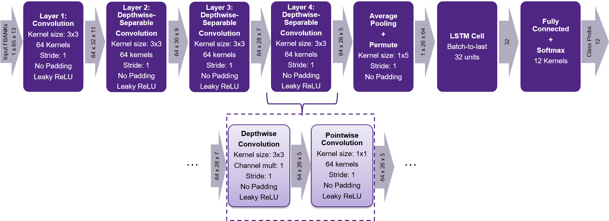

Key Word Spotting Example
==============================================
Example shows implementation of small speech recognition use case for Key Word Spotting (KWS). [TensorFlow speech commands tutorial](https://www.tensorflow.org/tutorials/sequences/audio_recognition) was used as basis for neural network model training with the following most notable changes:
1)	Input features: FBANK features instead of MFCC
2)	Model architecture: Depthwise separable convolutions + LSTM Cell.
KWS Modules are designed to process audio stream. The rest example code wraps modules to process single WAV file and output performance measurements.  

Quick Start
--------------

Example supports building with [MetaWare Development tools](https://www.synopsys.com/dw/ipdir.php?ds=sw_metaware) and running with MetaWare Debugger on [nSim simulator](https://www.synopsys.com/dw/ipdir.php?ds=sim_nSIM). Building with ARC GNU Toolchain isn’t supported yet. 

### Build with MetaWare Development tools

Here we will consider building for [/hw/em9d.tcf](/hw/em9d.tcf) template. This template is a default template for this example. Other templates can be also used. 

0. embARC MLI Library must be built for required hardware configuration first. See [embARC MLI Library building and quick start](/README.md#building-and-quick-start).

1. Open command line and change working directory to `./examples/example_kws_speech`

2. Example uses functions from DSP library and float point calculations for audio processing. For optimal performance C runtime libraries should be rebuilt for the target hardware template. Enter the following command in console (building may take 10-15 minutes):

        buildlib em9d_rt_libs -bd ./ -tcf="../../hw/em9d.tcf"

2. Clean previous example build artifacts (optional):

        gmake clean

3. Build example with pointing the runtime libraries which had been built on step 2:

        gmake TCF_FILE=../../hw/em9d.tcf BUILDLIB_DIR=./em9d_rt_libs

### Run example with MetaWare Debuger on nSim simulator.

Example application requires path to wav file (16kHz sample rate, 16bit samples, mono). Test sample inside the example directory might be used:

    gmake run TCF_FILE=../../hw/em9d.tcf RUN_ARGS=./test.wav

Expected console output: 

    0.240   1.215   "on"(99.994%)
    1.440   2.415   "stop"(99.997%)
    3.600   4.575   "_unknown_"(99.960%)

The first and the second columns are start and end timestamps in seconds correspondingly. The third column is a detected command with its probability in brackets. To see full list of commands see the corresponding [module explanation](#kws-modules-explanation).

### Build with ARC GNU toolchain
Build with ARC GNU Toolchain isn’t supported now. 

Example Structure
--------------------
Structure of the example application may be logically divided to next parts:

* **Application.** Implements allocation of fast memory and modules initialization. Input WAV file reading and KWS Module feeding with samples also related to this part.
   * main.cc
   * wav_file_guard.cc
   * wav_file_guard.h
* **KWS Results postprocessor.** Assuming KWS modules outputs arrays with probabilities each Nth input frame, this code is intended to analyze result series and provide final decision.
   * simple_kws_postprocessor.cc
   * simple_kws_postprocessor.h
* **Audio Features extractor.** Transformation of input audio waveform to more compact feature set which are easier for further analysis.
   * audio_features/audio_features.cc
   * audio_features/audio_features.h
* **Common interface for KWS Modules.** Common interface declaration for KWS modules (including data types and module builder).
   * kws/kws_factory.h
   * kws/kws_module.h
   * kws/kws_types.h
* **KWS modules implementation.** Implements logic of common KWS interface for specific NN graph. Uses embARC MLI Library for performing NN part of processing. 
   * dsconv_lstm_nn/*

Example structure contains test WAV file which consist of 3 samples of Google speech dataset.
* test.wav

More Options on Building and Running
---------------------------------------
To see profiling measures in console output (cycles count and memory requirements) pass the “-info” option after wav file path to application:

    gmake run TCF_FILE=../../hw/em9d.tcf RUN_ARGS=”./test.wav -info”

KWS Modules explanation
----------------------------
### Depthwise-Separable convolution with LSTM backend layer (kws/dsconv_lstm_nn)

In short:
* Module distinguish 10 key words (standard TF tutorial set including yes, no, up, and etc.) plus “silence” and “unknown”
* Filter Banks (FBANKs) features extracted from input audio frames as input for neural network 
* Layer 1: Convolution and Leaky ReLU activation (slope = 0.2) 
* Layers 2-4: Depthwise + pointwise convolution with Leaky ReLU activation (slope = 0.2)
* Average pooling across frequency dimension after layer 4
* Layer 5: LSTM sequential processing across time dimension
* Layer 6: Fully connected + softmax.

List of commands:
+ "yes"
+ "no"
+ "up"
+ "down"
+ "left"
+ "right"
+ "on"
+ "off"
+ "stop"
+ "go"

All the rest commands beside the list are marked as “\_unknown\_”

Module takes mono input 16bit PCM audio stream of 16kHz sample rate by frames of 15ms length (240 samples – stride size). FBANK Feature are calculated from 30ms long frame extracting 13 values from each frame.

When input features sequence is long enough to perform complete NN Inference (features for 65 frames), module invokes MLI based NN implementation of the following architecture:

The following table provides accuracy performance of trained model and it’s MLI based version for various bit depth of quantized data:

|                                                        |   TF Baseline (Float) |  MLI FX16           |  MLI FX8               |  MLI   DSCNN: FX8   LSTM: FX8w16d  |
| :----------------------------------------------------: | :-------------------: | :-----------------: | :--------------------: | :----------------------------------------: |
| Test dataset accuracy   [diff with baseline]       |  95.89%               | 95.89%   [==]   | 94.826%   [-1.06%] | 95.481%   [-0.41%]                     |

Version that corresponds to the last column is implemented in the module. To keep trained weights compact, all of them has been quantized to 8bit signed values. To minimize buffers for intermediate result, inputs and outputs of first 4 layers (convolutions) are also of 8bit depth. Activations of last convolution are transformed to 16bit depth to reduce the effect of the error accumulation in the recurrent  LSTM cell.  

References
----------------------------
Simple Audio Recognition Tutorial:
> TensorFlow - Simple Audio Recognition. https://www.tensorflow.org/tutorials/sequences/audio_recognition

Speech commands dataset:
> Pete Warden. Speech commands: A dataset for limited-vocabulary speech recognition. arXiv preprint arXiv:1804.03209, 2018

Explanation on FBANKs and MFCC Features:
> Haytham Fayek. Speech Processing for Machine Learning: Filter banks, Mel-Frequency Cepstral Coefficients (MFCCs) and What's In-Between. Blog post. https://haythamfayek.com/2016/04/21/speech-processing-for-machine-learning.html

